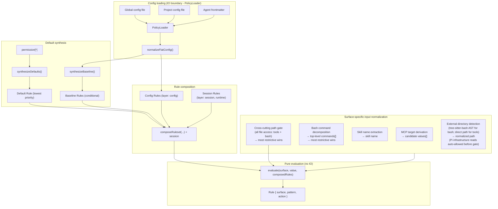
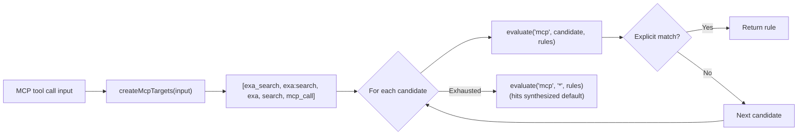
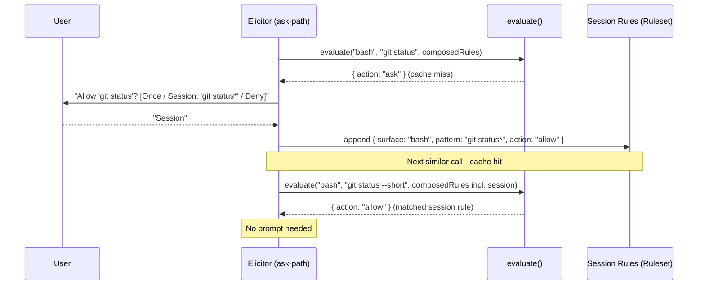
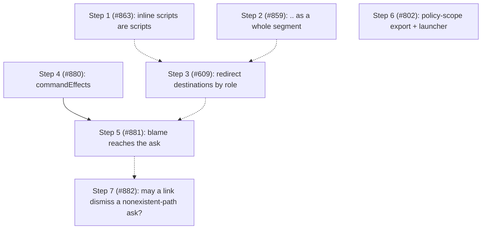

# Architecture

This document describes the internal design of the permission system, informed by [OpenCode's permission model](https://opencode.ai/docs/permissions/).

## Design principles

1. **Unified rule model** - one `Rule` type, one evaluation function, all surfaces.
2. **Pure evaluation** - permission decisions are pure functions of (surface, pattern, rules).
   IO stays at the edges.
3. **Session approvals are just more rules** - no separate matching engine, no separate pre-check.
4. **MCP stays special** - multi-name target derivation is pre-processing, not a special evaluation path.
5. **Defaults are rules** - the universal default (`permission["*"]`) is synthesized as a low-priority rule in the array.
   No side-channel fallbacks.
6. **Flat config format** - the flat `permission: { ... }` object where each key is a surface.
   The config IS the ruleset in human-friendly form.
   Capability is a suffix on the surface name, not a nested facet (`path_read`, `external_directory_write`), and a bare `path` / `external_directory` key is load-time sugar expanding into both directions — so every channel keeps speaking one flat `(surface, pattern)` vocabulary ([ADR-0013](../decisions/0013-permission-policy-model.md) §3, §4).
7. **Preserve the two-phase model** - tool filtering (before_agent_start) and invocation gating (tool_call) remain separate.
8. **Ask = cache miss** - "ask" is the absence of a matching rule.
   The human is the oracle.
   Their decision is a rule.
   Persistence determines lifetime (once / session / config).
9. **Single-agent core, multi-agent by extension** - Pi is single-agent by deliberate design; the notion of multiple named agents is introduced entirely by external extensions (pi-subagents, pi-agent-router, some MasuRii packages), not by Pi itself.
   Per-agent `permission:` frontmatter is therefore an extension bridge layered on this single-agent core, not a core responsibility.
   The package learns the active agent from a generic `<active_agent>` signal (a system-prompt tag or an `active_agent` session entry), never from a hard dependency on any one multi-agent extension, so the bridge works with any tool that emits the signal.

## Scope and non-goals

The README carries a short charter for the boundaries that come up most often.
This is the full inventory, with the decision record or design principle each rests on.

| Non-goal                                                                             | Rests on                                                                                |
| ------------------------------------------------------------------------------------ | --------------------------------------------------------------------------------------- |
| Implementing isolation — this decides and records; a sandbox contains                | [ADR-0013](../decisions/0013-permission-policy-model.md) §8                             |
| Deciding project trust — a policy enforcer, not a trust oracle                       | [ADR-0001](../decisions/0001-project-trust-adoption.md)                                 |
| Sanitizing the config merge so a project scope can only tighten                      | [ADR-0001](../decisions/0001-project-trust-adoption.md)                                 |
| Shipping permissive defaults, trust profiles, or workflow-mode presets               | Operator position; `docs/opencode-compatibility.md` divergence table                    |
| Built-in secret or sensitive-path denylists                                          | [ADR-0010](../decisions/0010-permission-log-secret-exposure.md)                         |
| Value-shape or entropy secret detection in the logs                                  | [ADR-0010](../decisions/0010-permission-log-secret-exposure.md)                         |
| Redacting the permission prompt or the forwarded request                             | [ADR-0010](../decisions/0010-permission-log-secret-exposure.md)                         |
| Disabling the review log by default, or gating `command` behind a flag               | [ADR-0010](../decisions/0010-permission-log-secret-exposure.md)                         |
| A downstream log-redactor registry                                                   | [ADR-0010](../decisions/0010-permission-log-secret-exposure.md)                         |
| Reading ambient host state (`cygpath`, MSYS detection) to interpret paths            | [ADR-0003](../decisions/0003-git-bash-posix-path-semantics.md)                          |
| Per-command argument tables in the deterministic bash layer                          | [ADR-0009](../decisions/0009-bash-path-projection-completeness-contract.md)             |
| Flooring every unprovable bash token to `ask`                                        | [ADR-0009](../decisions/0009-bash-path-projection-completeness-contract.md)             |
| Making the permission manager path-aware                                             | [ADR-0002](../decisions/0002-path-values-string-boundary.md), lint-guarded              |
| Making an LLM call, or holding model provider/prompt/threshold config                | [ADR-0007](../decisions/0007-model-judge-authorizer-chain-adr.md) §5                    |
| Letting an authorizer link `allow` on `external_directory` or a secret-shaped `path` | [ADR-0007](../decisions/0007-model-judge-authorizer-chain-adr.md) §5                    |
| Opt-out authorizer activation                                                        | [ADR-0007](../decisions/0007-model-judge-authorizer-chain-adr.md) §4                    |
| Running authorizer links on a relaying node, or a process-global registry            | [ADR-0007](../decisions/0007-model-judge-authorizer-chain-adr.md) §7                    |
| Re-deriving a forwarded request's facts at the parent                                | [ADR-0008](../decisions/0008-cross-session-access-intent.md)                            |
| A permanently tolerant dual-path wire, or a hard deny on a skewed request            | [ADR-0008](../decisions/0008-cross-session-access-intent.md) §4                         |
| Truncating or width-capping the assembled prompt message                             | [ADR-0011](../decisions/0011-prompt-presentation-contract.md) §2                        |
| Broadcasting evidence or annotations on `permissions:ui_prompt`                      | [ADR-0011](../decisions/0011-prompt-presentation-contract.md) §6                        |
| Returning model-generated annotations to the agent                                   | [ADR-0011](../decisions/0011-prompt-presentation-contract.md) §7                        |
| Echoing the agent's own tool input back in denial text                               | [ADR-0011](../decisions/0011-prompt-presentation-contract.md) §7                        |
| An in-package display for every operator's ideal (diffs, explanations)               | [ADR-0011](../decisions/0011-prompt-presentation-contract.md) §8                        |
| General agent steering from the permission dialog                                    | Operator position (issue #328)                                                          |
| Outbound bridges into another named extension's event contract                       | §"Beyond the target: a pluggable escalation seam", by analogy                           |
| A yolo mode that overrides explicit denies                                           | §"yolo is recorded authority"                                                           |
| A hard dependency on any one multi-agent extension                                   | Design principle 9                                                                      |
| A special evaluation path for MCP, or side-channel fallbacks                         | Design principles 4 and 5                                                               |
| OpenCode's top-level `"permission": "allow"` string shorthand                        | `docs/opencode-compatibility.md` divergence table                                       |
| A model that classifies access intent before `evaluate()`                            | §"Beyond the target"; [ADR-0007](../decisions/0007-model-judge-authorizer-chain-adr.md) |

Two entries rest on an operator position rather than a decision record, and are marked as such above.

The following are **not** boundaries, and must not be written as such.
Durable persistence of an approval is anticipated by design principle 8 and §"Authority lives in three places", which reserve a place for a ruling that outlives the session.
Whether a capability model replaces the actor-keyed surface list is settled: [ADR-0013](../decisions/0013-permission-policy-model.md) adds read/write capability as an axis beside the existing keys, so direction becomes expressible on `path` and on the boundary.
Which channels policy may enter through remains open in issue #799.
Multi-hop escalation, three-way grant scope, terminal-replacement registration, and non-TUI presentation are admitted-not-shipped or externally blocked, not declined.

## Core data model

### Rule

```typescript
/**
 * Provenance of a rule - which source contributed it.
 *
 * Config scopes: "global", "project", "agent", "project-agent".
 * Synthesized:   "builtin" (universal default / evaluate() fallback),
 *                "baseline" (conditional MCP metadata auto-allow).
 * Runtime:       "session" (session approvals).
 * Rewrite:       "yolo" (composition-stage ask→allow rewrite under yolo mode),
 *                "fail-closed" (composition-stage allow→ask floor when an
 *                invalid non-global config scope is detected).
 */
type RuleOrigin =
  | "global"
  | "project"
  | "agent"
  | "project-agent"
  | "builtin"
  | "baseline"
  | "session"
  | "yolo"
  | "fail-closed";

interface Rule {
  /** The permission surface: "bash", "edit", "mcp", "skill", "external_directory", "path", etc. */
  surface: string;
  /** The match pattern: a command glob, tool name, file path, skill name, or "*". */
  pattern: string;
  /** The decision. */
  action: PermissionState;
  /** Custom denial reason for deny rules (optional). */
  reason?: string;
  /**
   * Origin layer - used to derive PermissionCheckResult.source after evaluation.
   * Not used by evaluate(); purely informational metadata.
   */
  layer?: "default" | "baseline" | "config" | "session";
  /** Which source contributed this rule. */
  origin: RuleOrigin;
}
```

Every config entry, default policy, session approval, and agent override normalizes into `Rule[]`.

### Ruleset

```typescript
type Ruleset = Rule[];
```

Merge precedence is array ordering.
The synthesized universal default goes first (lowest priority), then MCP baseline auto-allow rules, then config rules (global → project → agent → project-agent), and finally session rules (highest priority).
Last-match-wins: `evaluate()` scans from the end.

### Evaluate

```typescript
function evaluate(
  surface: string,
  value: string,
  rules: Ruleset,
  platform: NodeJS.Platform,
): Rule {
  for (let i = rules.length - 1; i >= 0; i--) {
    const rule = rules[i];
    // On win32 a path-surface match folds case + separators; `platform` is
    // injected from `PermissionManager` (read once at the composition root,
    // #510), never `process.platform` ambiently.
    if (ruleMatches(rule, surface, value, platform)) {
      return rule;
    }
  }
  // Unreachable when defaults are synthesized - the catch-all always matches.
  return { surface, pattern: value, action: "ask" };
}
```

The entire decision engine.
When defaults are synthesized into the array, the catch-all `{ surface: "*", pattern: "*", action: "ask" }` always matches - the fallback return is defensive only.

## Composed ruleset

All rule sources are concatenated into a single flat array.
Index position determines priority (higher index wins):

```text
  ┌─────────────────────────────────────────────────────────────────┐
  │                     Composed Ruleset (Rule[])                   │
  │                                                                 │
  │  Index 0: Synthesized universal default (layer: "default")      │
  │    { surface: "*", pattern: "*", action: permission["*"] }      │
  │                                                                 │
  │  Index 1..B: MCP baseline auto-allow (layer: "baseline")        │
  │    (only when any config rule has surface:"mcp" action:"allow") │
  │    { surface: "mcp", pattern: "mcp_status",   action: "allow" } │
  │    { surface: "mcp", pattern: "mcp_list",     action: "allow" } │
  │    { surface: "mcp", pattern: "mcp_search",   action: "allow" } │
  │    { surface: "mcp", pattern: "mcp_describe", action: "allow" } │
  │    { surface: "mcp", pattern: "mcp_connect",  action: "allow" } │
  │                                                                 │
  │  Index B+1..C: Config rules (global → project → agent,         │
  │                   layer: "config", origin: "global"|"project"   │
  │                   |"agent"|"project-agent")                     │
  │    { surface: "bash",  pattern: "*",     action: "allow",       │
  │      origin: "global" }                                         │
  │    { surface: "bash",  pattern: "git *", action: "allow",       │
  │      origin: "global" }                                         │
  │    { surface: "bash",  pattern: "rm *",  action: "deny",        │
  │      origin: "project" }                                        │
  │    { surface: "read",  pattern: "*",     action: "allow",       │
  │      origin: "global" }                                         │
  │    { surface: "mcp",   pattern: "exa:*", action: "allow",       │
  │      origin: "agent" }                                          │
  │                                                                 │
  │  Index C+1..end: Session rules (layer: "session", highest)      │
  │    { surface: "external_directory", pattern: "/other/*",        │
  │      action: "allow" }                                          │
  │                                                                 │
  │  ◄── evaluate() scans from end, first match wins ──►            │
  └─────────────────────────────────────────────────────────────────┘
```

`synthesizeDefaults()` produces a single universal catch-all from `permission["*"]`.
Per-surface catch-alls (e.g. `bash: { "*": "allow" }`) are expressed as regular config rules via `normalizeFlatConfig()` - no separate override layer is needed.

`synthesizeBaseline()` conditionally emits MCP metadata auto-allow rules.

`composeRuleset()` concatenates: defaults + baseline + config rules.
Session rules are concatenated after config rules so `evaluate()` handles them via last-match-wins - no separate per-branch pre-check.

### Default synthesis

```typescript
// Single universal catch-all from permission["*"].
function synthesizeDefaults(universalDefault: PermissionState): Ruleset {
  return [
    { surface: "*", pattern: "*", action: universalDefault, layer: "default" },
  ];
}

// MCP metadata auto-allow - only synthesized when any config rule has
// surface: "mcp" && action: "allow".
function synthesizeBaseline(configRules: Ruleset): Ruleset { ... }

// Concat in priority order: defaults, baseline, config.
function composeRuleset(defaults, baseline, config): Ruleset {
  return [...defaults, ...baseline, ...config];
}
```

## Architecture overview



The `Agent frontmatter` input (`AF`) is the per-agent override layer.
It only carries data when an external multi-agent extension is active (see design principle 9): the package resolves the active agent's name from a generic `<active_agent>` signal, then reads the `permission:` sub-document of that agent's definition file at `<cwd>/.pi/agents/<name>.md` (project) or `<agentDir>/agents/<name>.md` (global).
The package does not discover or enumerate agents — it reads one sub-document by name, on demand — and the `<cwd>/.pi/agents` location is a Pi platform convention this package encodes independently (no dependency on pi-subagents, ADR 0002).

## Config format

```jsonc
{
  "permission": {
    "*": "ask",
    "read": "allow",
    "bash": { "*": "allow", "git *": "allow", "npm *": "allow", "rm *": "deny" },
    "mcp": { "*": "ask", "exa:*": "allow" },
    "skill": { "*": "ask", "librarian": "allow" },
    "path": { "*": "allow", "*.env": "deny" },
    "external_directory": "ask"
  }
}
```

Each top-level key in `permission` is a surface name.
A string value is shorthand for `{ "*": action }` (surface-level catch-all).
An object value maps patterns to actions.
`permission["*"]` is the universal fallback.

### Normalization to Rule[]

`normalizeFlatConfig` (`src/policy/normalize.ts`) flattens each `permission` entry into `Rule`s: a string value expands to a single surface catch-all (`{ surface, pattern: "*", action }`), and an object value expands each `pattern → action` pair to one `Rule`.

Ahead of it, `expandDirectionalSugar` runs once per scope inside `mergeScopesWithOrigins`, rewriting a bare `path` / `external_directory` key into its two directional members so origins stay attributed to the authoring scope.
After expansion no rule lives on a bare family surface; `PermissionResolver.resolve` answers a bare-family query by folding the members most-restrictive.

## MCP pre-processing

MCP is the one surface that requires pre-processing **before** evaluation.
The multi-name target derivation stays, but it feeds candidate values into `evaluate()` rather than a separate code path:



The priority ordering of candidates is preserved.
The evaluation function is unchanged - MCP just calls it multiple times with different values.
MCP target derivation helpers live in `src/access-intent/mcp-targets.ts`.
Input normalization for all surfaces lives in `src/access-intent/input-normalizer.ts`.

### Path-bearing tool normalization

Per-tool path patterns — e.g. `"read": { "*": "allow", "*.env": "deny" }` — are evaluated via the `access-path` intent the per-tool gate emits ([#502]).
When the pipeline calls `resolvePerToolCheck`, a present `input.path` triggers `normalizer.forPath(path)` and an `access-path` intent on the tool-name surface; the resolver unwraps it to `path-values` carrying the lexical ∪ canonical alias set before the manager evaluates the rule.
When `input.path` is missing or empty, the pipeline falls back to a `tool` intent, which `normalizeInput` collapses to `["*"]` (surface catch-all).
Path alias derivation (home-expansion, cwd-relative aliases) lives in `getPathPolicyValues` / `AccessPath` — not in `normalizeInput`, which no longer touches path surfaces (#504).
`getToolPermission()` is unaffected — it still evaluates with `"*"`, reporting the surface's own catch-all.
Tool injection no longer asks it: it asks `isToolFullyDenied()`, which probes every pattern configured on the surface (see [Phase 1](#phase-1-tool-filtering-before_agent_start)).

The cross-cutting `path` and `external_directory` gates extract paths for **extension and MCP tools too** (#352): `describePathGate` and `describeExternalDirectoryGate` call `getToolInputPath`, which reads `input.path` for built-ins, `input.arguments.path` for MCP, and a registered `ToolAccessExtractor` (or the default `input.path` convention) for any other tool.
The extractor registry (`src/tool-input/tool-access-extractor-registry.ts`) is created once in `index.ts` and shared: its lookup side is threaded into `ToolCallGatePipeline` (wrapped in the inheriting lookup below), and its registrar side is exposed cross-extension via `PermissionsService.registerToolAccessExtractor`.
Per-tool path maps for extension tools (a custom extractor key per tool) are a deferred follow-up.

A lookup that misses falls back to this node's **ancestors** in the same process (`src/authority/inherited-registrations.ts`), so a subagent child whose own registry has no extractor for a tool still sees the path that tool touches.
This is ADR 0012 decision 1's fact-shaping clause: an extractor produces a fact and decides nothing, so its *lookup* may cross an in-process node boundary while its *registration* stays node-local.
`getToolInputPath` reports which of the three sources answered, and a decision resolved from an ancestor carries `extractorSource: "inherited"` in its review-log context.
The authorizer registry has no such fallback, and `PermissionsService` deliberately exposes no reader for it — a link returns a verdict, so live authority stays converged at the adjudicating node (ADR 0007 §7).

On the bash side, which argument tokens count as filesystem operands is settled by [ADR 0009](../decisions/0009-bash-path-projection-completeness-contract.md): candidacy comes from the filesystem (a bare token is a path candidate iff it names an existing entry), the decision comes from explicit rules or the external boundary, and the ADR names both what the projection guarantees and which gaps are accepted residuals rather than bugs.
A plain `$HOME` / `${HOME}` / `$PWD` / `${PWD}` reference is resolved at token collection, upstream of classification, so an expanded token is gated exactly as its literal spelling; the resolvable set is closed at those two names by the same ADR.

## Session approvals: the cache-miss model

Session rules are stored as `Ruleset` and are generalized to all surfaces.

`evaluate()` is a **lookup** against cached decisions.
When no rule matches (or the matching rule says "ask"), the system has a cache miss - it needs the human oracle to produce a decision.

The human's response is simultaneously:

1. **The answer** for this request (allow or deny).
2. **A rule** that can be cached for future lookups.

The dialog determines **persistence** - where the rule lives:

```text
  evaluate(surface, value, composedRules)
       │
       ├── match.action = "allow" → proceed (cache hit)
       ├── match.action = "deny"  → block (cache hit)
       │
       └── match.action = "ask"   → cache miss, query oracle
                │
                ▼
           Dialog: "[surface] wants to [value]"
                │
                ├── "Yes"              → allow this request (no persistence)
                ├── "Yes, for session" → allow + store in session layer
                │                        (future lookups hit without asking)
                ├── "No"               → deny this request (no persistence)
                └── (future: "Always") → allow + store in config layer (disk)
```

### Pattern suggestions

When prompting, each surface suggests a **pattern** for the "for session" option.
The pattern determines what class of future requests auto-approve:

| Surface                | Input value                 | Suggested session pattern   | Mechanism                |
| ---------------------- | --------------------------- | --------------------------- | ------------------------ |
| bash                   | `git checkout main`         | `git checkout *`            | Arity table              |
| bash                   | `npm run dev`               | `npm run dev`               | Arity table              |
| tool (read/write/etc.) | tool surface itself         | `*` (all uses of that tool) | Tool-level               |
| mcp                    | `exa:search`                | `exa:*`                     | Server-level wildcard    |
| skill                  | `librarian`                 | `librarian`                 | Exact name               |
| external_directory     | `/other/project/src/foo.ts` | `/other/project/*`          | Directory prefix as glob |

The suggestion is shown in the dialog text so the user sees what they're approving:

```text
  ● Allow once
  ● Allow "git checkout *" for this session
  ● Deny
```

### Implementation



## Prompt presentation

What a prompt must show, what a renderer may elide, and what bounds its size are settled by [ADR 0011](../decisions/0011-prompt-presentation-contract.md).
The contract in one line: **the payload is complete, and elision is a property of a render, never of the payload**.

A gate emits structured facts rather than a sentence.
The payload's `request` group — requester and forwarded-ness, tool name and invoked tool name, gate surface and matched rule, the decision-relevant value, and for bash the unit that will actually run — is never elided by any renderer.
`evidence` is complete on the payload and elided to fit each renderer's budget, with the elision marked but uncounted; an operator must still be able to reach the complete information while the decision is pending.
The dialog is bounded by a row budget plus a per-field width cap, the review log by its own configured limits, and the `permissions:ui_prompt` broadcast receives the `request` facts only — the narrowest renderer, because the bus is the one channel an extension observes without the operator having named it.
Denial text is a fifth render of the same facts under one extra rule: it identifies the call rather than reproducing it, since the agent already holds its own tool input.

The payload exists, and the human-facing renderers are bounded.
Every gate emits a `PromptPayload` (`src/presentation/`), and `PromptPermissionDetails` requires one, so the six former assembly sites are gone.
`renderPromptDialog` renders it for the inline dialog and the `select`/`input` fallback under `promptMaxRows` plus `promptFieldMaxWidth`, and `Ctrl+O` expands the dialog to the complete request.
The cap applies to the `request` facts too: never elided means never *omitted* — a long one is shortened, marked, and reachable in full rather than dropped.
Without that reading a bounded render is unreachable, since the decision-relevant value is itself the pathological field in the reported case ([#710]).
A fact an adjacent line already states is not repeated — a bash ask's gate surface is its tool name, and a path ask's is the word its value line is labelled with — so the render spends a line only where it adds something.
That is a redundancy rule, not an elision: the fact is still on screen, which is what §3 requires.

The two cross-boundary contracts now carry facts rather than prose.
The forwarded-request wire carries the child's `PromptPayload`, so the serving node renders the child's own facts under the *parent's* budget — a forwarded bash ask reads `command : …` exactly as a local one does, and `kind: "forwarded"` narrows to meaning one thing: this ask arrived without a payload.
`permissions:ui_prompt` carries `request`, the payload's invariant core, and no evidence at all, which makes the bus the narrowest renderer (ADR 0011 §6): any loaded extension observes it without the operator having named that extension.
`toolInputPreviewMaxLength` and `toolTextSummaryMaxLength` are deprecated and ignored, superseded by the renderer budgets.

The last two consumers are renderers too, so the flat `message` string is gone.
The agent-facing text identifies a refused call rather than reproducing it (§7): it names the surface, the tool, the rule with its nested context, the flagged path or target or skill, and the operator's or human's reason — never the bash command, which is the payload that took over the viewport in [#710] and the agent's context window on every denial.
The flagged element is agent input, so it is capped rather than structurally bounded; naming it is what makes a denial correctable, since which of a call's operands a rule fired on is below tool-call granularity and the agent cannot recover it from its own arguments.
The review log persists the payload's request facts rather than the prompt sentence — stamped by `GateRunner` beside the request id, so no gate can forget them — and every string it writes is narrowed to `reviewLogFieldMaxWidth`.
That bound lives in `writeLine` beside the key-name mask, which makes the log's growth a decision the operator makes rather than a consequence of how long a command happened to be.
ADR 0011 records what each dependent item becomes under the contract.

## Two-phase checking

### Phase 1: Tool filtering (`before_agent_start`)

`shouldExposeTool` (`src/handlers/before-agent-start.ts`) asks `isToolFullyDenied(toolName)` and exposes the tool unless every value under its surface resolves to `deny` — "could *anything* this tool does get through?"

The answer comes from `isSurfaceFullyDenied` (`src/policy/rule.ts`), which probes each pattern configured on the surface (plus the catch-all) as a representative value through the same `evaluate()`.
Ordering is therefore honored: `bash: {"*": "deny", "git *": "ask"}` keeps the tool visible, while `bash: {"git *": "ask", "*": "deny"}` does not — the later catch-all shadows the exception, so nothing is reachable.
Asking the catch-all alone (`evaluate(toolName, "*", rules)`) withheld the tool in the first case too, which is the [#815] defect.
The probe is an approximation of "does any string resolve non-deny", and being wrong in either direction only changes visibility: Phase 2 re-evaluates the real value against the same ruleset.

The set that question is asked of is the session's **tool-surface baseline** (`src/exposure/tool-surface-baseline.ts`), not the previous turn's answer.
Filtering writes its result back through `setActive`, so reading the active set again next turn returns the filtered set; narrowing that again each turn made the surface monotonically shrink and stranded a tool once its rule was relaxed ([#873]).
The baseline is rebuilt every turn from the tools still active plus the ones this extension's own filtering withheld, and the exposed set is `baseline ∩ policy`.
It only ever grows from tools observed **active**, so [#385]'s restrict-only contract holds: a tool pi left inactive never enters it.
A restored tool is callable on the turn it returns, but its `Available tools:` line reappears one turn later — pi builds the prompt parts an extension receives before that extension runs, so `systemPromptOptions.toolSnippets` carries no one-line description for a tool that was withheld last turn, and the line cannot be rendered until it is already active.

### Phase 2: Invocation gating (`tool_call`)

The gate pipeline (`src/handlers/gates/`) normalizes the input to `(surface, value)`, evaluates it against the composed ruleset, and acts on the result: `allow` proceeds, `deny` blocks, and `ask` elicits from the session's `Authorizer` — a persisted "session" decision appends a `Rule` to `sessionRules` so the next similar call is a cache hit.

Same `evaluate()`, same ruleset.
The only surface-specific logic is input normalization (what `surface` and `value` to look up) and pattern suggestion (what glob to offer for "session" approval).

`checkPermission()` uses a single evaluate path: `normalizeInput()` → `evaluateFirst()` → `deriveSource()` → single result object.

## Subagent detection and permission forwarding

When `ask`-state permissions arise in a headless subagent child process, the extension forwards the dialog to the parent session rather than silently denying.
This requires two detections:

1. **Is the current process a subagent?**
   - `isSubagentExecutionContext()` in `src/authority/subagent-context.ts`.
2. **What is the parent session ID?**
   - `resolvePermissionForwardingTarget()` in `src/authority/permission-forwarding.ts`.

Neither decides whether *this* node serves an inbox of its own, which is `hasUI` alone (#907).
Together with a third question — is that parent draining its inbox right now?
— they decide whether a node with a UI of its own relays instead of prompting ([#909]).

### Known extension env var inventory

| Extension                                                                           | Child-process env vars                                                                    | Parent-session env var              |
| ----------------------------------------------------------------------------------- | ----------------------------------------------------------------------------------------- | ----------------------------------- |
| The adapter convention (new implementations)                                        | none required                                                                             | `PI_SUBAGENT_PARENT_SESSION`        |
| pi-agent-router (original)                                                          | `PI_IS_SUBAGENT`, `PI_SUBAGENT_SESSION_ID`, `PI_AGENT_ROUTER_SUBAGENT`                    | `PI_AGENT_ROUTER_PARENT_SESSION_ID` |
| [nicobailon/pi-subagents](https://github.com/nicobailon/pi-subagents)               | `PI_SUBAGENT_CHILD`, `PI_SUBAGENT_RUN_ID`, `PI_SUBAGENT_CHILD_AGENT`, `PI_SUBAGENT_DEPTH` | `PI_SUBAGENT_PARENT_SESSION`        |
| [tintinweb/pi-subagents](https://github.com/tintinweb/pi-subagents)                 | none - runs fully in-process via `createAgentSession()`                                   | n/a - deferred to #29               |
| [HazAT/pi-interactive-subagents](https://github.com/HazAT/pi-interactive-subagents) | `PI_SUBAGENT_NAME`, `PI_SUBAGENT_ID`, `PI_SUBAGENT_SESSION`, `PI_SUBAGENT_ACTIVITY_FILE`  | none set (see #98)                  |

### Detection (`isSubagentExecutionContext`)

`isSubagentExecutionContext()` checks three sources in priority order:

1. **Explicit registry** - the in-process half of the subagent adapter convention ([Subagent Integration](../subagent-integration.md#the-subagent-adapter-convention) is its canonical spec); the permission system's subscriber writes the entry into `SubagentSessionRegistry` synchronously.
   The registry (keyed by **child session id**) is checked first.
   Each concurrent sibling child of the same parent receives a unique session id from `sessionManager.newSession()`, so siblings occupy distinct keys - one sibling's `disposed` event cannot evict another's entry (fixes #298).
   The registry is a process-global singleton (via `getSubagentSessionRegistry()`, backed by `globalThis` + `Symbol.for()`) because each session's `ResourceLoader` creates its own `pi.events` bus: the parent's instance registers the child over the parent bus, while the child's separate jiti instance reads the same global store to detect itself and resolve its forwarding target.
2. **Env vars** (`SUBAGENT_ENV_HINT_KEYS`) - returns `true` when any key is set to a non-empty, non-whitespace value.
   Used by process-based subagent extensions.
   The list is composed from the per-extension markers plus `SUBAGENT_PARENT_SESSION_ENV_CANDIDATES`, since a process that names a parent session is a child by definition - which is what makes the convention's single out-of-process obligation sufficient on its own (#789).
   A UI host can therefore answer `true` here too, because an implementation may export the marker from its own root process so the children it spawns inherit it.
   The predicate answers "is this process a child", not "should this node relay rather than decide": `selectAuthorizer` relays a node with a UI only when a target resolves *and* that target is serving ([#909]), and serving eligibility does not consult the predicate at all (#907).
3. **Filesystem path** - session-directory path-based fallback (child session dir is nested under `subagentSessionsDir`).

### Parent-session resolution (`resolvePermissionForwardingTarget`)

`resolvePermissionForwardingTarget()` checks two sources in priority order:

1. **Explicit registry** - if the caller provides a `sessionId` and `registry`, the registry entry's `parentSessionId` is returned when present.
   Used by in-process subagent extensions.
2. **Env vars** (`SUBAGENT_PARENT_SESSION_ENV_CANDIDATES`) - iterates candidates and returns the first non-empty, non-`"unknown"` value.
   Used by process-based subagent extensions.

Either source skips a candidate naming the requesting session itself: a request filed into one's own inbox is drained by no watcher and answered by nobody (#907).
When no candidate survives, forwarding fails with an explicit log message naming the variables checked.

The function answers only "which *other* session", so it is also what `selectAuthorizer` asks before relaying a node that has a UI: no target means the human here decides ([#909]).
That node additionally requires `ForwardingLivenessJudge` to report the target as serving, and records `forwarded_permission.relay_started` / `relay_stopped` when the answer changes — the requester-side counterpart of the serving node's own `serving_started` / `serving_stopped`.

HazAT sets no parent-session env var today, so forwarding still fails for it with that message pointing to #98.
Adding a new env var candidate when an extension adopts the convention is a one-line change to the array.

### In-process case (resolved)

In-process subagent extensions (e.g. `@gotgenes/pi-subagents`) call `createAgentSession()` directly - no child process is spawned and no env vars are ever set.
The announcement they owe, and the pre-bind ordering that makes it usable, are specified by the adapter convention in [Subagent Integration](../subagent-integration.md#the-subagent-adapter-convention); `src/authority/subagent-lifecycle-events.ts` subscribes and writes/removes the entry in `SubagentSessionRegistry` synchronously.
The registry is process-global (see `getSubagentSessionRegistry()` in `src/authority/subagent-registry.ts`) so the child's separate jiti instance reads the same store as the parent.

### External convention guide

A [permission frontmatter convention guide](../guides/permission-frontmatter-for-subagent-extensions.md) documents how upstream subagent extensions can adopt the `permission:` frontmatter key as a shared convention.
This is a documentation-only proposal - no code dependency is required.
The guide covers the two-layer model, flat format reference, composition examples, and the optional event bus runtime integration.

## Cross-extension service accessor

The primary cross-extension API is a `Symbol.for()`-backed service object on `globalThis`.
The cross-node contract governing this surface is settled in [ADR 0012](../decisions/0012-cross-node-extension-contract.md); its decisions 2, 3, and 4 are implemented here.

Pi's extension loader creates a fresh jiti instance per extension with `moduleCache: false`, isolating module-scoped state.
`Symbol.for()` and `globalThis` are process-global by spec, so they survive this isolation.

One process can host several **nodes** — one Pi session runtime each, with its own `ExtensionContext`, event bus, gates, registries, and `PermissionSession`.
A root session and each of its in-process subagent children are separate nodes, and each loads its own instance of this extension.
Registrations never cross a node boundary: a child fixes an ask's facts and runs its own gates, so the extractors and formatters it needs are the ones registered in *its* registries, and chain links are consulted only by the node that adjudicates (ADR 0007 §7).

So each node publishes its `PermissionsService` at `session_start` into a process-global map keyed by its own session id, and a consumer resolves it with `getPermissionsService(sessionId)`.
The session id travels as data on the `permissions:ready` payload, alongside `adjudicatesLocally` — a registrant needs no branch on the latter, since a link registered where no chain runs is accepted and recorded rather than refused (decision 4, `authorizer_link_vacant` in the review log).
That payload is broadcast twice per session generation: at `session_start` after the node publishes, and again at the node's first `before_agent_start`, which runs after every extension's `session_start` and before any ask (decision 3, the ready latch).
So the channel fires at least once per session and may repeat, and the ready handler alone is a sufficient registration site — a consumer needs no second attempt from its own `session_start`, only an idempotence guard.
The keyed map is the only slot.
A legacy single slot, written by every node that was not an in-process subagent child (the #302 guard) and read by a deprecated `getRootPermissionsService()`, was removed once its last downstream migrated — it answered "the process root's service", which is the wrong node in every node but the root, and keyed publication dissolves the clobbering hazard the guard existed for.
The locator's `sessionId` is required rather than optional, so a `PermissionsReadyEvent.sessionId` of `null` cannot fall through to some other node; a caller the types cannot reach (JavaScript, or a consumer compiled against an earlier major) gets `undefined` plus a once-guarded `PI_PERMISSION_SYSTEM_WARN0001` warning rather than another node's service.
The `package.json` `exports` field's `default` condition points to `src/service.ts`, which contains the interface, the accessor functions, and the `Symbol.for()` key - no extension machinery.
The `types` condition instead resolves to a bundled `dist/public.d.ts` (built by `rollup-plugin-dts` from `rollup.dts.config.mjs`, published via `prepack`) so a downstream consumer's `tsc` never follows the raw `#src/*` module graph - only the `default` condition (the jiti runtime) reads `src/` directly (#592).

Both accessors come from `import("@gotgenes/pi-permission-system")`.
The `PermissionsService` interface exposes six methods:

- `checkPermission(surface, value?, agentName?)` - full policy query.
- `getToolPermission(toolName, agentName?)` - the surface's catch-all permission state (`allow`/`deny`/`ask`).
- `isToolFullyDenied(toolName, agentName?)` - whether every value under the surface resolves to `deny`; the question tool pre-filtering asks, since a partially permissive surface reports `deny` from the catch-all.
- `registerToolInputFormatter(toolName, formatter)` - register a custom ask-prompt preview for a tool name; returns a disposer (#283).
- `registerToolAccessExtractor(toolName, extractor)` - declare the filesystem path a non-conventional tool accesses, so the cross-cutting `path`/`external_directory` gates see it; returns a disposer (#352).
- `registerAuthorizer(name, authorize)` - register a named live-authority chain link (`allow | deny | defer`, ADR 0007 §4); decides nothing until the operator names it in `authorizerChain` config, and every verdict is capped by the bounded-delegation checkpoint; returns a disposer.

`permissions:decision` and `permissions:ui_prompt` broadcasts remain on the event bus - fire-and-forget observation is the right abstraction for those channels ([#531] removed the event-bus RPC channel; the service accessor is now the sole cross-extension policy/prompt surface).

## The authority model

This section records the organizing concept the package is built around — the spine the elicitation, forwarding, and yolo machinery collapse into — plus the still-open directions that extend it.
It is current state, not a target: the `Authorizer` interface, its three implementations, once-per-activation selection, `canConfirm()`'s dissolution, serving-as-resolution, human-selectable grant-scope, and the `authority/` directory migration all shipped in Phase 9 (see [history/phase-9-authorizer-spine.md](history/phase-9-authorizer-spine.md) for why the spine is the correct model of the `@gotgenes/pi-subagents` integration — the anonymous cross-session-authority recursion behind the [#296]/[#298]/[#302] bug history — and not merely an internal tidy).
Of the ["beyond the target"](#beyond-the-target-a-non-deterministic-access-intent-classifier) extension points below, the model-triage `Authorizer` chain is now implemented (Phase 12; [ADR 0007](../decisions/0007-model-judge-authorizer-chain-adr.md)), and its named-link registration subsumes the pluggable escalation seam; the deny-first slice is dogfooded by `packages/pi-permission-model-judge`, and the allow-capable opaque-bash adjudicator ([#620]) remains the sole open Track B slice.
A non-deterministic access-intent classifier remains aspirational.

### The spine

Every action resolves against an **authority** — an entity empowered to permit or forbid it.
The only questions are *which* authority and how we reach it.

This sharpens principle 8.
That principle calls the human "the oracle," borrowing the computer-science term for a black box consulted for an answer the system cannot compute.
But a permission decision is not epistemic (who *knows* the answer); it is deontic (who has the *right* to decide).
If a bystander happened to know what the user wanted, their saying "allow" would authorize nothing.
What makes a decision binding is authority, not knowledge — so the organizing concept is authority, and the entity that holds it is an **`Authorizer`**.
The human is merely the `Authorizer` at the interactive root; another agent can hold the role equally well.

### Authority lives in three places

1. **Recorded authority** — the ruleset.
   Config (durable, on disk), session rules (this session), and synthesized defaults/baseline are all prior rulings.
   `evaluate()` *is* "consult recorded authority": an `allow` or `deny` means recorded authority is sufficient, and the decision is final.
2. **Live authority** — reached only on `ask`, when recorded authority is silent.
   An entity empowered to rule *now*, reached through one of three channels (below).
3. **Absent authority** — nothing recorded, nothing reachable.
   Least privilege applies: no authority means the action is unauthorized, so it is denied.

The three are one thing at different lifetimes.
A live ruling, once persisted, *becomes* recorded authority — principle 8's "their decision is a rule."
The "for this session" dialog option writes a session rule; a future "always" writes config.

### The `Authorizer` role

On `ask`, the gate escalates to **one `Authorizer`, selected once per session from context**, and is told the decision.

1. **`LocalUserAuthorizer`** — the session has UI and names no parent that is draining its inbox; prompt the human here.
2. **`ParentAuthorizer`** — the session is a subagent without UI, or one whose declared parent is serving ([#909]); escalate up the tree to the parent's authority.
3. **`DenyingAuthorizer`** — no authority is reachable; deny (least privilege).

There is no "can anyone answer" pre-check.
`canConfirm()` — today a boolean smeared across the gateway, prompter, and forwarder — dissolves: every `Authorizer` answers, the `DenyingAuthorizer` by denying.
The three context predicates (`hasUI`, `isSubagent`, yolo) are evaluated once, at selection, instead of repeatedly down the prompt path.

```text
evaluate(action, recorded authority)
  ├─ allow / deny ------------------> decided (recorded authority sufficient)
  └─ ask (recorded authority silent)
        └─ escalate to the session's Authorizer
              ├─ LocalUserAuthorizer -> prompt the human here
              ├─ ParentAuthorizer    -> forward up the tree, await the parent's ruling
              └─ DenyingAuthorizer    -> deny (no authority reachable)
                    |
              (a persisted ruling becomes recorded authority)
```

### The recursion

Authority is delegated **down** the session tree: the human drives the root, which spawns subagents that hold no inherent authority to approve a novel action.
So an `ask` a subagent cannot answer **escalates up** to where authority resides.
Permission-system instances form a tree mirroring the session tree, and `ParentAuthorizer` is the edge that routes a child's escalation toward the human at the root.
This is the same recursion pi-subagents describes (a subagent is a child Pi), viewed from the permission system's side: the package is itself one of the hooks on that child, and it recurses by forwarding.

### Reconstruction fidelity at the serving node

The courier hop carries facts, not judgment — but what the serving node reconstructs from a forwarded request differs by audience, and the two directions are the same rule applied to different trust boundaries.

An **in-process seam** — the `Authorizer` chain, reached through `PromptPermissionDetails` — receives the full child-fixed fact set.
A chain link is operator-opted-in via `authorizerChain` and must decide from evidence, not from parsed display text or a parent-side re-derivation of the child's path ([ADR 0008](../decisions/0008-cross-session-access-intent.md) forbids the latter outright).
The bounded-delegation checkpoint reads the same facts, so a forwarded ask is capped on the gate surface exactly as a local one is ([ADR 0007](../decisions/0007-model-judge-authorizer-chain-adr.md) §5).

A **cross-extension broadcast** — `permissions:ui_prompt` / `permissions:decision` on `pi.events` — receives the minimum needed to stay correlatable, because any loaded extension can observe it.

Maximum fidelity to the decider; minimum disclosure to the observer.
Requester identity (`requesterCwd`, `principal`) crosses to neither: it is the serving node's own resolution input (ADR 0008 §3) and stays on the wire object, with the ask details carrying only the `forwarding` provenance.

### yolo is recorded authority

yolo is not a channel and not a live concern — it is a standing authorization, and it belongs in the ruleset, not in the prompt path.
It is a composition-stage rewrite: when enabled, every `ask` action in the composed ruleset is rewritten to `allow`, tagged `origin: "yolo"` so the review log still distinguishes a yolo grant from a policy allow.

```typescript
const effective = yolo
  ? composed.map((r) => (r.action === "ask" ? { ...r, action: "allow", origin: "yolo" } : r))
  : composed;
```

This is faithful to current behavior exactly: explicit `deny` rules are not `ask`, so they pass through untouched — yolo suppresses prompts but **preserves hard denies**.
It honors principle 5 (defaults are rules; no side-channel fallbacks): `evaluate()` runs pure over the rewritten ruleset, and the prompt path loses all yolo knowledge (`shouldAutoApprovePermissionState` and `canResolveAskPermissionRequest`'s yolo arm dissolve).

The ruleset is the whole story for asks the ruleset produces.
An `ask` synthesized *after* resolution is not one: the bash wrapper floor (#481, #490) and the fail-closed `<unparseable-bash-command>` sentinel (#452) are properties of a parsed command unit, not of a pattern, so there is no rule for the rewrite to touch and they reached the prompter under yolo (#712).
A wrapper the floor no longer covers (#803) synthesizes nothing, so it never reaches that reconciliation at all — it is decided by an ordinary rule, on the inner command's text.
The reconciliation has exactly one home — `resolveYoloGrant` at `GateRunner`'s auto-approve fast path, the single choke point every gate passes through before escalating — so the contract "an `ask` never reaches `PermissionPrompter` under yolo" holds structurally for whatever floor is added next.
It is the same deny-preserving shape as the rewrite: a `deny` is not an `ask`, so it matches neither arm.
A future "disable everything" mode — overriding denies too — would be a *different*, deliberately named operation: appending a final `{ surface: "*", pattern: "*", action: "allow" }` rule (last-match-wins).
It is not built, and it would be requested by name, never conflated with yolo.

### Fail-closed on an invalid non-global scope

The mirror image of the yolo rewrite.
When a non-global config scope (project, agent, or project-agent) is present but fails to load or validate, the loader marks it invalid (`ScopeConfig.invalid`) instead of silently substituting an empty scope.
At composition the manager floors every `allow` in the composed ruleset to `ask`, tagged `origin: "fail-closed"`, so a permissive rule inherited from a lower-precedence scope cannot remain effective behind a higher scope that was meant to tighten it (#646).

```typescript
const effective =
  failClosedScopes.length > 0
    ? composed.map((r) => (r.action === "allow" ? { ...r, action: "ask", origin: "fail-closed" } : r))
    : composed;
```

Like yolo it is deny-preserving (only `allow` is touched) and applied at composition, so the display surfaces (`getComposedConfigRules`, `getToolPermission`) reflect the clamp too.
Global is excluded — it is the lowest precedence, so nothing more permissive is inherited when it fails.
The two overlays stack in order: fail-closed floors `allow`→`ask` first, then yolo (if enabled) rewrites `ask`→`allow`, so an explicit yolo opt-in still wins.

### Discriminating delegation: a model `Authorizer`

Nothing constrains an `Authorizer` to be deterministic.
`LocalUserAuthorizer` is already a non-deterministic oracle — the human — and the determinism principle governs *recorded* authority (`evaluate()`), never the live-authority layer.
A model (e.g. Claude Haiku) can hold an `Authorizer` role on the same terms: it is live authority, so it never touches `evaluate()` or the deterministic core.

The design is settled in [ADR 0007](../decisions/0007-model-judge-authorizer-chain-adr.md); the essentials follow.

**The live-authority layer is a Chain of Responsibility.**
Each link returns `allow | deny | defer`; on `defer` the next link decides.
The chain ends at a **terminal that cannot defer** — today the human (`LocalUserAuthorizer`), the headless `DenyingAuthorizer`, or `ParentAuthorizer` (terminal for its node, forwarding up to the parent node's chain — the [recursion](#the-recursion) above).
The invariant is type-level: a terminal returns only `allow | deny`, so a deferring link cannot occupy the terminal slot.
`selectAuthorizer` becomes the terminal-selection step of `composeAuthorizerChain` — registered non-terminal links, then the context-selected terminal.

**One chain per node.**
An ask is adjudicated by exactly one node's chain: the node whose terminal decides it (ADR 0007 §7).
A subagent node's terminal relays the ask to a serving node, which escalates it through *its* chain over the same child-fixed facts — so a relaying node resolves no links, and records `authorizer_chain_delegated` rather than reporting each configured name as a fail-safe skip.
An adjudicating node records `authorizer_chain_resolved` with the names it consulted, since a deferring link decides nothing and otherwise leaves no evidence it ran.

```text
ask -> [ model-judge link ] --defer--> … --defer--> [ terminal: human | Parent | Denying ]
              ├─ deny (with teaching reason)   -> denied
              ├─ allow (slice 2, if not excluded) -> permitted
              └─ defer                          -> next link
```

**The model judge is a non-terminal link**, not a decorator or a fourth channel.
It reviews an `ask`, decides the ones it is confident about, and defers the rest to its successor — a middle rung between prompt-everything and allow-everything.
Denies are decided by recorded authority and structurally never reach an `Authorizer`, so a model link cannot grant a hard deny; the safeguard for a sensitive resource stays an explicit `deny` rule, which survives the model just as it survives the yolo rewrite.

The verdict range is `allow | deny | defer` — a superset of the earlier allow-or-escalate framing — because the first use case is **deny-first**.
A light model reviews `external_directory` asks, denies an errant "typo" path with a teaching `reason` (wrong path; correct location) so the invoking model self-corrects, and defers everything else.
A second use case adjudicates **opaque bash**: the model decomposes a `bash -c "…"` / `eval` command and queries the deterministic engine per sub-command through an injected, narrow `PermissionQuery` (never a reach-through to `PermissionsService`), allowing only what the engine already grants for the pieces it identifies.
The two are one link on a **capability gradient**: the deny/defer reviewer is strictly more restrictive and ships first; the allow-capable adjudicator loosens privilege and is gated behind the full envelope (hard exclusions, audit `origin: "authorizer:model"`, non-persistence, off by default), because its safety property holds only if the model's decomposition is faithful.

Registration mirrors `registerToolAccessExtractor`: a downstream extension offers a **named** capability (`registerAuthorizer("model-judge", …)`) on `permissions:ready`, and this package makes no LLM call itself.
Three invariants govern the seam: config order (not registration order) fixes the security-relevant chain order; a missing configured link is skipped fail-safe (more prompting, never less); and **registration alone grants no authority** — a link decides nothing until the operator names it in the `authorizerChain` config (opt-in).
Bounded delegation is operator config this package enforces at a checkpoint that downgrades an excluded-surface `allow` to `defer`, with `external_directory` and secret-shaped `path` always excluded; the model's provider/prompt/threshold live in the downstream extension's own config.

This is the principled successor to the per-command argument-position work deferred from [#509].
The bash path projection surfaces a bare token that names a real file ([#645]) and deliberately accepts a fail-safe false positive (`grep id_rsa secrets.txt` prompts when an `id_rsa` file happens to exist); that false positive lives on the *ask-producing* side of `evaluate()`, and the model link dismisses it on the *ask-consuming* side without hard-coding per-command file-argument tables.
This split is the layering principle of [ADR 0009](../decisions/0009-bash-path-projection-completeness-contract.md): the deterministic layer biases toward surfacing because over-suppression is unrecoverable, and the judge absorbs the surplus.
The two compose cleanly because a promoted token emits the same structured descriptor a prefixed path does, so a link needs no promotion-specific knowledge.

**Dogfooded:** a first-party monorepo package (`packages/pi-permission-model-judge`) implements the deny-first typo-path reviewer against the real seam, so `registerAuthorizer` is born consumed (the [#267] vacant-surface guard).

### Resolved direction

These were the open decisions; they are now settled and shipped (full rationale in [history/phase-9-authorizer-spine.md](history/phase-9-authorizer-spine.md)).

1. **Serving is resolution.**
   A serving node runs `evaluate()` against its recorded authority then escalates to its own `Authorizer` on `ask`, carrying the forwarded ask's provenance as data so the `permissions:ui_prompt` broadcast stays non-degraded.
2. **Multi-level escalation: admitted, not shipped.**
   A middle node's chain terminates in a `ParentAuthorizer`, so re-escalation needs no special-casing; the tree is depth-2 today (pi-subagents' recursion guard), and a one-hop canary flags any future break.
3. **Full delegation of authority down the tree.**
   A subagent inherits its ancestors' `allow`/`deny` rules and yolo; because yolo is deny-preserving, the safeguard for a cheaper delegate is an explicit `deny` in its per-agent frontmatter, not an `ask`.
4. **Grant scope is human-selectable.**
   Approving a forwarded request "for this session" offers root / parent / requesting-subagent scope (requesting subagent pre-selected); "parent" and "root" coincide until trees deepen.

### Remaining design work

**Access-intent extraction** is the one genuinely open piece, and the foundation for the path surface of the decisions above.
The package's center of mass is not the decision engine (tiny, pure) but turning `(toolName, input)` into "what is being accessed" — bash decomposition, MCP target derivation, path extraction, external-directory detection.
This is a distinct domain (access intent) that gates should *emit* and a single `resolve(intent)` should answer, so adding a gate cannot widen the resolver surface.
The [#393] false-green (a stubbed-but-unrouted resolver method silently passing `allow`) was the probe pointing at it: the resolver surface was `resolve` + `resolvePathPolicy`, widening per gate, until Phase 6 Step 6 ([#478]) collapsed it to one `resolve(intent)`.
[#418] is a second probe, from the access-path side: both external-directory gates matched config patterns against the symlink-resolved path because a single `string` carries a path that is simultaneously a containment value (canonical, for the outside-CWD boundary) and a match value (lexical, as the user typed it), with no type distinction — so the canonical form leaked into matching and defeated a configured `/tmp/*` allow.
The same conflation lived in `BashProgram.externalPaths(): string[]`, which returned only the canonical form and so lost the typed value the matcher needed.
The fix's `getExternalDirectoryPolicyValues` helper (the union of lexical aliases and the canonical path) was the embryo of the access-path: `AccessPath` ([#476]) now holds both forms behind distinct `matchValues()` and boundary accessors, making the misuse a compile error; `BashProgram.externalPaths()` now returns `AccessPath[]` and one external-directory policy check can replace the two parallel gates that independently acquired this bug.
The tractable first slice was the access-path value object seeded by [#418]: it removed the path-representation conflation and the duplicate external-directory gate without waiting on principal identity or cross-session portability.
Principal identity and path portability across cwds — a subagent in a `pi-subagents-worktrees` worktree resolves paths against a different root than the parent — are now settled: [ADR 0008](../decisions/0008-cross-session-access-intent.md) (Phase 12) fixes a path-shaped ask's portable meaning at the child (the child's lexical ∪ canonical `matchValues()` plus canonical `boundaryValue()`), carries it onto the forwarded wire as `ForwardedAccessIntent`, and makes serving agent-scoped (`requesterAgentName` decision-participating).
A forwarded ask now resolves against the child-fixed alias set rather than a re-derivation through the parent's `PathNormalizer`/cwd.
With principal identity and path portability delivered, this domain has no further genuinely open piece; a non-path serving refinement (a per-surface `Authorizer` chain exclusion beyond `external_directory`/secret-shaped `path`) remains a candidate but is not scheduled.

### Beyond the target: a non-deterministic access-intent classifier

This is a **more distant** direction than the target above — noted as a candidate extension point, not planned work.

Access-intent extraction is deterministic by design: `(toolName, input)` becomes "what is being accessed" through bash decomposition, MCP target derivation, and path rules.
A second, independent place non-determinism could one day enter is a model that *classifies* access intent **before** `evaluate()` — deciding, for instance, that `id_rsa` in `git grep id_rsa` is a search pattern rather than a file, so no path candidate is emitted at all.

The classifier differs from the [`ModelTriageAuthorizer`](#discriminating-delegation-a-model-authorizer) in *where the model sits*.
The classifier feeds **recorded** authority — it shapes the intent `evaluate()` rules on — whereas the Authorizer holds **live** authority and answers the `ask`.
A wrong classifier call is a misread of what is being accessed; a wrong Authorizer call is a mis-granted decision.
Because the classifier changes the *input* to the deterministic core, it weakens the "same `(toolName, input)` yields the same ruling" property more subtly than the Authorizer does — the model output becomes part of the intent — so it warrants its own decision record and is deliberately out of scope for the current target.
The access-intent domain the gates emit into is the natural seam for such a pluggable classifier: deterministic today, model-assisted only if and when that trade is made by name.

### Beyond the target: a pluggable escalation seam

The **registration seam** this section anticipated is now designed: [ADR 0007](../decisions/0007-model-judge-authorizer-chain-adr.md) settles the `Authorizer` chain and its named-link registration (`registerAuthorizer`), with the model judge as its first consumer.
What remains a **more distant** direction — a candidate extension point, not planned work — is applying that same seam to *replace the terminal* (a delegation framework other than pi-subagents, a chat-approval bot, or a remote review surface *as* the authority) and refactoring the built-in subagent integration to register through it.

The [#261]/[#267] inversion made pi-subagents pure — it publishes its child lifecycle and knows nothing about consumers ([ADR-0002]) — but the purity is one-sided: this package is the integration owner.
It knows pi-subagents' event channel names (`subagent-lifecycle-events.ts`), hardcodes an env-hint inventory of known third-party subagent extensions (`SUBAGENT_ENV_HINT_KEYS`), and bakes in a session-directory heuristic.
Supporting a new delegation framework — or something that is not a subagent extension at all, such as a chat-approval bot or a remote review surface — means editing this package.

The subagent machinery decomposes into three roles a seam would name and separate:

- **Detection** — is this session a delegated context?
  This is an Authorizer-selection predicate; [#529]'s `SubagentDetection` gives it one owner.
- **Target resolution** — where does authority live for this session; which node serves the escalation (`resolvePermissionForwardingTarget` today).
- **Transport** — how an `ask` travels to that authority and the ruling returns (the file-based request/response polling today; [#530]'s escalation-up role, `ParentAuthorizer` since [#555]).

A registered provider is exactly a selection predicate plus a `ParentAuthorizer`-shaped transport: "when my predicate matches this session and recorded authority is silent, escalate through me."
The `Authorizer` spine is therefore the seam — this direction is the spine's registration story, not a mechanism beside it.

Two shapes, the second generalizing the first:

1. **A bridge extension** — a third package subscribes to pi-subagents' lifecycle and registers with this package's public seam, leaving both cores pure.
   A dedicated glue extension knowing both ends is the sanctioned complement of the rule against outbound bridges *from a core*.
2. **A dogfooded provider seam** — this package defines the registration API and implements its own built-in pi-subagents integration through it, the way `registerToolAccessExtractor` / `registerToolInputFormatter` already let extensions plug the gates; third parties register on equal terms and the zero-config default survives.

A history guard: this re-introduces an inbound registration surface of the kind [#267] retired.
It differs in kind — consumer-agnostic, documented for third parties, and consumed by the built-in provider itself, so it cannot go vacant the way the two-method `registerSubagentSession` RPC did.

Any design must honor the standing constraints: registration lands synchronously before `bindExtensions()`; cross-session visibility rides `globalThis` + `Symbol.for()` (the [#296] bus-split lesson); a provider is live authority only and never touches `evaluate()`; and a session no provider claims selects `DenyingAuthorizer` — least privilege, unchanged.
It sequences after the Phase 9 spine and warrants its own decision record.

### Naming

The concept and the code role take two grammatical forms of one root, each for what it correctly denotes:

- **`authority`** (mass noun) — the right to decide; used for the concept ("recorded authority," "where authority lives").
- **`Authorizer`** (count noun) — the entity that holds it; used for the interface and its implementations.

`Authorizer` is domain-idiomatic: AWS Lambda "authorizers" and OAuth's authorization server return allow/deny, so the term already denotes an entity that can refuse.

## Module structure

```text
src/
├── index.ts                  Extension factory - event wiring, collaborator construction (established injection-bag wiring kept inline per the anti-procedure-splitting rule)
├── service.ts                PermissionsService interface + the Symbol.for() accessors (cross-extension API) over the session-keyed map every node publishes into; public surface published as a self-contained dist/public.d.ts bundle
├── types.ts                  Core type definitions; the config-shape types (PermissionState, FlatPermissionConfig, etc.) are re-exported from config-schema.ts; domain type guards `isPermissionState`, `isDenyWithReason`
├── value-guards.ts           Runtime type guards (`toRecord`, `getNonEmptyString`)
├── permission-request-id.ts  `createPermissionRequestId()` — the one mint for a permission request's `perm-<uuid>` id; distinct from the host's `toolCallId`, which stays alongside it as the join back to the Pi transcript
│
├── config/               Configuration domain: everything that reads, validates, holds, or reflects configuration. Consumed by `policy/`, which never reads a file itself
│   ├── config-loader.ts     File I/O, format detection, strict zod validation (fail-closed) for config files
│   ├── config-schema.ts     Zod schemas - single source of truth for the config shape; derives the JSON Schema (buildPermissionsJsonSchema) and the config types. `permissionSchema` names ten well-known surfaces (`*`, the `path` and `external_directory` families, `bash`, `mcp`, `skill`) as `surfaceProperty(...)` properties over a `.catchall(...)` that keeps arbitrary tool-name surfaces validating, each carrying its own description and markdownDescription so an editor binds documentation to the key under the cursor. It rejects two unusable surface-key spellings at load: a misspelled directional key (which would sit inert, failing **open** as a restriction) and an empty key. Constraints: refinements do not serialize into JSON Schema, so both are loader-only checks; `DIRECTIONAL_SURFACE_KEYS` is the loader's allowlist and is held in step with the schema's directional properties by test, not structurally
│   ├── config-store.ts      `ConfigStore` class — owns `config` + `lastConfigWarning`; `ConfigReader`, `SessionConfigStore`, `CommandConfigStore` narrow interfaces
│   ├── config-paths.ts      Path derivation
│   ├── config-reporter.ts   Structured log entries for resolved config
│   ├── config-modal.ts      /permission-system slash command UI
│   ├── extension-config.ts  Runtime knobs (debugLog, yoloMode, etc.)
│   ├── extension-paths.ts   `ExtensionPaths` value object - immutable path constants derived from `agentDir` (and optional Pi `getPackageDir()`) at startup (`computeExtensionPaths`)
│   ├── policy-loader.ts     PolicyLoader interface + FilePolicyLoader (file I/O, mtime caching); marks a present-but-unloadable non-global scope `invalid` (an absent file stays a plain empty scope) so composition can fail closed
│   ├── yaml-frontmatter.ts  Minimal YAML/frontmatter parsing (`parseSimpleYamlMap`, `extractFrontmatter`)
│   └── status.ts            Footer status bar integration
├── policy/               Policy domain: the rule model and the composition that turns configuration into a decision. Depends on `config/` for loading and on nothing above it
│   ├── rule.ts                 Rule type, Ruleset type, evaluate() (takes an injected `PathFlavor` for win32 path-surface case-folding); exports `pathMatchOptions(surface, flavor)` and `isSurfaceFullyDenied(surface, rules, flavor)`, the reachability probe tool exposure asks (each configured pattern probed through evaluate, so last-match-wins shadowing is honored)
│   ├── normalize.ts            Config → Ruleset normalization (flat format); `expandDirectionalSugar` rewrites a scope's bare `path` / `external_directory` key into its directional members before composition, sugar entries first and explicit directional entries appended after, whatever the file's key order. Constraint: no rule survives on a bare family surface — the resolver's family fold is the read path (ADR 0013 §4)
│   ├── synthesize.ts           Universal default + MCP baseline → Ruleset
│   ├── wildcard-matcher.ts     Compiled glob matching. `CompiledWildcardPattern.matches(value)` is the only match surface (no exposed `RegExp`). Constraint: the win32 `windowsSeparators` fold applies to the pattern and the matched value alike, and lives on the compiled pattern so it cannot be half-applied — folding only the pattern makes every forward-slash value unmatchable (#653)
│   ├── scope-merge.ts          Cross-scope permission merge + origin-map bookkeeping
│   ├── permission-merge.ts     Deep-shallow merge for flat permission configs
│   ├── restrictiveness.ts      The deny > ask > allow ordering, first-wins on ties: `mostRestrictiveOf` over a statically non-empty tuple (total, so the resolver's family fold has no `undefined` branch) and the empty-tolerant `pickMostRestrictive` the bash gates use. Core-layer, so `permission-resolver.ts` can depend on it
│   ├── permission-manager.ts   Scope loading + rule composition + `check(intent)` (single resolution entry point); delegates I/O to PolicyLoader; floors the composed ruleset `allow`→`ask` (origin `fail-closed`) when a non-global scope is `invalid`, and appends a fail-closed notice to `getConfigIssues`. Constraint: stays string-based — must not import `AccessPath` (the ADR 0002 string boundary, lint-guarded by `no-restricted-imports`)
│   ├── permission-resolver.ts  `ScopedPermissionResolver` interface - the single `{ resolve(intent) }` role the gate factories / runner / pipeline depend on; `PermissionResolver` concrete class holds `ScopedPermissionManager` + `SessionRules`, owns `resolve(intent)` (unwraps an `access-path` `AccessIntent` via `matchValues()` before calling `manager.check`; the concrete class also accepts a pre-fixed `path-values` intent as a passthrough — the forwarded-serving wire's producer, #597 — while the gate-facing interface stays narrow to `AccessIntent`), the surface-family fold (an intent naming a bare `path` / `external_directory` surface is resolved against each directional member and combined most-restrictive, returning the losing member's own result). Constraint: the fold lives here, not in the gates — this is the one entry point the gates, `LocalPermissionsService`, and `ServingPolicy` share, and a serving node resolving a forwarded child request against an emptied bare surface would stop hard-denying what the parent's config denies (#712, #806). Also owns raw `checkPermission` (`implements SkillPermissionChecker`, no session rules), `getToolPermission`, `isToolFullyDenied`, and `getConfigIssues`
│   └── permission-gate.ts      Pure deny/ask/allow gate (injected IO). Reports a whole-session grant as one optional field (`canGrantForSession` in, `sessionGrant` out) rather than echoing the suggestion, which the caller already holds and which has no single representative once an approval carries a surface per pattern. The field carries the width to record at rather than sitting beside a separate flag, so a width for a grant that never happened is unrepresentable. Both result arms carry the `DecisionSource` that answered — the gate is the one place that knows whether recorded authority or an escalation decided, so the caller reads it rather than reconstructing it from a captured decision. Its `messages` bag holds one refusal factory, not one per outcome: which sentence a refusal earns follows from the decision's own decider, dispatched at the renderer
├── session/              Session domain: the state scoped to one session's lifetime — its lifecycle owner, its approvals, its identity, and its agent name
│   ├── permission-session.ts         `PermissionSession` class - state/lifecycle owner: owns context lifecycle, session-rule lifecycle (`reset`/`shutdown`/`reload`), skill entries, the tool-surface baseline (`resolveExposedTools`), agent-name resolution, the config gateway, the Tell-Don't-Ask gate inputs, and `notify(message)` (UI warn over the owned context, no-op before activation); `implements ToolCallGateInputs`. The resolve role lives in `PermissionResolver`, the recorder role in `SessionRules`; handlers depend on the concrete class + `PermissionResolver`
│   ├── session-rules.ts              Session approval store (Ruleset wrapper); records each grant on the surface that grant names, so an ask whose paths proved different directions grants each only its own; `implements SessionApprovalRecorder`; injected into `GateRunner` as the recorder role
│   ├── session-approval.ts           SessionApproval value object - owns a list of `ApprovalGrant`s, built by `single` or `forGrants`; exposes `isRecordable`, `toForwardedData()`, and `atWidth(width)`, which produces the approval as recorded at a chosen width so the runner never inspects a grant's surface
│   ├── approval-grant.ts             `ApprovalGrant` interface - one pattern paired with the surface it was approved on - plus the `SessionGrantWidth` vocabulary over it: `widenGrant` folds a grant to its family, `provenDirectionOf` answers whether one direction describes a whole approval, `isSessionGrantWidth` guards the value off the forwarded wire. Its own module because both `session-approval.ts` and the forwarded wire type name it, and those two already import in one direction
│   ├── session-approval-recorder.ts  `SessionApprovalRecorder` interface - records a granted session-scoped approval into the session ruleset; implemented by `SessionRules`
│   ├── session-identity.ts           `readSessionId(ctx)` — this node's own session id, or `null` when the host exposes none; the one defensive read shared by subagent-child detection and service publication
│   └── active-agent.ts               Agent name detection from session/system prompt
├── access-intent/        Access-intent domain: turns `(toolName, input)` into what is being accessed (bash decomposition, MCP targets, path extraction, the `AccessPath` value object and `AccessIntent` union)
│   ├── path-normalization.ts  `AccessPath`'s representation backing: `normalizePathForComparison` (lexical absolute, via `flavor.comparable`), `canonicalNormalizePathForComparison` (symlink-resolved + win32-lowercased via `flavor.fold`), `normalizePathPolicyLiteral` (literal cleanup), `getPathPolicyValues` (lexical ∪ relative match set) + `PathPolicyValueOptions`; pure derivation over an injected `PathFlavor`
│   ├── access-intent.ts       `AccessIntent` discriminated union each gate emits: `tool` (raw input the manager normalizes) and `access-path` (an `AccessPath` for every path gate — `path`, `external_directory`, and the per-tool path-bearing surfaces `read`/`write`/`edit`/`grep`/`find`/`ls`). Constraint: `ResolvedAccessIntent` (`tool | path-values`) is what the manager consumes after the resolver unwraps `access-path` via `matchValues()` — `path-values` is still not gate-emitted, keeping the manager string-based (the ADR 0002 boundary), but since #597 it has a second legitimate producer: the forwarded-serving wire builds a `path-values` intent directly from a `ForwardedAccessIntent`'s child-fixed `matchValues`, via `buildResolvedIntentFromMatchValues` (`input-normalizer.ts`)
│   ├── access-path.ts         `AccessPath` value object: `matchValues(): string[]` (lexical alias union ∪ canonical, the match set), `boundaryValue(): string` (symlink-resolved + win32-lowercased), `value(): string` (lexical absolute display form), `resolvedAlias(): string | undefined` (the canonical form only when distinct, for disclosing a symlink target in a prompt/denial); `forPath(pathValue, { cwd, resolveBase?, flavor })` serves every path surface, `forLiteral(literal)` builds a literal-only path with no canonical for the unknown-base bash case, and `forDevice(devicePath)` preserves an MSYS device path verbatim. Type-distinct accessors make the lexical/canonical conflation a compile error
│   ├── tool-kind.ts           `ToolKind` string-union + `classifyToolKind(toolName)` — the single dispatch point deciding what an invocation accesses (bash command / MCP target / skill / path-bearing tool / extension) once at the normalize boundary; imports only `PATH_BEARING_TOOLS` (AccessPath-free, so `permission-manager.ts` may consume it without breaching the ADR 0002 string boundary). Also owns `isMcpCheck({ toolName, source })`, the shared MCP-ness predicate the presentation consumers dispatch on
│   ├── input-normalizer.ts    Surface-specific input normalization → NormalizedInput
│   ├── mcp-targets.ts         MCP multi-name target derivation
│   ├── tool-input-path.ts     `getToolInputPath` (built-in / MCP / extension path extraction) + `getPathBearingToolPath` (built-in-only)
│   ├── path-surfaces.ts       Static surface/tool lookup sets (`PATH_BEARING_TOOLS`, `READ_ONLY_PATH_BEARING_TOOLS`, `PATH_SURFACES`) plus the capability-axis vocabulary: `surfaceFamilyOf`, `surfaceFamilyMembers`, `capabilitySurfaceForEffect` (the narrowest family member an attributed effect names), and `capabilitySurfaceForTool`, which routes a tool's identity through it over a private `effectProvenByTool`. The family relation is derived from a family set and a suffix list, so each of the four directional names is spelled exactly once, and every proof source reaches a surface by the one function
│   ├── effect.ts              The filesystem-effect vocabulary: `Effect` (`read` | `write`), `AttributedEffect` (adds the fail-closed `unproven`), `EffectSource` (`syntax` | `core` | `retracted` | `unproven` — the review log's blame fact), `TokenEffect`, `UNPROVEN_EFFECT`, and `mergeTokenEffects`, which keeps the effect and the first source when two attributions of one path agree and falls to unproven when they disagree. Constraint: core-layer, so it must not import from `bash/` — `path-surfaces.ts` consumes it, and a vocabulary module reaching into the bash subtree is the layering violation that relocated `restrictiveness.ts` out of `handlers/gates/`
│   └── bash/
│       ├── parser.ts                    Lazy tree-sitter-bash parser: `TSNode` interface (exported), `getParser = memoizeAsyncWithRetry(initParser)` (exported); `warmBashParser()` / `getWarmBashParser(): TSParser | null` / `resetWarmBashParser()` (test-only) expose the resolved parser synchronously after a `before_agent_start` warm-up so the advisory bash path can decompose at gate parity. Also owns the two readers of `TSNode`'s `hasError` / `previousSibling`: `parseUnresolvedAt(node)` (subtree or preceding sibling), because error recovery discards text it cannot attach in either place and a caller consulting only the subtree sees half the cases; and `parseUnresolvedWithin(node)` (subtree only), the question a walker descending statements asks. Constraints: no other module reads either member — recovering-parser behavior is a fact about tree-sitter rather than about any construct, and a hand-rolled sibling walk elsewhere is how the two placements drift apart again (#814); and the two are not interchangeable — the predecessor clause is a fact about redirects, so borrowing it for statements would condemn every statement following a failed one (#840)
│       ├── node-text.ts                 Quote-aware AST node-text resolver: `resolveNodeText` (pure), `SKIP_SUBTREE_TYPES` (node types whose *text* is never an argument — heredoc/comment), `ARG_NODE_TYPES` (argument-value node-type set); delegates expansion nodes to `shell-variable-expansion.ts`, falling back to the node's literal text
│       ├── nested-execution.ts          Shared nested-execution vocabulary for both bash surfaces: `NESTED_EXECUTION_CONTEXTS` (substitution node type → `BashCommandContext`), `EXECUTION_HOST_TYPES` (node types that are not commands or argument values but whose subtree can host a command that really runs — redirects, heredoc/herestring bodies), and two traversals answering the two questions a consumer can have: `forEachNestedExecution(node, visit)` searches strictly within a subtree, while `forEachExecutionIn(node, visit)` is root-inclusive, visiting a node that *is* a context and delegating for one that merely contains one. Neither descends past a context it finds, which is what lets a visitor decide how to treat the interior. Constraint: the command surface and the path surface must share one definition of a nested execution, or a command gated on one surface escapes the other (#741)
│       ├── shell-variable-expansion.ts  Pure plain-reference resolver: `resolvePlainVariableExpansion(node): string | null` — `$HOME`/`${HOME}` → `os.homedir()`, `$PWD`/`${PWD}` → `.` (the base-relative marker, so the resolver's existing `resolveBase` applies it after `cd` folding). Plainness is structural (exactly one `variable_name` child, otherwise only delimiters), so an operator form (`${HOME:-/tmp}`, `${#HOME}`) is rejected without enumerating bash's expansion operators. Constraint: the resolvable set is closed at `HOME`/`PWD` — widening it is an ADR 0009 amendment, and the expansion vocabulary lives only here, never in the classifiers
│       ├── command-effects.ts           Pure word-based effect proofs, the two sources the package can hold without belief: `PURE_READER_CORE` (the frozen 21-word roster, grouped by admission reason with the deliberate exclusions recorded beside it) behind `proveCommandEffect(headWord, argWords)`, and `redirectDestinationEffect(operator, destinationIsDescriptor)` over the redirect operator table. Constraints: a core word matches as a **bare basename only** — a head word containing `/` or `\` proves nothing, rejected on the separator characters directly so the rule needs no `PathFlavor` and stays fail-closed on both platforms; `find`/`fd`/`sort` carry retraction guards matched fail-closed across the exact-word, long-stem (including a GNU abbreviation and an attached `=value`), and clustered-short forms, yielding `retracted` rather than a write; an operator outside the table proves nothing rather than returning `null`, since dropping a token removes a path from the gates entirely. Pure and word-based — the AST walk that produces the words stays in `token-collection.ts`
│       ├── token-collection.ts          Bash argument/flag tokenizer: `collectPathCandidateTokens`, `collectCommandTokens`, `collectRedirectTokens`, `extractCommandName`, `extractCommandWord` (exported); private `PATTERN_FIRST_COMMANDS` table and pattern/generic collectors, plus `collectEmbeddedOptionValues` — emits the inline value of a **generic** command's `--opt=value` argument as its own token, read from the argument nodes (a collector classifies a flag and never emits it), so an option-embedded path is classified by the ordinary shape rules without per-command option tables (#645). A pattern-first command runs that split from inside its own walker instead, because there each recognized flag carries a `PatternFlagRole` — `script` / `script-file` / `value` / `suffix`, keyed by short **and** long spelling and matched exactly, `=`-embedded, or glued — which decides at once whether the inline pattern positional is spent, whether the flag's value is a path candidate, and whether the following argument belongs to the flag at all; a pending consumption discharges on whatever node type follows, and a positional is likewise spent by any node the shell passes as a word, so a number, expansion, or substitution — as a flag's argument or as the pattern itself — cannot shift the positional count onto the operand; a redirect hosted on the command node is the one exclusion, narrow on purpose because miscounting an argument as a redirect drops an operand while the reverse only over-surfaces. The table lists a flag as consuming only when it consumes on every supported platform **and in every command sharing the entry** — which is why `grep` and `rg` split on `--context` (getopt declares it optional-argument, clap does not), why `sed -i` is `suffix` (BSD takes a separate suffix argument and GNU glues it, and the argument's own emptiness decides which without detecting the host's sed), and why `awk`/`nawk`'s GNU long forms are `unknown-arity` — the bare name is GNU awk on Fedora/RHEL and one-true-awk or mawk elsewhere, so the table claims neither arity and lets both spellings' operands through rather than guessing, while `gawk` names GNU awk outright and carries the real roles. This is an active constraint, since over-listing drops a real operand while under-listing only over-surfaces (#823). Every collector returns `PathToken[]` — the token paired with the `TokenEffect` its position proved — tagged where the token is *produced*, so a nested execution's tokens keep their own command's attribution and a redirect destination carries the operator's proof over the redirected command's. `extractCommandName` basenames for the pattern-first tables while `extractCommandWord` returns the raw head word the core's bare-basename rule needs; the two are documented against each other. Also projects the operands of a command hosted in a redirect destination or an interpolating heredoc body; the `EXECUTION_HOST_TYPES` dispatch sits above the `SKIP_SUBTREE_TYPES` check because `heredoc_body` is in both sets and the host reading must win — its prose stays out of the path surface while its substitution's operands enter it (#741). `COMMAND_PREFIX_TYPES` (`command_name`, `variable_assignment`) names the children that supply no operand of their own but can host a command that really runs, so both walkers collect a prefix-position substitution's operands while a prefix assignment's literal value stays out; the set exists because the two walkers are different state machines and would otherwise drift. Also reads the operands a statement names directly — a `for`/`select` word-list entry and a `case` subject — through one `collectStatementOperandTokens` walker parameterized by which side of the anonymous `in` keyword is the operand side. Constraints: a non-operand child, and an operand-side child outside `ARG_NODE_TYPES`, both fall through to the ordinary recursion rather than to a hosted-execution search — the first is what keeps a `do_group` reaching the loop body's commands, and the second is what keeps a substitution in the word list descended rather than read as literal text, so it retains its own command's effect attribution; a `case` pattern, a loop variable, and a function's own name are never read, the same boundary the command enumerator's `STATEMENT_TYPES` filter draws from the other side (#839)
│       ├── command-enumeration.ts       Bash command enumerator: `collectCommands` (exported) + the descend/skip tables and the node→`CommandWord` adapter; owns the `BashCommand` interface including the `wrapperKind` discriminant, the display-only `executedUnit`, and the `floorExemption` a transparent wrapper carries; strips leading `variable_assignment` prefixes from command units. Relays a `UnitScope` — the enclosing statement's execution context, whether it writes a file through a redirect, and whether its parse was resolved — because a `redirected_statement` owns the redirect its command node does not, and `TSNode` exposes no parent; a nested execution starts with a fresh scope, since an enclosing statement's redirect is not the substitution's. `unresolvedScope` marks every unit at or beneath a node whose subtree the parser could not resolve, so the verdict fold can floor it (#840); it skips `COMMAND_ENUM_DESCEND` members, since `program` / `list` / `pipeline` report an error whenever anything anywhere beneath them failed and asking there would mark every unit of the command. A compound statement (`COMPOUND_STATEMENT_TYPES`) is emitted whole and then descended through `descendStatementChildren`, which recurses only into children named by `STATEMENT_TYPES` and searches the rest for hosted executions; a `STATEMENT_GROUP_TYPES` member (`do_group`, `case_item`, `elif_clause`, `else_clause`) is descended but never emitted. Constraints: `COMMAND_ENUM_SKIP` holds only genuinely inert types (`comment`, `heredoc_end`) — a node that is not a command but can host one belongs in `EXECUTION_HOST_TYPES`, and conflating the two questions is the bypass #741 fixed; the `STATEMENT_TYPES` filter is what keeps an operand word (a loop variable, a `case` subject, a function's own name) from being emitted as a command unit; an `ERROR` node is emitted whole and never descended, because tree-sitter's error recovery invents the structure inside one (#742)
│       ├── wrapper-analysis.ts          Pure word-based wrapper interpretation: `classifyWrapperWords` (the `WrapperKind` discriminant — `"opaque-payload"` for `bash -c`/`eval`, `"indirection"` for sudo/env/xargs/find -exec/…), `executedUnitOf` (the command a wrapper actually runs), and `isTransparentWrapper` (whether the floor still has a reason to hold), over the shared wrapper vocabulary and one private `unwrapIndirection` walk. Constraints: all three answers read one vocabulary — the shape that floors a unit, the shape that names its inner command, and the shape that exempts it cannot drift; and the two consumers of that walk must part company at an opaque payload, since `executedUnitOf` is display-only and deliberately names what runs *inside* `sh -c`, while a gateable answer read off that string would let a core-looking first word stand for an unparsed program. `isTransparentWrapper` therefore establishes its own inner command and proves it through `proveCommandEffect`, so a retracted core word (`xargs sort -o`) is not exempt
│       ├── bash-path-resolver.ts        `BashPathResolver` class (constructed with a `PathNormalizer` and an optional `workdir`): `resolve(rootNode): ResolvedBashPaths` walks the AST once, tagging each path-candidate token with the `EffectiveBase` in force at its position and the `TokenEffect` its collector proved, and returns `{ externalAccesses: BashExternalPath[], ruleCandidates: BashPathRuleCandidate[] }`; routes every path through the injected `PathNormalizer`. Constraint: both dedup loops keep the effect **out** of the dedup key and merge a repeat through `mergeTokenEffects` — keying on it would split `cat ~/a > ~/a` into two entries and show the path twice in the prompt, while the fold lands two disagreeing proofs on the bare family, which consults both directions anyway. The seeded `workdir` access carries `UNPROVEN_EFFECT`. Both projections fall back to the shared `probeBareToken` for a token the shape gates reject, admitting it only when `normalizer.entryExists` confirms it names a real entry and the effective base is known; `projectRuleCandidates` passes `this.normalizer.flavor` so a win32 backslash-relative token is recognized like its `/` form; `projectExternalPaths` decides outside-cwd from the `AccessPath`'s canonical boundary via `collectIfExternal`, treating a literal-only bash token as unconditionally external. Constraint: consults no ruleset — candidacy is a filesystem question and the decision belongs to the gates (ADR 0009). The subtlest region in the package
│       ├── redirect-analysis.ts         Reads a `file_redirect` node well enough to consult the operator table: `redirectEffectForDestination(redirect, destination)` (the effect proved for one destination, `null` for a descriptor duplication) and `redirectMayWriteFile(redirect)`, over one private operator lookup and one private descriptor-node set. Both ask `parseUnresolvedAt` first: a redirect the grammar could not resolve proves nothing (ADR 0013 §10's base case) and refuses the exemption outright. Constraints: the two answers carry different burdens of proof, and must not be collapsed — the token collector asks what to *attribute* to a destination, so it answers with a proof; the command enumerator asks whether it is safe to *remove* the wrapper floor, so it answers with a refusal, and a destination the parse cannot resolve (`> $OUT`, `> $(mktemp)`) counts against the exemption. Reusing the collector's literal-destination filter as a write gate is the fail-open pre-completion review caught in #803. The demotion applies to a proof and never to the `null`, or a descriptor duplication's bare number becomes a path candidate (#814)
│       ├── msys-bash-tokens.ts          Pure win32 bash-token shape classifier: `classifyWin32BashToken(token): BashTokenShape` (`device` | `drive-mount` with translated `windowsPath` | `posix-absolute` | `plain`); no filesystem, no `process.platform` read; the return type of `PathFlavor.bashTokenShape`, consumed by `PathNormalizer.forBashToken`/`interpretBashCdTarget`
│       ├── token-classification.ts      Pure token classifiers: `classifyTokenAsPathCandidate` (strict: `/`, `~/`, `..`, Windows drive-letter), `classifyTokenAsRuleCandidate(token, flavor)` (broader: also dot-files, relative paths, the drive-letter backslash form, and — under the win32 flavor — a backslash-relative token), and `classifyBareTokenCandidate(token)` (prelude-only: returns any token whose shape does not rule out a path, for the resolver to probe). Constraint: policy-free — no classifier consults the ruleset (ADR 0009)
│       ├── sync-commands.ts             `parseBashCommandsSync(command): BashCommand[] | null` — warm-parser-backed synchronous command enumeration; returns `null` in the pre-warm window so the advisory bash path falls back to whole-string matching
│       ├── program.ts                   Born-ready `BashProgram` value object: `parse(command, normalizer, options?)` eagerly resolves all three slices at construction; parameter-free getters `commands()`, `externalAccesses(): BashExternalPath[]`, `pathRuleCandidates()` — the latter two pairing each path with the effect the command stream proved for it. `commands()` splits the chain AND descends into command/process substitutions and subshells — wherever they appear, including a redirect destination and an interpolating heredoc body (#741) — tagging each nested command with its execution `context`, stripping any leading `variable_assignment` prefix, and flagging wrapper units with a `wrapperKind` so their decision floors to `ask` unless the unit also carries a `floorExemption`
│       ├── bash-arity.ts                Command arity table for bash pattern suggestions
│       └── async-cache.ts               `memoizeAsyncWithRetry` - memoizes an async factory but drops a rejected result so the next call retries; used by `access-intent/bash/parser.ts` for resilient tree-sitter parser init
├── path/                 Path-language domain: the win32-vs-POSIX decision resolved once, plus the co-rewritten path leaves
│   ├── path-flavor.ts             `PathFlavor` interface + `pathFlavorForPlatform` factory + `win32PathFlavor`/`posixPathFlavor` singletons — the platform's path *language* as one immutable collaborator (`impl`, `matchOptions`, `fold`, `comparable`, `isWithin`, `hasPathSeparator`, `lastSeparatorIndex`, `bashTokenShape`). Constraint: holds the package's only `=== "win32"` comparison, and the one separator alphabet both separator answers read; injected once from `index.ts` into `PermissionManager` / `PermissionSession` (→ `PathNormalizer`) / `SubagentDetection`
│   ├── canonicalize-path.ts       Best-effort symlink resolution via `realpathSync` — walks up to longest existing ancestor and re-appends non-existent tail; ENOENT/ENOTDIR safe, EACCES/ELOOP fall back to lexical form; takes an injected `PathFlavor`
│   ├── path-containment.ts        Pure path geometry over already-canonical operands: `isPathOutsideWorkingDirectory` (excludes safe system paths, then defers containment to `PathFlavor.isWithin`; no derivation, no filesystem)
│   ├── approval-pattern.ts        `deriveApprovalPattern` - the session-approval glob for an accessed path, scoped at the value's own last separator. Constraint: scopes on `PathFlavor.lastSeparatorIndex`, never the platform's default `sep` — the two differ for a Git Bash token on a win32 host, where `sep` widened a directory grant to its parent (#655)
│   ├── pi-infrastructure-read.ts  `isPiInfrastructureRead` - read-only-tool auto-allow within infra dirs / project-local `.pi/{npm,git}`; takes an already-canonical path + injected `PathFlavor`
│   ├── path-normalizer.ts         `PathNormalizer` class - the path-interpretation collaborator constructed once at the session edge with the injected `PathFlavor` (exposed as `readonly flavor`) and session `cwd` baked in; hands raw tokens, returns prepared values: `forPath`/`forLiteral` (build `AccessPath`s), `isAbsolute`/`resolveBase`/`joinBase` (flavor-aware `cd`-fold routing), `isWithinDirectory`/`isOutsideWorkingDirectory` (containment), `comparableValue` (lexical comparison for skill-prompt matching), `isInfrastructureRead`, `approvalPatternFor` (the session-approval glob for a built `AccessPath`, the sole home of that derivation), and `forBashToken`/`interpretBashCdTarget`/`isBoundaryOutsideWorkingDirectory` (Git Bash/MSYS bash-token interpretation — safe devices preserved, `/c/…` drive mounts translated, other POSIX absolutes literal-only). Also owns `entryExists` (lstat), the existence probe deciding whether a bare bash token names a real filesystem entry, kept here so path interpretation has a single filesystem edge alongside canonicalization (ADR 0009). A facade over the `path/` and `access-intent/path-normalization` primitives; holds no platform discriminator — every platform question delegates to `flavor`, so no consumer reads `process.platform` or threads `cwd`
│   ├── expand-home.ts             `expandHomePath`: `~` / `$HOME` / `${HOME}` expansion for patterns and path values, over one prefix table so the three spellings cannot drift; a prefix is recognized only standalone or before a separator, so `~username` / `$HOMEDIR` / `${HOME:-/tmp}` are left alone
│   ├── safe-system-paths.ts       `SAFE_SYSTEM_PATHS` (OS device files: `/dev/null`, `/dev/std{in,out,err}`) + `isSafeSystemPath`
│   └── node-modules-discovery.ts  Global node_modules resolution (walk-up + npm root -g fallback)
├── handlers/             Handler classes with narrow constructor injection
│   ├── index.ts                    Barrel re-exports
│   ├── lifecycle.ts                SessionLifecycleHandler (session: `PermissionSession` + resolver + serviceLifecycle + audit); writes the decision-audit summary on `session_shutdown`
│   ├── before-agent-start.ts       AgentPrepHandler (turnPrep + session + resolver + toolRegistry + logger); shouldExposeTool pure helper, which withholds a tool only when every value under its surface resolves to deny; recomputes the active set + system-prompt override every fire, applying the policy to the session's tool-surface baseline and recording each change to the effective surface as a `tool_surface.changed` debug entry
│   ├── session-turn-prep.ts        `SessionTurnPrep` (session + `warmParser: () => void` + readyAnnouncer) behind the `TurnPreparation` seam — everything that must be true before the node answers a question this turn: the fire-and-forget tree-sitter warm-up, `session.activate`, the project-trust-gated `refreshConfig`, then the once-per-session `permissions:ready` re-announcement (ADR 0012 decision 3)
│   ├── permission-gate-handler.ts  PermissionGateHandler (session + toolRegistry + pipeline + skillInputPipeline + runner); `handleToolCall` returns the internal total `GateOutcome`; validateRequestedTool + getEventInput + extractSkillNameFromInput pure helpers
│   ├── tool-call-boundary.ts       `createFailClosedToolCall(gate, reporter, audit, tracer)` - the only `pi.on("tool_call")` target and sole `GateOutcome` → SDK-shape translator; owns the `try/catch → block` (the SDK's `emitToolCall` does not catch a throwing handler), writes a `gate_error` review entry on throw with its own minted request id (the throw may come from anywhere in the pipeline, so no gate's id is available) and broadcasts the matching terminal `permissions:decision` under that same id, via a helper that swallows so the block stays unconditional, and emits a `debugLog`-gated `permission.decision` trace per call
│   └── gates/            Pure descriptor factories + runner
│       ├── types.ts                      GateOutcome, ToolCallContext
│       ├── descriptor.ts                 GateDescriptor (carrying the `PromptPayload` as its single presentation fact), GateBypass, GateResult types, plus `DecisionEventFacts` (a decision event minus the `requestId` only the runner can supply — the type that routes every emit through the runner's stamping site); also `preResolvedCheckOf` (the one expression of the `preCheck` → `preResolved` precedence, shared with `GateRunner`), `isUnconditionalDeny`, and the stable `orderDenyFirst` partition. Constraint: `promptDetails` omits both `requestId` and `payload`, which the runner stamps, so a gate cannot supply either twice. Constraint: `isUnconditionalDeny` excludes a session-sourced check, because the runner's session fast path allows it before the deny/ask/allow gate is reached (#899)
│       ├── runner.ts                     GateRunner class — constructed with `ScopedPermissionResolver`, `SessionApprovalRecorder`, `AskEscalator` (the single-method ask-escalation seam), `DecisionReporter`, plus a live `isYoloEnabled` reader (read per gate; the sole place a post-resolution ask is reconciled with yolo); `run(gate, agentName)` dispatches null / bypass / descriptor and mints the request id before the branch, so a request that never prompts is identified exactly as one that does; its private `emitDecision` is the sole site stamping that id onto a `DecisionEventFacts`
│       ├── tool-call-gate-pipeline.ts    `ToolCallGateInputs` interface (`getActiveSkillEntries`, `getInfrastructureReadDirs`, `getToolPreviewLimits`, `getPathNormalizer`, `getShellToolAliases`) + `ToolCallGatePipeline` class — constructed with `ScopedPermissionResolver` + `ToolCallGateInputs`; owns bash-command extraction + the single `BashProgram.parse`, `ToolPreviewFormatter` construction, the infra-dir list, the six gate producers, and the run loop; `evaluate(tcc, runner)` produces every gate before running any, runs an unconditionally denying one ahead of the rest, and returns the first block outcome or allow. Constraint: the deny-first pass is what keeps an earlier gate's `ask` from suspending the call ahead of a later gate's `deny`, and it is deliberately not extended to `ask` — two asking gates ask two different questions (#899)
│       ├── skill-input-gate-pipeline.ts  `SkillInputGateInputs` + `GateNotifier` interfaces + `SkillInputGatePipeline` class — owns the raw `checkPermission` pre-check, deny notify, `describeSkillInputGate` descriptor, and `runner.run`; `evaluate(skillName, agentName, notifier, runner)` makes the `input` path symmetric with the `tool_call` path
│       ├── helpers.ts                    deriveDecisionValue, buildDecisionEvent, resolveYoloGrant (the standing yolo grant covering a resolved check — a ruleset-rewritten allow or, under yolo, a residual ask)
│       ├── skill-read.ts                 describeSkillReadGate - pure descriptor factory
│       ├── skill-input.ts                describeSkillInputGate - pure descriptor factory; takes a pre-computed check result so the runner reuses the caller's check
│       ├── external-directory.ts         describeExternalDirectoryGate - pure descriptor/bypass factory; builds an `AccessPath`, delegates policy resolution to `resolveExternalDirectoryPolicy` on the narrowest `external_directory`-family surface the tool's identity proves (`capabilitySurfaceForTool`), uses `accessPath.boundaryValue()` for the outside-CWD boundary and infra-read checks, and discloses `accessPath.resolvedAlias()` when it names a location distinct from the typed path
│       ├── external-directory-policy.ts  Shared external-directory policy check for both gates: `resolveExternalDirectoryPolicy(path, resolver, surface, agentName)` emits an `access-path` `AccessIntent` on the caller's `external_directory`-family surface; `selectUncoveredExternalPaths(accesses, resolver, agentName)` routes each access through `capabilitySurfaceForEffect`, keeps the not-allowed entries with the surface and effect each resolved under, and selects the worst via `pickMostRestrictive`
│       ├── bash-external-directory.ts    describeBashExternalDirectoryGate - pure descriptor/bypass factory over the injected `BashProgram` (`externalAccesses()`); delegates the per-path routing, alias matching, and worst-uncovered selection to `selectUncoveredExternalPaths`, and stamps the deciding path's `effect`/`effectSource` on the log context. Records one session-approval grant per uncovered path at that path's own proven surface, so an ask mixing a proven read with a proven write grants each path only its own direction; two paths sharing a directory derive the same glob and so grant both directions there, which is what the prompt showed
│       ├── bash-path.ts                  describeBashPathGate - pure descriptor/bypass factory for bash path rules over the injected `BashProgram` (`pathRuleCandidates()`); routes each candidate through `capabilitySurfaceForEffect` on the `path` family, evaluates its `AccessPath` via an `access-path` `AccessIntent`, and selects the worst uncovered token via `pickMostRestrictive`, keeping the raw token for prompts/logs/approvals and `path.value()` for the approval pattern. The deciding token's surface is the one the descriptor, payload, access facts, decision, and session approval all carry, and its `effect`/`effectSource` ride the log context
│       ├── bash-path-extractor.ts        Thin facade (`extractExternalPathsFromBashCommand`) over `BashProgram`
│       ├── bash-command.ts               `resolveBashCommandCheck` - pure combiner over caller-supplied `BashCommand[]` units, checks each unit on the `bash` surface, tags the winning result with the offending command's execution `context`, selects via `pickMostRestrictive`; when empty, resolves the whole command only for a trivially-empty command and otherwise returns an explicit `deny` covering it, else fails closed to a synthetic `ask` with the `<unparseable-bash-command>` sentinel. `floorUnparsedUnit` is that clause's partial-failure half: a unit the enumerator marked `parseUnresolved` has its `allow` clamped to `<unparsed-bash-subtree>`, naming the **whole** command rather than the unit, because a partial parse can drop a command from enumeration entirely and `command` is also the session-approval pattern. Constraints: only an `allow` is floored, so a wrapper unit keeps its own more specific sentinel; and the result spreads the resolved check, so a `source: "session"` grant reaches `GateRunner`'s session fast path, which tests the source before the state (#840). `resolveWrapperUnit` decides a wrapper unit: the `WRAPPER_SENTINEL` floor, or — when the enumerator marked it exempt — the inner command's own `bash` rule, keeping `command` as the wrapper text so the prompt, decision value, and session-approval suggestion name what runs. Constraint: only a unit whose own text resolved to `allow` reaches it, which is what makes the exemption structurally unable to weaken an explicit `deny`/`ask` (#803)
│       ├── path.ts                       describePathGate - pure descriptor factory for cross-cutting path rules; builds an `AccessPath` and emits an `access-path` `AccessIntent` on the narrowest `path`-family surface the tool's identity proves (`capabilitySurfaceForTool`) so it matches the canonical (symlink-resolved) form like `external_directory`
│       └── tool.ts                       describeToolGate - pure descriptor factory for the per-tool gate; for path-bearing built-in tools the pipeline builds an `AccessPath` and emits an `access-path` intent on the tool-name surface so per-tool rules match lexical ∪ canonical, and the session-approval value derives from `accessPath.value()`; bash/MCP/extension tools keep the raw `tool` intent. Stamps a bash wrapper's `floorExemption` on the log context when one applies, the same routing the bash path gates give `effect`/`effectSource` — an exempt unit usually raises no prompt at all, so the fact is not a payload fact
├── authority/            Subagent detection, the Authorizer spine, and forwarded-permission escalation
│   ├── authorizer.ts                   `Authorizer` (non-terminal chain link, `authorize(details, query, log): Promise<AuthorizerVerdict>` - handed a session-scoped `PermissionQuery` and an `AuthorizerLog` review-log seam per ADR 0007 §3) + `TerminalAuthorizer` (terminal, `authorize(details): Promise<PermissionPromptDecision>` - cannot defer, enforced type-level) + `AuthorizerVerdict` (`allow | deny | defer`) + `SelectedAuthority` (`{ terminal, adjudicatesLocally, relayTarget? }`) + `AuthorizerSelectionDeps` + `selectAuthorizer(ctx, deps): SelectedAuthority` - the per-activation local/relay/deny dispatch, returning the chain role that dispatch implies (`adjudicatesLocally: false` only for the relaying `ParentAuthorizer` arm, ADR 0007 §7). Constraint: a node with a UI relays only when a forwarding target resolves to another session **and** the private `resolveLiveRelayTarget` reads `serving.isServing(target) === true` - a human is present, so an unconfirmable target keeps the local dialog, the opposite burden of proof from `ParentAuthorizer.checkServingLiveness` (#909). It is re-evaluated on every activation, which is what returns a pane to its own dialog when its parent exits; `relayTarget` is the target that selection itself verified, absent on the headless arm where `ParentAuthorizer` resolves one per ask
│   ├── authorizer-chain.ts             `composeAuthorizerChain(links, terminal, query, log)` - folds non-terminal `NamedAuthorizer` links ahead of the context-selected terminal (`defer` → next link, `allow`/`deny` → decision stamped `decidedBy: {kind: "authorizer", name, verdict, reason}` at the point the loop breaks, so a link that deferred is not credited), injecting `query` and the review-log `log` into each link; zero links returns the terminal instance (identity)
│   ├── decision-source.ts              `DecisionSource` discriminated union (`user | authorizer | rule | session_approval | yolo | infrastructure_read | unavailable | gate_error | forwarded`) + depth-bounded tolerant guard `asDecisionSource` + `effectiveDecider` (unwraps a `forwarded` hop to the decider inside the responding session, so a reader asking *what* decided is not answered with *where*). Constraint: each variant is self-contained (it repeats its own surface/pattern/origin/name/reason) because the forwarded response file carries no such columns to lean on; the recursive `forwarded` variant is read off disk, so its guard is depth-bounded and rejects an over-deep chain whole rather than truncating it
│   ├── decision-resolution.ts          `resolutionFor(decidedBy, outcome)` — the one place a `DecisionSource` becomes a `PermissionDecisionResolution`, shared by the gate runner and the serving node so the two records of one request cannot disagree. Constraint: exhaustive with no `default`, so a new decider variant is a compile error rather than a silent `user_approved`; `outcome` supplies only what the decider does not record (allowed, and whether the human scoped the grant to the session)
│   ├── authorizer-registry.ts          `AuthorizerRegistry` (+ `AuthorizerLookup`/`AuthorizerRegistrar` ISP interfaces) - name → link `authorize` map mirroring `ToolAccessExtractorRegistry`; one instance in `index.ts`, exposed cross-extension via `PermissionsService.registerAuthorizer`; throw-on-duplicate, identity-guarded disposer. `ObservedAuthorizerRegistrar` decorates the registrar side: a link registered on a relaying node is accepted (its chain never runs, ADR 0007 §7) and recorded as `authorizer_link_vacant` rather than refused
│   ├── delegation-envelope.ts          `encloseInDelegationEnvelope(authorize)` + `DELEGATION_EXCLUDED_SURFACES` - the bounded-delegation checkpoint (ADR 0007 §5): caps a link's `allow` on an excluded surface **family** (`external_directory`/`path` and their directional members, or an undetermined surface, fail-safe) to `defer`; deny/defer pass through. Constraint: membership is tested on `surfaceFamilyOf(surface)`, not the literal name, so a directional key cannot escape the envelope (ADR 0013 §4) while *which* families are excluded stays independently relaxable
│   ├── local-user-authorizer.ts        `LocalUserAuthorizer` class - `TerminalAuthorizer` for a session with UI and the single `permissions:ui_prompt` emit site: renders a forwarded ask's provenance as a non-degraded broadcast + `(Subagent)` title, then dispatches to the inline keybind dialog (TUI) or the `select`/`input` fallback. `buildRequestOptions` is the one place that decides which options an ask offers, composing three independent groups - the session label, the both-directions width, the forwarded scope - from the grants it already reads
│   ├── permission-dialog.ts            Dialog option semantics + `requestPermissionDecisionFromUi` (`select`/`input` fallback) + `PermissionPromptDecision` (whose `decidedBy` is required) and `UnattributedDecision` (the same minus it); the mode dispatch lives in `permission-prompt-component.ts`. `sessionGrantWidth` is orthogonal to `state` rather than a value of it, because the forwarded-response reader rejects an unrecognized `state` outright and merely drops an unrecognized field; absent means the proven direction, so a narrow grant serializes as it did before the width option existed
│   ├── permission-prompt-decision.ts   Pure decision model (`reducePrompt` + `PromptModelConfig`/`PromptViewState`) for the inline keybind dialog - hotkey arming (double-press), step transitions, reason validation; no SDK/TUI imports. `visibleOptionKeys(config)` is the single home for which options an ask offers - the `b` width option appears iff the config carries a label for it - so the component renders the roster rather than declaring a second copy of it
│   ├── permission-prompt-component.ts  Inline `ctx.ui.custom<UnattributedDecision>` keybind dialog (TUI) driven by the decision model + the `requestPermissionDecision` mode dispatcher (tui → inline, else fallback); the reason step delegates to the pi-tui `Input` line editor (rebuilt per visit, so a backed-out draft cannot be undone back into a later ask) and forwards Pi's `app.tools.expand` action in the decision/scope steps only, never during reason entry. Renders whichever option rows `visibleOptionKeys(config)` names rather than holding a roster of its own, with `labelFor` supplying the two session rows' ask-derived labels. Constraint: the dispatcher is the one place a human surface is chosen, so it is where the decision is attributed (`decidedBy: {kind: "user", via}`) - the dialog model and the fallback each naming themselves would be two sites that must agree with its branch
│   ├── bracketed-paste.ts              `collapsePastedNewlines(data)` - rewrites the content between a chunk's `\x1b[200~`/`\x1b[201~` markers so each newline run becomes one space, keeping a multi-line paste readable in the single-line reason field (the line editor deletes newlines outright, joining the words across a break); markers preserved, anything that is not a complete paste chunk returned unchanged
│   ├── denying-authorizer.ts           `DenyingAuthorizer` class - least-privilege `TerminalAuthorizer` for a session with no reachable authority; denies with the `confirmationUnavailable` marker so the ask path derives the `confirmation_unavailable` resolution, attributed `decidedBy: {kind: "unavailable"}`
│   ├── authorizer-selection.ts         `AuthorizerSelection` class - context-owning `AskEscalator` implementation (`escalate(details)`) and the `AdjudicationRole` seam (`adjudicatesLocally()`, read by the service lifecycle and the registration observer so neither re-derives the role from subagent detection); selects the authority once per activation, and per ask resolves the `authorizerChain` config to registered links (config order; unregistered names skipped fail-safe with an `authorizer_chain_unregistered_link` review event; consulted names recorded as `authorizer_chain_resolved`; each wrapped in the delegation envelope), composes them via `composeAuthorizerChain`, and delegates via `PermissionPrompter`; a relaying node resolves none and records `authorizer_chain_delegated` instead (one chain per node, ADR 0007 §7)
│   ├── permission-prompter.ts          `PermissionPrompter` class (`PermissionPrompterApi`) - review-log bracketing (waiting → approved/denied) around `authorizer.authorize(details)`, recording the decision's `decidedBy` on the outcome entries only (the waiting entry has no decider yet); `PromptPermissionDetails` type (carries the child-fixed `accessIntent` facts a forwarded ask relays)
│   ├── subagent-detection.ts           SubagentDetection class - single owner of subagent detection (SubagentDetector.isSubagent); delegates to subagent-context
│   ├── subagent-context.ts             Pure subagent execution context detection (registry + env vars + filesystem)
│   ├── subagent-registry.ts            SubagentSessionRegistry class + getSubagentSessionRegistry() process-global accessor - in-process subagent session tracking
│   ├── serving-registry.ts             ServingSessionRegistry class + getServingSessionRegistry() process-global accessor, split into the `ServingAnnouncer` (poller) and `ServingLookup` (forwarding child) seams - which in-process sessions are draining a forwarded-permission inbox; `composeServingAnnouncers` fans one announcement across every channel a serving session publishes on
│   ├── forwarding-liveness.ts          The filesystem half of the same question, for a child that shares no memory with its parent: `ServingHeartbeatStore` (a `ServingAnnouncer` publishing `<forwardingDir>/serving/<id>.json` with the served session, its pid, and its refresh time; throttled, never throws, and sweeps records of dead processes once per session) + `HeartbeatReader` classifying a target as alive/absent/stale/dead_pid + `ForwardingLivenessJudge` (`TargetServingLookup`), which routes a liveness question to the channel that can answer it by the target's `self`/`registry`/`env` provenance. Constraint: the records live beside `sessions/`, never inside it, so liveness stays disjoint from the request/response cleanup ordering (#398)
│   ├── subagent-lifecycle-events.ts    subscribeSubagentLifecycle() - subscribes to @gotgenes/pi-subagents child lifecycle events and dispatches each fact to its owner: registers/unregisters child sessions in SubagentSessionRegistry on `session-created`/`disposed`, and hands a `bound` child to `ChildNodeAudit` (ADR 0002). Constraint: the `session-created` handler must stay synchronous, so the registry entry lands before `bindExtensions()` proceeds
│   ├── child-node-audit.ts             `ChildNodeAudit` (`BoundChildAuditor`) - reports an in-process child that bound its extensions without publishing a permission node of its own, so it gates nothing: a `child_node_absent` review entry per affected child, one visible warning per parent session. Constraint: the `bound` channel it reads is optional for a subagent implementation, so a child announced on neither channel is not audited (ADR 0012 decision 5 amendment)
│   ├── inherited-registrations.ts      `AncestorNodes` + `InheritingToolAccessExtractorLookup`/`InheritingToolInputFormatterLookup` - completes a node's fact-shaping lookups from its in-process ancestors, nearest first, so an excluded extractor provider cannot leave a child's tool path ungated; the local registry always wins and an inherited answer is tagged `inherited`. Constraint: fact-shaping registries only — no equivalent exists for the authorizer registry, because a link returns a verdict (ADR 0007 §7, ADR 0012 decision 1's fact-shaping clause)
│   ├── forwarder-context.ts            `ForwarderContext` read-interface + `getSessionId`/`getCwd` - shared by the escalation and serving roles
│   ├── permission-forwarding.ts        Cross-session forwarding wire types (`ForwardedPermissionRequest`, which carries the child's `PromptPayload` rather than a sentence assembled under the child's config; `ForwardedPermissionResponse`, whose optional `decidedBy` names what decided inside the responding session, distinct from the `responderSessionId` that names where; the `ForwardedAccessFacts`/`ForwardedAccessIntent` intent schema per ADR 0008) + `resolvePermissionForwardingTarget`, which returns the resolved session id together with its `self`/`registry`/`env` provenance (the routing key for which liveness channel may judge the target) + `encodeSessionIdForPath`, shared by both session-keyed layouts under the forwarding root
│   ├── approval-escalator.ts           `ParentAuthorizer` class - `TerminalAuthorizer` for a subagent session: escalates the ask up the tree via the request-write/poll machinery, completing the child-fixed facts into a `ForwardedAccessIntent` (stamps `requesterCwd`/`principal`), `ctx` bound at construction; adopts the requester's `requestId` as the forwarded request's `id` (falling back to a fresh mint when it could not safely name a file — at a relay hop that id came off disk); every abandonment path (unresolvable target, unusable directories, unwritable request, unserved target, unreadable response, timeout) denies with `confirmationUnavailable` plus a path-naming `denialReason` — reused verbatim as the `unavailable` decider's reason so the two cannot drift — and discards the request so a late answer cannot arrive; an answered request's decision is nested under a `forwarded` decider carrying the responder's own
│   ├── forwarded-request-server.ts     `ForwardedRequestServer` class (`InboxProcessor`) - serving-down role: `processInbox()` drains forwarded requests and resolves each like a local action - `ServingPolicy` (recorded authority) then `AskEscalator` on `ask`; `ServingPolicy.resolve(intent: ForwardedAccessIntent)` is intent-shaped (agent-scoped to `principal.agentName`, child-fixed `matchValues` used as-is, never re-derived through this session's `PathNormalizer`/cwd), floors to `ask` when `accessIntent` is absent (version skew); projects the request's access facts onto the escalated ask (`surface`/`matchValues`/`boundaryValue` only — `requesterCwd`/`principal` stay off the ask details, and the bounded-delegation checkpoint's exclusion reads the projected gate surface, #635); writes its decider onto the response (its own matched rule in full, the escalated decision's source, or a `gate_error` when the escalation itself threw) and carries a denying rule's own deny-with-reason text beside it, so the requesting session can tell its agent why rather than only that; the grant-scope translation rewrites the scope but never the decider; broadcasts the terminal `permissions:decision` for every ask it escalates, rendered from the same `PromptPermissionDetails` its `permissions:ui_prompt` was built from, so a prompt the requesting session's gate would answer on another bus is clearable on this one — a recorded-authority resolution stays silent on both channels; one-hop canary
│   ├── forwarding-io.ts                Forwarding filesystem helpers - request/response read-write (tolerant read of the optional `accessIntent` and `decidedBy` fields; an unusable decider is dropped without rejecting the decision it accompanies), location derivation, atomic JSON writes (owner-only; `rename` preserves the temp file's mode). Constraint: the readers rebuild an allowlist of known fields, so a wire field added without being listed here is silently dropped
│   └── forwarding-manager.ts           `ForwardingController` interface + `ForwardingManager` class - drives the forwarded-permission inbox polling lifecycle; tells `ForwardedRequestServer.processInbox`, and publishes the polled session id to the `ServingAnnouncer` plus a `forwarded_permission.serving_started`/`serving_stopped` review entry. Serving eligibility is `hasUI` alone - it consults no subagent detector, since a root may carry a parent-session marker it exports for its children to inherit (#907). Constraint: the per-tick re-announcement runs ahead of the processing guard, so a session whose human is deliberating at a forwarded dialog keeps announcing while `processInbox` is held open; it also re-resolves the live session id each tick and republishes on a change, because `processInbox` reads the live id and an announcement pinned to the id captured at `start` strands children on both sides of a mid-session change
├── exposure/             Tool-exposure pass (`before_agent_start`): what the agent is shown before it starts. Exposure is not authorization — the `tool_call` gate re-evaluates every decision made here
│   ├── tool-registry.ts            ToolRegistry interface + tool name validation
│   ├── tool-surface-baseline.ts    `ToolSurfaceBaseline` class + `ToolSurfaceObservation` / `ToolSurfaceResolution` - the session's pre-filter tool surface, so each turn's exposed set is `baseline ∩ policy` rather than the previous turn's filtered output narrowed again. Rebuilt per turn from the tools still active plus the ones this extension's own filtering withheld, so a relaxed rule restores its tool while another party's deactivation sticks; the baseline only ever grows from tools observed **active**, never the registry, which is what keeps filtering restrict-only. The registry is consulted for withheld tools alone — an unregistered one is forgotten rather than left a restoration candidate, and an active tool is adopted whatever the registry reports. Constraint: `PermissionSession.reload()` must not reset it — a reload is when a relaxed policy arrives, and reseeding there strands the tool it just un-denied (#873)
│   ├── tool-surface-prompt.ts      Relocate the tool surface: remove the `Available tools:` and `Guidelines:` sections pi wrote and render this session's own at the end of the prompt, from `systemPromptOptions.toolSnippets` and each allowed tool's `promptGuidelines`. Constraint: the block must land past every layer a subagent child inherits, and the relocation must run in every node — editing the sections in place, or relocating them in children alone, collapses the identity a child shares with its parent (ADR 0014)
│   └── skill-prompt-sanitizer.ts   Skill prompt filtering by policy
├── tool-input/           Tool-input domain: reading a tool's input and shaping it into a fact — the two serialization entry points, the formatters, and both fact-shaping registries
│   ├── tool-input-preview.ts              Pure tool-input text utilities (truncation, line counting, count formatting), serialization + default constants; `serializeToolInputPreview` (prompt, unredacted) and `serializeRedactedToolInputPreview` (log) are separate entry points because the input is flattened to a string before the writer sees its keys
│   ├── tool-input-prompt-formatters.ts    Pure per-tool prompt formatters (edit/write/read) + getPromptPath helper
│   ├── tool-preview-formatter.ts          ToolPreviewFormatter class - config-dependent prompt + log formatting; seam-first dispatch consults ToolInputFormatterLookup before built-in switch
│   ├── tool-input-formatter-registry.ts   ToolInputFormatter type, ToolInputFormatterLookup + ToolInputFormatterRegistrar interfaces, ToolInputFormatterRegistry class - persistent registry for custom previews
│   ├── tool-access-extractor-registry.ts  ToolAccessExtractor type, ToolAccessExtractorLookup (answers a resolution naming the registration's origin) + ToolAccessExtractorRegistrar interfaces, ToolAccessExtractorRegistry class - persistent registry letting extensions declare a tool's filesystem path for the path/external_directory gates
│   └── builtin-tool-input-formatters.ts   Built-in formatters registered at startup: formatMcpInputForPrompt keyed to "mcp"
├── presentation/         Prompt presentation: the payload a gate emits, and the renders over it (ADR 0011)
│   ├── prompt-payload.ts         `PromptPayload` (the `kind` discriminant, the `request` invariant core, the complete `evidence` list, the `annotations` slot) + `localRequester`/`findEvidence`/`allEvidence` + `asPromptPayload`, the all-or-nothing tolerant guard the forwarded wire's reader narrows through. Constraint: the payload is complete by contract — it never truncates and never decides what a human sees, so elision is a property of a render (ADR 0011 §2). The guard lives beside its type so a new request fact updates it next door rather than in a distant reader
│   ├── tool-ask-payload.ts       `buildToolAskPayload` — the bash, MCP, and generic-tool asks; carries the invoked tool name when a shell alias re-exposes bash (#574) and the wrapper's executed unit (#713)
│   ├── path-ask-payload.ts       `buildPathAskPayload`, `buildExternalDirectoryAskPayload`, `buildBashExternalDirectoryAskPayload` — each escaping path carries its canonical alias as that evidence entry's `detail`, so a bounded render cannot show a path while eliding what it resolves to. All three take the deciding `surface` from their gate (a directional member when a tool's identity, a redirect operator, or the pure-reader core proved a direction); the payload `kind` stays coarse so renderer dispatch is independent of the axis
│   ├── skill-ask-payload.ts      `buildSkillAskPayload`, `buildSkillPathAskPayload` — the skill is the decision-relevant value (it is what the policy names); a skill read carries the path it was reached through as evidence
│   ├── forwarded-ask-payload.ts  `buildForwardedAskPayload` — a two-branch projection, not a synthesizer: the child's own payload with only `requester` re-stamped to the request's authoritative provenance, or a degraded `kind: "forwarded"` render built from the display fields a payload-less request does carry. Constraint: the serving node is the only party that knows the ask arrived over the wire, so it re-stamps the requester and passes every other child fact through untouched
│   ├── dialog-renderer.ts        `renderPromptDialog(payload, budget, paint)` — the bounded render for the inline dialog and the `select`/`input` fallback: aligned one-fact-per-line layout, a per-field width cap, a row budget over the evidence, and whole-token highlighting of the flagged element. Also `RenderBudget`/`DEFAULT_RENDER_BUDGET`/`resolveRenderBudget` (the configured budget) and `completeViewBudget` (the complete view). Constraint: the row budget bounds evidence and the field cap bounds the core — a core fact is shortened, never dropped (ADR 0011 §3 over §5)
│   ├── line-fitting.ts           `fitLinesToWidth` — wrap-then-truncate to a terminal width, so each line is one visual row; shared by the `ctx.ui.custom` dialog, whose contract requires it, and by the renderer, which cannot count rows before wrapping
│   ├── fact-vocabulary.ts        `flaggedElements`/`flaggedElementLabel`/`valueLabel`/`describeBashCommandContext` — the render vocabulary shared by every renderer over a payload: which element an ask flags, what it is called, and how a nested execution context reads. Owned by no renderer, so the dialog, the agent text, and the review log cannot disagree about what an ask is flagging
│   ├── agent-renderer.ts         `EXTENSION_TAG` + `renderRefusal` (the single dispatch, exhaustive over `DecisionSource` with no `default`) over `renderPolicyDenial`/`renderUserDenial`/`renderUnavailableDenial`/`renderAuthorizerDenial`/`renderEscalatedPolicyDenial`/`renderGateErrorDenial` — the agent-facing render of a refused ask, chosen by what refused it. The dispatch reads the unwrapped decider *and* the outer `forwarded` frame, so a refusal decided one hop away says another session decided without naming which. `renderEscalatedPolicyDenial` names the deciding node's rule rather than the payload's `matchedPattern` (the rule that raised this session's own ask), which is why `identification` takes its rule clause as a parameter and `askRuleClause` names the local one. Constraint: it identifies the call and never reproduces it (ADR 0011 §7) — the bash command is never rendered, and the flagged path/target/skill is capped; the link name and the deciding rule's pattern are operator config rather than agent input, so they are not capped. Constraint: ADR 0011 §10 bounds what a forwarded refusal may disclose — a deciding rule's pattern, its deny reason, and an escalation's error text may cross; the responder session id and the rule's `origin` may not
│   ├── review-log-renderer.ts    `renderReviewLogFacts(payload)` — the request facts the review log persists (ADR 0011 §6), and no evidence or annotations. Constraint: exposure does not grow — evidence is the unbounded part `docs/decisions/0010-permission-log-secret-exposure.md` bounds
│   ├── pattern-suggest.ts        Per-surface approval pattern suggestions: `suggestSessionPattern` for a surface's own value vocabulary (bash command, MCP target, skill name), `suggestPathSessionPattern` for a pattern the caller's `PathNormalizer` already derived. Also the dialog's label vocabulary: `describeGrantTarget` names what an approval covers (one pattern, or a count), `buildDirectionalSessionLabels` labels the two direction widths, `buildForwardedScopeLabels` labels the forwarded scope step. Constraint: holds no path-language semantics — a path pattern arrives derived and is labelled verbatim. The forwarded scope label names the grants' shared *family*, never a directional member: it is built before the dialog runs, so a direction there could contradict a width chosen inside it
│   └── permission-prompts.ts     Agent-facing pre-check reasons (missing tool name, unknown tool) refused before any permission check runs
├── logging/              Logging domain: the JSONL writer plus everything bounding what it may write (key-name redaction, the review stream's width cap, owner-only modes) and the two per-session recorders that produce entries for it
│   ├── logging.ts               JSONL review/debug log writer; serializes through `redactedJsonStringify` and creates both logs owner-only. Constraint: `writeLine` is the only place a line is produced, so both the key-name mask and the review stream's width bound live there and no write path can escape either
│   ├── log-field-cap.ts         `capLogFieldWidths` + `resolveReviewLogFieldWidth` + `DEFAULT_REVIEW_LOG_FIELD_MAX_WIDTH` - the review log's `reviewLogFieldMaxWidth` bound. Constraint: narrows by length alone and never reads a value to decide what to shorten, which is what keeps it a cap rather than redaction
│   ├── log-redaction.ts         `isSensitiveLogKey` + `redactedJsonStringify` - key-name masking applied at the log-write boundary. Constraint: structural, never value-shape; see `docs/decisions/0010-permission-log-secret-exposure.md`
│   ├── log-file-permissions.ts  Owner-only mode constants + best-effort `restrictExistingPathToOwner`; shared by the log writer, the logs-dir helper, and forwarding IO
│   ├── json-safe-stringify.ts   `createJsonSafeReplacer` (Error → plain object, bigint → string, cycles → `[Circular]`) + `safeJsonStringify`; separate from the writer because the prompt path serializes tool input too, and only the log path redacts
│   ├── session-logger.ts        `SessionLogger` interface + `PermissionSessionLogger` class; owns JSONL-writer composition, IO-failure warning dedup, and notify sink
│   ├── decision-reporter.ts     `DecisionBroadcaster` (emit only) + `DecisionReporter` (extends it with the review-log write) + `GateDecisionReporter` class - owns `SessionLogger` and event bus; a collaborator that only announces an outcome depends on the narrow half
│   └── decision-audit.ts        `DecisionRecorder` / `DecisionSummaryWriter` / `AuditLogger` interfaces + `DecisionAudit` class - per-session decision counters; `writeSummary` emits a `permission.session_summary` debug line on shutdown and warns on a `toolCalls != allowed + blocked + errors` invariant violation
└── service/              Cross-extension service surface: this node's outward face — the in-process `PermissionsService`, its publication lifecycle, the event channels, and the advisory bash check
    ├── permissions-service.ts   `LocalPermissionsService` class - in-process implementation of `PermissionsService`; injected with narrow collaborator interfaces (a `resolve` + `getToolPermission` + `isToolFullyDenied` resolver view, a `getPathNormalizer` session view, the formatter/access-extractor/authorizer registrars); routes path-surface queries through the resolver as an `access-path` intent so external policy queries match lexical ∪ canonical like the gates, and bash queries through `resolveBashAdvisoryCheck` for decomposed fidelity
    ├── service-lifecycle.ts     `ServiceLifecycle` + `ReadyAnnouncer` interfaces + `PermissionServiceLifecycle` class — owns this node's session-keyed service publication, both ready emits carrying the node's `sessionId`/`adjudicatesLocally` (one private `emitReady` recomputes the facts from the passed ctx, so `session_start` and the latch cannot drift), the once-per-activation latch guard, and session teardown ordering
    ├── permission-events.ts     Event channel constants, payload types, emit helpers. `PermissionsReadyEvent` carries the emitting node's `sessionId` (the key for `getPermissionsService`) and `adjudicatesLocally` — plain data, never a live capability: the bus announces, the locator provides. `permissions:ready` fires at least once per session and may repeat, so a handler must be idempotent. `PermissionUiPromptEvent` carries the payload's `request` core alongside the flat `surface`/`value` display projection — the gate surface and the display surface are two facts, not one (#292)
    ├── permission-ui-prompt.ts  Centralized construction for `permissions:ui_prompt` event payloads - `buildUiPrompt` is the single builder for direct and forwarded asks, keeping the emitted contract shape in one place. It projects the prompt payload's `request` core onto the event and nothing else: the bus is the narrowest renderer, so no evidence reaches it (ADR 0011 §6)
    └── bash-advisory-check.ts   `resolveBashAdvisoryCheck(command, agentName, resolver)` — routes an advisory `bash` query through the gate's shared `resolveBashCommandCheck` over `parseBashCommandsSync` units, falling back to a whole-string `tool` intent in the pre-warm window; kept out of `access-intent/` to avoid a domain→handler import
```

### Directory vocabulary

The tree above is a **rule**, not a description.
A new module goes to the directory named here when it is written — not when a later phase happens to rewrite it.

| Directory             | Holds                                                                       | Does not hold                                     |
| --------------------- | --------------------------------------------------------------------------- | ------------------------------------------------- |
| `config/`             | Reading, validating, holding, and reflecting configuration                  | Deciding anything from it                         |
| `policy/`             | The rule model and the composition that turns configuration into a decision | File I/O, or any gate                             |
| `session/`            | State scoped to one session's lifetime                                      | Anything a second session could share             |
| `access-intent/`      | Turning `(toolName, input)` into what is being accessed                     | Any verdict; it is policy-free (ADR 0009)         |
| `access-intent/bash/` | The bash decomposition and its lookup tables                                | Anything importing `handlers/`                    |
| `path/`               | The platform's path language and the derivations over it                    | A `process.platform` read (lint-guarded)          |
| `handlers/`           | The Pi event handlers and their narrow injection                            | Domain logic                                      |
| `handlers/gates/`     | The gate descriptors and the runner                                         | Anything a non-gate consumer needs                |
| `authority/`          | Subagent detection, the `Authorizer` spine, cross-session forwarding        | The deterministic layer's own decisions           |
| `exposure/`           | The `before_agent_start` pass deciding what the agent is shown              | Authorization — the `tool_call` gate re-decides   |
| `tool-input/`         | Reading a tool's input and shaping it into a fact                           | Deciding on that fact                             |
| `presentation/`       | The payload a gate emits and the renders over it (ADR 0011)                 | A decision, or a bound that inspects a value      |
| `logging/`            | The JSONL writer and every bound on what it may write                       | A second write path (`writeLine` is the only one) |
| `service/`            | This node's outward face: the service, its lifecycle, its channels          | A live capability on a bus payload                |

Five files stay at the root, and the list grows only by an explicit edit to this subsection:

- `index.ts` — the `pi.extensions` entry point.
- `service.ts` — the public API entry point, named by `package.json`'s sole `exports` entry and by the rollup declaration bundle.
- `types.ts`, `value-guards.ts`, `permission-request-id.ts` — package-wide leaves belonging to no domain, each read from directories that share nothing else.

This supersedes the earlier convention that a domain directory grows only in the phase that rewrites its files, and never by a bulk move.
That rule was recorded as a Phase 8 non-goal and re-applied through Phase 14, and it is the reason the layout lapsed: issue-by-issue work only ever moves the files issues happen to touch, so cold modules accumulate at the root indefinitely.
Writing the target layout down is what replaces it — a module's home is now answerable without re-deriving it, and the same-directory import convention is lint-enforced for this package so the two cannot drift silently ([#837]).

## Improvement roadmap — Phase 15: Token roles, declared effects, and the sandbox seam

### Findings (planned 2026-09-05)

The declared candidate is [ADR-0013](../decisions/0013-permission-policy-model.md)'s Staging section, whose slices 4–7 Phase 14 assigned to this phase, and its unfiled remainder of slice 2 — the user-declaration half of §7, `commandEffects`, which Phase 14 split off so wrapper transparency could depend on the audited core alone.
That half is described as shipped in `docs/configuration.md` ("A user `commandEffects` declaration participates in effect classification") while no such key exists in `config-schema.ts`; the drift is corrected by Step 4.

The cause is that **a bash token's role is established at collection and discarded before projection**.
The collectors know whether a token is a redirect destination, an inline script, a pattern, or an operand — that is how they attribute a `TokenEffect` — but `PathToken` carries only the effect, so `BashPathResolver` re-judges every token by shape and existence as if it were roleless.
Two open defects are that one loss seen from both sides.
A redirect destination arrives at `projectRuleCandidates` tagged `{ effect: "write", source: "syntax" }` and is dropped, because `newfile` is bare and does not exist yet ([#609]'s residual; ADR 0013 measured it as "collection is real; classification then drops the token").
An interpreter's inline script (`node -e "// comment…"`) is projected, because after quote removal the token starts with `/` ([#863]).
ADR 0013 §10 says effects attach per path token, and the collector already tags them there; threading the role the same way is the decide-once fix.
The symptom fallow sees is the `child.type === "command_name" || child.type === "variable_assignment"` disjunction spelled literally at three sites while `COMMAND_PREFIX_TYPES` exists for it — cited as a symptom, and paid down as Step 3's tidy-first prep.

A second cause surfaced while measuring: **blame never reaches the entries a human decides**.
Each bash gate stamps `effect`/`effectSource` and the flagged paths on its `logContext`, and the runner spreads that context into the entries it writes — but on `ask` the gate writes nothing, and `PermissionPrompter` brackets the ask (`waiting`/`approved`/`denied`) from `PromptPermissionDetails`, a second projection that never sees the context.
The local review log has **zero** entries carrying an `effect` key, and every one of the 134 bash `external_directory` asks since [#807] shipped records `path: null` and no `externalPaths`.
ADR 0013 §7's "provenance is logged" and the package skill's claim that the stamped context makes a retraction readable both describe a path no ask takes; Step 5 dissolves it by making the deciding path and its effect provenance **request facts**, which every writer renders.

Measured against the local review log (`scripts/measure-path-false-positives.mjs`, 2026-09-05): of 617 bash `external_directory` asks carrying paths, 28 (4.5%) flagged a token with a shape no path has, and the count is 12 → 6 → 4 → 6 by month with no revision-range ask at all (55 commands carry one, all under a known base).
The other ~95% flag real paths outside the tree, where the question is direction rather than candidacy.
`scripts/measure-core-coverage.mjs` (same date) says `external_directory_read: {"*": "allow"}` would relieve 98 of 388 recent bash asks today, and the remaining head words are led by `git` (92) and `sed` (24) — exactly the subcommand- and option-dependent readers §7's `commandEffects` was written for — then wrappers and interpreters (`xargs` 61, `timeout` 30, `env` 22, `pnpm` 20, `bash` 19, `python3` 15), band C, whose only belief-free relief is §8's sandbox tier.

Corroboration (fallow, 2026-09-05): health 78 (B), dead code 0, duplication 1.3% — up from 0.1%, entirely the five `scripts/measure-*.mjs` instruments cloning one review-log-reading prelude (production `src/` still holds the same two small clone groups).
The hotspot list is led by `test/access-intent/bash/program.test.ts` (43 commits), `src/index.ts` (cooling), the two gate fixtures, and `token-collection.ts` / `command-enumeration.ts` (accelerating) — the files this phase's spine rewrites.
The repeated-discriminator sweep found one new family, the `COMMAND_PREFIX_TYPES` clone above; the rest are validation-edge `typeof` guards and per-node AST dispatch, idiomatic.

The craftsmanship scout **refuted all six** fallow large-function flags on test files (each a nested tree of behavior-named `it`s with `it.each` collapsing near-duplicates) and refuted the planner's first reading that the generic and pattern-first token walkers, or `readCommandWords` and `commandArgumentWords`, are one state machine spelled twice — their filters and outputs differ.
It found one concentrated test-design cluster: `test/handlers/gates/bash-path-extractor.test.ts` re-tests ~300 lines of `BashProgram` coverage through the facade (`/etc/[p]asswd`, the `for` word list, `$(cat /etc/hosts)`, redirect targets), so [#821] and [#839] each landed in two files.
That rides Step 3 as a `test:` prep commit — Step 3 would otherwise land in both files a third time.
`collectPatternCommandTokens` (cognitive 45) is adjudicated a justified state machine, `runDescriptor` stays whole (Phase 14's call holds), and `src/index.ts` is unchanged since Phase 14's clearance.
The `scripts/` prelude duplication is scattered and rides whichever step next adds an instrument.

Directory check: skipped — `src/` holds five root files and every module this phase touches has a home in the directory vocabulary; Step 6's new types go to `service.ts` (the public entry point) and its launcher to `scripts/`.

Trajectory: Phase 12's maximum step priority was 20, Phase 13's 20, Phase 14's 20; this phase's is 20 (Step 4).
No decline, so the regular improvement rotation continues.

The operator's clarification shaped the composition: the friction that matters is the **false positive** — a token that is not a path at all — not the ask about a real external file.
After Steps 1 and 2 close the cases syntax or a known table decides, what remains is the shape-indistinguishable class ([#797]'s `/Sheet1/B1`, which no rule separates from `/etc/passwd`), and it has two complementary levers on opposite sides of `evaluate()`: a declaration that withdraws a *named* tool's operands (Step 4's `effects: []`, the ask-producing side, zero tokens, permanent) and judgment that dismisses an ask for a token naming nothing on disk (Step 7, the ask-consuming side, for the tool nobody declared).
That is ADR 0013 §7's own core-versus-chain layering applied to candidacy, and neither lever makes the other redundant.
Step 7 exists because ADR 0007 §5 and ADR 0013 §7 contradict each other on this population — §7 says the judge absorbs the surplus, §5 excludes `external_directory` from a link's `allow`, so the judge can only defer it back to the human ([#859]'s reporter noticed; [#684] presses for a blanket opt-out this phase does not adopt).

Deferred by composition, with the reason each carries: [#804] (staging slice 7, structured bash rules) is the largest slice and depends on Step 4's config shape as its precedent, so it opens Phase 16 with that shape settled; [#799] (channels) and [#780] compete with Step 7 for one ADR budget, and Step 7 won it because it is the one the false-positive population needs.

#### Open-issue sweep dispositions

- [#609] — adopted as Step 3 (staging slice 4), carrying the phase's breaking change.
- [#863] and [#859] — adopted as Steps 1 and 2 (2nd consecutive sweep, scheduled).
  Both are shape decisions the classifier makes on tokens whose role the collector already knew, and each fix is fail-closed: a script string was never a path, and the [#645] existence probe still admits a real file named `a..b`.
- [#802] — adopted as Step 6 (staging slice 6, first two of its three parts).
- [#880] — filed for Step 4 (`commandEffects`); the unfiled remainder of staging slice 2 (ADR 0013 §7).
- [#881] — filed for Step 5 (blame threading, staging slice 5), recast from a UX slice into a `fix:` by the measurement above.
- [#800] — **close as completed** with the config recipe: `external_directory_read: {"*": "allow"}` plus the pure-reader core delivers what it asks for `cat`/`ls`/`find`/`grep`, and Step 4 covers the non-core readers it names (`strings`, `file`) by declaration.
- [#804] — deferred to Phase 16 with recorded rationale (operator composition decision; 2nd consecutive sweep): it mirrors the `commandEffects` shape Step 4 creates, and landing it in the same phase would have both steps deciding one shape.
- [#822] — deferred behind Step 6 with recorded rationale (operator decision; 2nd consecutive sweep): a sandbox subsumes static glob expansion, so the mechanism waits for the seam that would replace it.
- [#620] — deferred with recorded rationale (explicit operator decision; **4th consecutive sweep**, not a silent re-defer).
  Step 4 narrows its charter again — a declared `git log` needs no judge — and Step 6 answers band C without belief, so what remains for the chain is genuinely judgment; it is re-evaluated when Phase 16 opens with both landed.
  [#698] and [#706] fold into it when it is scheduled.
- [#751] — deferred with recorded rationale (explicit operator decision; 3rd consecutive sweep): still small, self-contained, and the last ADR 0011 §4 residual; a cheap independent candidate for any phase.
- [#519] — deferred with recorded rationale (explicit operator decision): externally blocked on Pi SDK `UIContext` evolution, with no in-repo lever.
- [#799] — deferred with recorded rationale (operator composition decision; 2nd consecutive sweep): the strongest non-code candidate, blocking PRs [#675], [#692], and [#638]; [#671]'s launcher env contract and [#720]'s `--yolo` flag are channels too and join its inventory.
- [#780] — deferred with recorded rationale (2nd consecutive sweep): the outbound-bridge ADR is what PR [#693] waits on; it joins [#799] in the next ADR budget.
- [#861], [#868], [#875] — deferred with recorded rationale (2nd consecutive sweep each): the same dispositions as Phase 14's, unchanged by this phase's cause — [#861] is the ADR 0007 §5 deliberation's neighbor, [#868] reopens `config-schema.ts` and may ride Step 4's schema edit as a boy-scout tidy, and [#875] is an enumeration residual with no verdict-fold lever.
- [#874] — out of scope for the roadmap; PR [#757] moves the settings dialog off the overlay path and is its candidate close target.
- [#688] ↔ PR [#703], [#658] ↔ PR [#693], [#736] ↔ PR [#749], [#686] ↔ Step 6 — each open PR is recorded against the issue it serves; none is merged, per the repo's reimplement-through-TDD practice.
- [#797] — adopted as Step 4's named acceptance case (`commandEffects: { officecli: { effects: [] } }` produces no ask) and as the example population of Step 7; Phase 14's config-recipe answer (`external_directory: {"/Sheet1/*": "allow"}`) stands as the interim workaround.
- [#882] — filed for Step 7 (the ADR 0007 §5 deliberation); PR [#684] is its close target either way.
- [#886] — filed by Step 1's planning; deferred to a later phase.
  It is real roadmap work, but it is not this phase's cause: the phase is about a lost role producing false positives, and [#886] adds prompts in the opposite direction — 270 of 5918 corpus commands carry an interpreter inline script.
  Step 4's `commandEffects` deliberately does not lift the wrapper floor (ADR 0013 §11) and Step 6's sandbox seam answers band C without belief, so both change its calculus before it is worth scheduling.
- [#892] — filed by Step 1's planning; folds into Step 6, which it scopes up and moves first.
  The sandbox is the enforcement boundary for bash and the projection becomes a hint, so Steps 1–5 and 7 are re-evaluated after the record lands rather than before; [#863]'s plan is committed but not implemented for that reason.
- [#891] — filed by Step 1's planning; deferred to a later phase.
  Pi's built-in `powershell` tool (v0.84.3, recommended on Windows) reaches only the `tools:` surface today.
  The issue asks for a Codex-shaped static layer — a small literal subset lowered to argv, fail closed on the rest, and deliberately **no** path projection — which is a new shell surface rather than this phase's role-loss cause, and it is sequenced behind the sandbox re-planning that Step 6 opens.
- [#735] scenario 2 / [#722], [#762], [#860], [#856] — unchanged from Phase 14.
- [#890] — filed by the `pi-subagents` [#884] PR review; resolved outside this phase as `pi-subagents` Phase 22 Step 18, whose cross-package plan is [`docs/plans/0890-inherited-region-tool-surface-relocation.md`](https://github.com/gotgenes/pi-packages/blob/main/docs/plans/0890-inherited-region-tool-surface-relocation.md).
  `AgentPrepHandler`'s in-place rewrite of the child's `Available tools:` list landed inside the region `pi-subagents` keeps byte-identical with the parent's, collapsing the shared prefix for any child with a narrowed tool set.
  It is this package's `exposure/` pass, which no step in this phase opens — the spine is token roles and declared effects — so it stayed out of the phase; the tool surface is now relocated to the end of the prompt rather than edited in place ([ADR 0014](../decisions/0014-tool-surface-is-node-local-prose.md)).
- [#899] — filed by the `pi-subagents` [#889] implementation; deferred to a later phase, then pulled forward and shipped outside this phase.
  An `ask` on an earlier gate suspends the call before a later gate's unconditional `deny` is consulted, so an operator is prompted to approve a command policy already forbids and both answers end in denial — measured as a full 600 s subagent stall on a `bash` rule that resolved correctly when tested directly.
  The deferral rested on a coupling that did not hold: it predicted the fix would hoist resolution ahead of the prompt in `GateRunner.runDescriptor`, pairing it with the `runDescriptor` split this phase's `#### Deferred tidyings swept` list holds as deferred.
  Planning measured that every gate already carries its resolved state on the descriptor (`preCheck` on five, `preResolved` on the skill-read gate), so the fix is a deny-first ordering pass in `ToolCallGatePipeline.evaluate` and the runner is untouched; the `runDescriptor` split stays deferred.
  The cause remains the pipeline's run loop rather than this phase's role loss or its blame gap.
- [#907] — out of scope for the roadmap; PR [#911] is its close target.
  A root interactive session stops serving forwarded permission requests because `ForwardingManager` reads the root's own inherited `PI_SUBAGENT_PARENT_SESSION` marker as subagent evidence — an `authority/` forwarding-lifecycle defect, not this phase's role loss.
- [#909] — out of scope for the roadmap; a third-party request from the Pi Herdsman maintainer, landed as a breaking `feat!:`.
  A subprocess child kept visible in its own pane adjudicated locally because `selectAuthorizer` tested `hasUI` before subagent detection — an `authority/` authority-selection dispatch, not this phase's role loss.
- [#914] — filed by [#907]'s planning; out of scope for the roadmap.
  A Windows atomic-rename failure in `forwarding-io.ts`'s shared write helper drops heartbeat and forwarded-file writes; it is platform robustness in the same layer as [#907], sharing no step's mechanism.
- [#915] — filed by [#899]'s planning; deferred to a later phase with rationale.
  Two gates that each resolve to `ask` on one tool call raise one prompt each — measured as two `escalate` calls for `cat /etc/hosts` under `external_directory: {"*": "ask"}` plus `bash: {"*": "ask"}`.
  Coalescing them needs an ADR 0011 §2 payload that composes several gates' evidence and a `SessionApproval` recording a grant per asking surface, which is the prompt-presentation seam Phase 13 opened rather than this phase's role loss.
  Step 5 enriches the fields one ask carries; [#915] changes how many asks there are, so no step produces or consumes what it needs.
- Feature issues [#691], [#687], [#680], [#654], [#648], [#604], [#603], [#472] — out of scope for a structural phase; [#680] is narrowed further by Step 4 (a declared reader needs no floor override), and [#604] by [#813].

#### Deferred tidyings swept

`token-collection.ts`'s three near-identical prefix-skip loops and its hand-rolled child loop (recorded under [#839] and [#823]) are Step 3's tidy-first prep; `runner.ts`'s `runDescriptor` split stays deferred on the scout's re-adjudication; the twin registries, `agent-renderer.test.ts`'s flat describes, and `service.test.ts`'s repeated `afterEach` stay scattered.

### Health metrics

| Metric                                                                        | Baseline (2026-09-05) | Phase 15 target |
| ----------------------------------------------------------------------------- | --------------------- | --------------- |
| Interpreter script-role commands in `token-collection.ts`                     | 0                     | ≥ 4             |
| Substring `..` tests in `token-classification.ts`                             | 2                     | 0               |
| Token-role vocabulary in `token-collection.ts` (`TokenRole`)                  | 0                     | ≥ 1             |
| Role-bypass site in `bash-path-resolver.ts` (`redirect-destination`)          | 0                     | ≥ 1             |
| Literal `COMMAND_PREFIX_TYPES` re-spellings in `access-intent/bash/`          | 3                     | 0               |
| `commandEffects` in `config-schema.ts`                                        | 0                     | ≥ 1             |
| Effect provenance in the ask payload (`effectSource`, `path-ask-payload.ts`)  | 0                     | ≥ 1             |
| `getPolicyScope` on the public service (`service.ts`)                         | 0                     | ≥ 1             |
| ADR 0007 amendments (`#### Amendment` headings)                               | 0                     | ≥ 1             |
| Non-path tokens flagged per month (`measure-path-false-positives.mjs`)        | 6 (2026-08)           | 0               |
| fallow health score                                                           | 78 (B)                | ≥ 78            |
| Production clone groups in `src/`                                             | 2                     | ≤ 2             |
| Dead exports                                                                  | 0                     | 0               |

Recompute commands (run from the repo root):

- Interpreter script-role commands: `grep -cE '"(node|python|python3|perl|ruby)"' packages/pi-permission-system/src/access-intent/bash/token-collection.ts`
- Substring `..` tests: `grep -c 'includes("..")' packages/pi-permission-system/src/access-intent/bash/token-classification.ts`
- Token-role vocabulary: `grep -c 'TokenRole' packages/pi-permission-system/src/access-intent/bash/token-collection.ts`
- Role-bypass site: `grep -c 'redirect-destination' packages/pi-permission-system/src/access-intent/bash/bash-path-resolver.ts`
- `commandEffects` schema key: `grep -c 'commandEffects' packages/pi-permission-system/src/config/config-schema.ts`
- Effect provenance in the payload: `grep -c 'effectSource' packages/pi-permission-system/src/presentation/path-ask-payload.ts`
- Policy-scope export: `grep -c 'getPolicyScope' packages/pi-permission-system/src/service.ts`
- ADR 0007 amendments: `grep -c '#### Amendment' packages/pi-permission-system/docs/decisions/0007-model-judge-authorizer-chain-adr.md` (Step 7 records its answer as an amendment whether accepted or rejected, so the row reads ≥ 1 either way)
- Non-path tokens per month: `node packages/pi-permission-system/scripts/measure-path-false-positives.mjs` (read the latest month's `non-path` column; the log grows with use, so re-run rather than trusting the figure)
- Health / clone groups / dead exports: `pnpm fallow health --score --hotspots --targets --workspace @gotgenes/pi-permission-system` / `pnpm fallow dupes --workspace @gotgenes/pi-permission-system` (count the groups whose paths are under `src/`) / `pnpm fallow dead-code --workspace @gotgenes/pi-permission-system`

The prefix re-spelling count needs a pipeline, so it lives here rather than in the table:

```bash
grep -rn 'child.type === "command_name" || child.type === "variable_assignment"' packages/pi-permission-system/src/access-intent/bash | wc -l
```

Five rows grep for a name the phase has not created when it opens — `TokenRole`, `redirect-destination`, `commandEffects`, `effectSource` in the payload module, and `getPolicyScope`.
The step that creates each (Steps 3, 3, 4, 5, 6) must either use the roadmap's name or update the metric row in the same commit, or the rename silently breaks the delivered-vs-predicted verification at phase close.
`commandEffects` and `getPolicyScope` are ADR 0013's own spellings (§7, §8), so a rename there is an ADR amendment too.
The fallow health score is carried as a floor: it is blind to the type-level wins a cause-driven phase produces.

### Steps

#### Step 1: An interpreter's inline script is a script, not an operand ([#863])

**Cause:** the same role loss from the other side — `node -e "…"`, `python -c "…"`, `perl -e`, `ruby -e` hand the collector a program text in a flag's argument slot, and with no role recorded the shape classifier reads its first character.
The `script` role already exists in `PATTERN_FIRST_COMMANDS` (that is how `sed -e` and `awk -f` are read since [#823]); these commands are simply absent from the table.

- **Smell:** Category C (a vocabulary that exists for this role is not consulted for these commands).
- **Target:** `src/access-intent/bash/token-collection.ts` — `PATTERN_FIRST_COMMANDS` entries for `node` (`-e`/`--eval`, `-p`/`--print`), `python`/`python3` (`-c`), `perl` (`-e`/`-E`), `ruby` (`-e`), each with zero pattern positionals so a script *file* operand (`node build.js /tmp/x`) stays an operand; the flag is listed as consuming only where it consumes in every implementation the name reaches, per [#823]'s rule.
- **Constraint:** the script's own contents are not projected — an interpreter payload is band C, exactly as `bash -c` is, and the token being dropped was the whole program text rather than any path inside it, so nothing the gates could act on is lost.
  This is recorded as an ADR 0009 accepted residual alongside the opaque-payload one it mirrors.
- **Outcome:** `node -e "// comment\nconsole.log(1)"` reaches the bash surface with no `external_directory` ask; the measurement script's monthly non-path count reads 0 for the first full month after landing.
- **Commit type:** `fix:`.
- **Impact 3 / Risk 1 / Priority 15.**

Release: independent

#### Step 2: `..` is a path signal only as a whole segment ([#859])

**Cause:** `classifyTokenAsPathCandidate` and `classifyTokenAsRuleCandidate` test `token.includes("..")`, a substring rule, so a git revision range (`HEAD..origin/main`, `a...b`) is a parent-traversal candidate, and under an unknown base ([#393]'s conservatism after `cd ~/x`) it is flagged external.

- **Smell:** Category C (an over-broad shape rule; the classifier is right that shape decides, and wrong about the shape).
- **Target:** `src/access-intent/bash/token-classification.ts` — `..` qualifies when the token is exactly `..`, starts with `../`, ends with `/..`, or contains `/../`; everything else falls through to `classifyBareTokenCandidate` and the [#645] existence probe, so a real file named `a..b` is still caught when it exists.
- **Outcome:** `cd ~/x && git log HEAD..origin/main` raises no `external_directory` ask; the two substring tests read 0.
- **Commit type:** `fix:`.
- **Impact 2 / Risk 1 / Priority 10.**

Release: independent

#### Step 3: A redirect destination is projected by its role, not its shape ([#609])

**Cause:** the collector proves a redirect destination names a file — that is what `redirectDestinationEffect` attributes a `syntax` write from — and then hands the projection a `PathToken` carrying only the effect, so `projectRuleCandidates` re-asks the shape classifier and the existence probe, both written for operands of unknown role, and a bare creating redirect (`> newfile`) is dropped.
ADR 0013 measured the drop and ADR 0009 lists redirect targets among the projection's guarantees, so this is inside the contract, not a residual.

- **Smell:** Category C (decided once at collection, re-decided at projection; the `COMMAND_PREFIX_TYPES` clone at three sites is the same fact fallow can see).
- **Target:** `src/access-intent/bash/token-collection.ts` — `PathToken` gains a `role` (`redirect-destination` | `operand`, and the `script` value Step 1's table entries become if the plan folds them in), stamped where the effect is; `src/access-intent/bash/bash-path-resolver.ts` — `projectRuleCandidates` and `projectExternalPaths` admit a `redirect-destination` token without the shape gate or the existence probe, resolving it against the effective base like any operand (an unknown base still flags conservatively, per [#393]); `docs/decisions/0009-bash-path-projection-completeness-contract.md` — the wording ADR 0013 flagged.
  Tidy-first prep, as separate commits ahead of the change: export `COMMAND_PREFIX_TYPES` and replace its three literal re-spellings (`refactor:`), and settle which layer owns generic bash-path coverage by removing `bash-path-extractor.test.ts`'s duplication of `program.test.ts` (`test:`), so this step lands its cases once.
- **Constraint:** the role decides candidacy only; the direction still comes from the effect, and an unresolvable redirect ([#814]) still proves nothing and projects nothing.
  A descriptor duplication (`2>&1`) collects no token at all and is unaffected.
- **Breaking change:** a bare creating redirect newly reaches `path_write` and, under an unknown base, `external_directory_write`, so an unconfigured install prompts on `echo hi > out.txt` where it did not.
  The plan measures the affected share of real commands from the review log and writes the migration note (`path_write: {"*": "allow"}` restores the old posture) into the `BREAKING CHANGE:` footer.
- **Outcome:** `cat x > newfile` under `path_write: {"*": "ask"}` prompts; `PathToken` carries a role; the prefix-type disjunction is spelled once; `bash-path-extractor.test.ts` tests the facade only.
- **Commit type:** `fix!:`.
- **Impact 4 / Risk 2 / Priority 16.**

Release: independent

#### Step 4: `commandEffects` — the user declares what their own tools do ([#880])

**Cause:** ADR 0013 §7 gives the deterministic layer three effect sources and the package ships two; without the third, every subcommand- or option-dependent reader (`git log`, `sed -n`, `strings`) is unproven, consults both directional surfaces, and asks on `_write` for a read — the largest measured population left after the core (`git` 92 and `sed` 24 of 388 recent asks).
The long tail has nowhere to live but the package's own frozen core, which is the pressure ADR 0009 refused.

- **Smell:** Category A (a declared design with no implementation, and a shipped doc describing it as present) over the Category C cause above.
- **Target:** `src/config/config-schema.ts` — top-level `commandEffects` per §7's shape (exact command basenames, `effects`, `unlessOption`, recursive `subcommands`; no patterns), with `.meta` descriptions and `pnpm run gen:schema`; `src/config/extension-config.ts` and `src/config/config-loader.ts` — carried through the runtime type and shallow-merged by command key across global and project scopes on the `shellTools` precedent, never agent frontmatter (§7, §9); `src/access-intent/bash/command-effects.ts` — `proveCommandEffect` consults declarations after syntax and core, with `unlessOption` stems matched fail-closed over attached, clustered, and `=`-embedded forms; `src/access-intent/effect.ts` — `EffectSource` gains a declared value carrying the scope; `BashProgram.parse` threads the declarations to the collectors; `docs/configuration.md` — the line describing it as shipped becomes true, with a `git`/`sed`/`curl` recipe and the `external_directory_read` adoption recipe beside it.
- **Constraint:** a declaration narrows uncertainty toward fewer effects and never lifts the wrapper floor (§11: `xargs sed -n` keeps its floor); undeclared is unknown; a guard retracts and never substitutes.
  The pipe-safety argument is the same as the core's: a wrong declaration is the user's own allow, at finer grain than the standing grants the record already accepts.
- **Design question the plan must settle:** whether subcommand descent is exact-word (§7) or routes through `bash-arity.ts`'s meaningful-prefix machinery so `git -C ~/other log` resolves as `git log`; §7 says exact, §10 says structural, and Phase 16's [#804] will need the same answer.
- **Acceptance case:** [#797] — `commandEffects: { officecli: { effects: [] } }` withdraws the tool's operands from the path surfaces, so `officecli set data.xlsx /Sheet1/B1` raises no `external_directory` ask while `bash: {"officecli *": …}` still governs the command; `[]` is the enforcement-relevant value §7 names beside `"read"`, and it is the ask-producing-side lever for the shape-indistinguishable class (Step 7 is the ask-consuming one).
- **Outcome:** `git: { subcommands: { log: "read" } }` plus `external_directory_read: {"*": "allow"}` silences `git log ~/other`; the [#797] acceptance case passes; `scripts/measure-core-coverage.mjs` accepts a declarations file and reports the relieved share; the review log's `effectSource` can read `declared`.
- **Commit type:** `feat:`.
- **Impact 5 / Risk 2 / Priority 20.**

Release: batch "declared-effects"

#### Step 5: Blame reaches the ask it explains ([#881])

**Cause:** the gate's blame facts — the deciding path, its `effect`, its `effectSource` — live on the gate's `logContext`, which the runner spreads into the entries *it* writes, but on `ask` the gate writes nothing and `PermissionPrompter` brackets the request from `PromptPermissionDetails`, which carries the payload and not the context.
So the blame reaches the review log on every path except the one a human decides — zero `effect` keys in the local log, and every bash `external_directory` ask since [#807] recorded with `path: null` — and it reaches the dialog on no path at all, so the user asked about `git log ~/x` on `external_directory_write` cannot see that the effect was unproven or what would prove it.

- **Smell:** Category C (two projections of one request, one of which omits the facts the other was designed to carry).
- **Target:** `src/presentation/prompt-payload.ts` — the `request` core gains the deciding path with its effect and source as **request facts** (bounded: one path, two enums), so `renderReviewLogFacts` renders them for every writer and ADR 0011 §6's evidence exclusion is untouched; `src/presentation/path-ask-payload.ts` — the three path payload builders stamp them from the gate's `worstEntry`; `src/handlers/gates/bash-path.ts` and `bash-external-directory.ts` — the `logContext` copies go, since the payload now carries them; `src/presentation/dialog-renderer.ts` and `fact-vocabulary.ts` — a blame line (`~/b: write (redirect) → external_directory_write asks`; `unproven — declare git log in commandEffects to classify it`) in the bounded render; `asPromptPayload` and the forwarded reader's allowlist admit the new facts so a serving node renders the child's blame.
- **Constraint:** the fact set is the *deciding* path only; the full escaping-path list stays evidence and stays out of the log.
  The teaching sentence names `commandEffects`, so it lands after Step 4.
- **Outcome:** a bash `external_directory` ask's `waiting` entry names the path and its provenance; the dialog states why the direction was chosen; the package skill's claim about the stamped context becomes true; `effectSource` appears in the payload module.
- **Commit type:** `fix:`.
- **Impact 4 / Risk 2 / Priority 16.**

Release: batch "declared-effects"

#### Step 6: The policy-scope export and a launcher that consumes it ([#802], with [#892])

**Re-sequenced first (2026-09-07):** [#892] folds in and scopes this step up from "export + launcher" to the decision record that makes the OS sandbox the enforcement boundary for bash — the manifest compiler, a `bash` tool override, a Linux backend (seccomp-notify `capability_elevation` answered by a webhook this package serves) and a macOS backend (fresh child per command, `--rollback`), and a fallback prompt for the cases the kernel cannot name.
It lands ahead of Steps 1–5 and 7, each of which polishes the projection the record demotes to a hint, and each is re-evaluated once it is recorded.
The measurements and upstream references are in [#892]'s body.

**Cause:** ADR 0013 §8 revised this package's boundary to "does not implement isolation, and exports its scope decisions to something that does", and nothing exports them — the seam its flagship decision rests on is vacant, and band C (interpreters and build tools, 54 of 388 recent asks) has no relief that does not require believing a classifier.

- **Smell:** Category A (a decided seam with no implementation) over Category F (the isolation question answered by no package).
- **Target:** `src/service.ts` — `PolicyScope` / `ScopeGrant` and `getPolicyScope(agentName?)` on `PermissionsService`, published in `dist/public.d.ts`; `src/service/permissions-service.ts` — derives the scope from `getComposedConfigRules` for the active agent: the working directory read-write, `piInfrastructureReadPaths` read, `external_directory_read` / `external_directory_write` allow patterns as roots, `path_*` denies as exclusions; `scripts/pi-sandboxed.sh` (repo `scripts/`, not the tarball) — renders it into `nono run --read … --write … --allow … -- pi`, verified against `nono`'s real flag surface (`--read`/`-r`, `--write`/`-w`, `--allow`, `--read-file`/`--write-file`; Landlock on Linux, Seatbelt on macOS).
- **Design question the plan must settle:** how a rule pattern becomes a root — `~/dev/*` is the root `~/dev`, a file-naming pattern is a `--read-file`, and a pattern naming no directory root is **reported unexpressible and not granted**, since for a sandbox the fail-closed direction is a narrower profile, never a wider one.
- **Constraint:** the reciprocal enforced-scope declaration (§8's three constraints) stays out, per the issue; the export is read via the session-keyed locator (ADR 0012) and this package learns no sandbox's vocabulary.
- **Outcome:** `getPolicyScope` exists on the public service; launching through the wrapper, a write outside the declared scope fails at the OS level while in-scope work proceeds; the profile is derived, not hand-maintained.
- **Commit type:** `feat:`.
- **Impact 4 / Risk 3 / Priority 12.**

Release: independent

#### Step 7: May a link dismiss an `external_directory` ask for a token that names nothing on disk? ([#882])

**Cause:** two decision records promise opposite things about the shape-indistinguishable false positive.
ADR 0013 §7 layers the projection over judgment ("the judge absorbs the surplus"); ADR 0007 §5 excludes the whole `external_directory` family from a link's `allow`, so on the one surface where the projection's false positives land, `model-judge` can only defer them to the human.
Step 4 answers this for a tool the user has declared; the undeclared tool has no lever at all.

- **Smell:** Category F (two records, one population, contradictory boundaries) over Category C (a checkpoint that reads the surface but not the fact that would license the verdict).
- **Target:** `docs/decisions/0007-model-judge-authorizer-chain-adr.md` — an amendment, settled interactively in the pattern of ADR 0007 / 0011 / 0012, deciding the bound: nothing exists at the path, no ancestor exists short of the root, or the effect is proven `read` and the path is absent (the `_read` half of a nonexistent path is vacuous; the `_write` half is where `mkdir -p` / `install -D` / `git clone` create parents).
  If accepted, the same issue lands the narrow change: an existence fact fixed at the child on `ForwardedAccessFacts` and the payload request core (never re-derived at the serving node, ADR 0008), read by `encloseInDelegationEnvelope` beside the surface, and carried onto the `authorizer` decider's review entry so the licensing fact is auditable.
  If rejected, the amendment records why, PR [#684] closes with that reasoning, and the class stays on Step 4 and the human.
- **Constraint:** this is not [#684]'s blanket flag — a link never gains `allow` over the outside-the-tree boundary for a path that exists; `path` stays excluded regardless.
- **Soft dependency:** Step 5, whose request-core addition is the vehicle the existence fact rides.
- **Outcome:** ADR 0007 carries its first amendment; `officecli set data.xlsx /Sheet1/B1` with no declaration and `model-judge` in the chain either raises no prompt or the record says why it must.
- **Commit type:** `docs:` for the amendment; `feat:` if the checkpoint change lands under it.
- **Impact 4 / Risk 3 / Priority 12.**

Release: independent

### Step dependency diagram



The steps are numbered in the order they are meant to land, and the dashed edges are sequencing preferences, not dependencies.
Steps 1 and 2 are one-file fixes in `token-collection.ts` and `token-classification.ts`; landing them before Step 3 keeps the role thread's diff about the role, and Step 3's `TokenRole` then has a `script` value to absorb Step 1's table entries into if the plan chooses.
Step 5 stamps the deciding token's provenance onto the payload from the same `worstEntry` Step 3 gives a role, so landing Step 3 first means Step 5 reads one shape rather than two.
Step 5 hard-depends on Step 4 only for its teaching sentence, which names the config key.
Step 7's deliberation can start any time; only its code half, if any, waits on Step 5's request-core vehicle.

### Parallel tracks

- **Track A — role-carrying projection:** Steps 1 → 2 → 3.
  Owns `src/access-intent/bash/token-collection.ts`, `token-classification.ts`, `bash-path-resolver.ts`, and the bash-path tests.
- **Track B — declared effects and blame:** Steps 4 → 5.
  Step 4 owns `src/config/` and `command-effects.ts`; Step 5 owns `src/presentation/` and the two bash path gates.
  Step 5 touches `bash-path.ts` / `bash-external-directory.ts`, which Track A's Step 3 also edits — sequence Step 5 after Step 3, not concurrently.
- **Track C — the sandbox seam:** Step 6, now first; it opens with the [#892] decision record, and its code adds a `sandbox/` directory (a vocabulary-table edit), a `bash` tool override, and the Linux webhook listener beside the `service.ts` / `service/permissions-service.ts` / `scripts/` surface it already owned.
  Tracks A, B, and D wait on the record, since each polishes the layer it demotes.
- **Track D — the judgment lane:** Step 7, a deliberation first; its code half touches `authority/delegation-envelope.ts`, `authority/permission-forwarding.ts`, and the payload core Step 5 owns, so it lands after Step 5.

### Release batches

- **Batch "declared-effects":** Steps 4, 5 (ship together; tail = Step 5; release vehicle = Step 4's `feat:` with Step 5's `fix:` riding the same release).
  They ship together because Step 5's blame line names the config key Step 4 creates, and a prompt telling the user to declare an effect they cannot declare is worse than the prompt it replaces.
- Independently releasable: Step 1 (`fix:`), Step 2 (`fix:`), Step 3 (`fix!:` — newly prompts on a bare creating redirect under an unconfigured `path_write`), Step 6 (`feat:` — a new public service method ships in the declaration bundle), Step 7 (`feat:` if the checkpoint changes; a `docs:` amendment alone cuts no release).

## Refactoring history

The architecture above is the product of fourteen completed improvement phases.
Each phase's findings, numbered plan, dependency diagram, and health metrics are preserved in a per-phase history file under [`history/`](history/).

| Phase | Theme                                                | History                                                                                                                    |
| ----- | ---------------------------------------------------- | -------------------------------------------------------------------------------------------------------------------------- |
| 1     | Preview formatter extension seam                     | [phase-1-preview-formatter-seam.md](history/phase-1-preview-formatter-seam.md)                                             |
| 2     | Complexity and duplication paydown                   | [phase-2-complexity-duplication.md](history/phase-2-complexity-duplication.md)                                             |
| 3     | State-owning collaborators                           | [phase-3-collaborator-encapsulation.md](history/phase-3-collaborator-encapsulation.md)                                     |
| 4     | Constructibility and god-object decomposition        | [phase-4-constructibility.md](history/phase-4-constructibility.md)                                                         |
| 5     | Tell-Don't-Ask and decoupling sweep                  | [phase-5-tell-dont-ask-sweep.md](history/phase-5-tell-dont-ask-sweep.md)                                                   |
| 6     | Access-intent extraction                             | [phase-6-access-intent-extraction.md](history/phase-6-access-intent-extraction.md)                                         |
| 7     | AccessPath as the universal path representation      | [phase-7-accesspath-universal-representation.md](history/phase-7-accesspath-universal-representation.md)                   |
| 8     | Tidy first for the authority spine                   | [phase-8-tidy-first-authority-spine.md](history/phase-8-tidy-first-authority-spine.md)                                     |
| 9     | The Authorizer spine                                 | [phase-9-authorizer-spine.md](history/phase-9-authorizer-spine.md)                                                         |
| 10    | Decide-once dispatch and bash-surface hardening      | [phase-10-decide-once-dispatch-bash-surface-hardening.md](history/phase-10-decide-once-dispatch-bash-surface-hardening.md) |
| 11    | Shell-tool aliasing and elicitation UX               | [phase-11-shell-tool-aliasing-elicitation-ux.md](history/phase-11-shell-tool-aliasing-elicitation-ux.md)                   |
| 12    | Cross-session access intent and the Authorizer chain | [phase-12-cross-session-intent-authorizer-chain.md](history/phase-12-cross-session-intent-authorizer-chain.md)             |
| 13    | The prompt-presentation seam                         | [phase-13-prompt-presentation-seam.md](history/phase-13-prompt-presentation-seam.md)                                       |
| 14    | The capability axis                                  | [phase-14-capability-axis.md](history/phase-14-capability-axis.md)                                                         |

[#261]: https://github.com/gotgenes/pi-packages/issues/261
[#267]: https://github.com/gotgenes/pi-packages/issues/267
[#296]: https://github.com/gotgenes/pi-packages/issues/296
[#298]: https://github.com/gotgenes/pi-packages/issues/298
[#302]: https://github.com/gotgenes/pi-packages/issues/302
[#620]: https://github.com/gotgenes/pi-packages/issues/620
[#393]: https://github.com/gotgenes/pi-packages/issues/393
[#418]: https://github.com/gotgenes/pi-packages/issues/418
[#529]: https://github.com/gotgenes/pi-packages/issues/529
[#530]: https://github.com/gotgenes/pi-packages/issues/530
[#531]: https://github.com/gotgenes/pi-packages/issues/531
[#476]: https://github.com/gotgenes/pi-packages/issues/476
[#478]: https://github.com/gotgenes/pi-packages/issues/478
[#502]: https://github.com/gotgenes/pi-packages/issues/502
[#509]: https://github.com/gotgenes/pi-packages/issues/509
[#555]: https://github.com/gotgenes/pi-packages/issues/555
[#710]: https://github.com/gotgenes/pi-packages/issues/710
[#645]: https://github.com/gotgenes/pi-packages/issues/645
[#815]: https://github.com/gotgenes/pi-packages/issues/815
[#837]: https://github.com/gotgenes/pi-packages/issues/837
[#385]: https://github.com/gotgenes/pi-packages/issues/385
[#873]: https://github.com/gotgenes/pi-packages/issues/873
[#472]: https://github.com/gotgenes/pi-packages/issues/472
[#519]: https://github.com/gotgenes/pi-packages/issues/519
[#603]: https://github.com/gotgenes/pi-packages/issues/603
[#604]: https://github.com/gotgenes/pi-packages/issues/604
[#609]: https://github.com/gotgenes/pi-packages/issues/609
[#638]: https://github.com/gotgenes/pi-packages/issues/638
[#648]: https://github.com/gotgenes/pi-packages/issues/648
[#654]: https://github.com/gotgenes/pi-packages/issues/654
[#658]: https://github.com/gotgenes/pi-packages/issues/658
[#671]: https://github.com/gotgenes/pi-packages/issues/671
[#675]: https://github.com/gotgenes/pi-packages/issues/675
[#680]: https://github.com/gotgenes/pi-packages/issues/680
[#684]: https://github.com/gotgenes/pi-packages/issues/684
[#686]: https://github.com/gotgenes/pi-packages/issues/686
[#687]: https://github.com/gotgenes/pi-packages/issues/687
[#688]: https://github.com/gotgenes/pi-packages/issues/688
[#691]: https://github.com/gotgenes/pi-packages/issues/691
[#692]: https://github.com/gotgenes/pi-packages/issues/692
[#693]: https://github.com/gotgenes/pi-packages/issues/693
[#698]: https://github.com/gotgenes/pi-packages/issues/698
[#703]: https://github.com/gotgenes/pi-packages/issues/703
[#706]: https://github.com/gotgenes/pi-packages/issues/706
[#720]: https://github.com/gotgenes/pi-packages/issues/720
[#722]: https://github.com/gotgenes/pi-packages/issues/722
[#735]: https://github.com/gotgenes/pi-packages/issues/735
[#736]: https://github.com/gotgenes/pi-packages/issues/736
[#749]: https://github.com/gotgenes/pi-packages/issues/749
[#751]: https://github.com/gotgenes/pi-packages/issues/751
[#757]: https://github.com/gotgenes/pi-packages/issues/757
[#762]: https://github.com/gotgenes/pi-packages/issues/762
[#780]: https://github.com/gotgenes/pi-packages/issues/780
[#797]: https://github.com/gotgenes/pi-packages/issues/797
[#799]: https://github.com/gotgenes/pi-packages/issues/799
[#800]: https://github.com/gotgenes/pi-packages/issues/800
[#802]: https://github.com/gotgenes/pi-packages/issues/802
[#804]: https://github.com/gotgenes/pi-packages/issues/804
[#807]: https://github.com/gotgenes/pi-packages/issues/807
[#813]: https://github.com/gotgenes/pi-packages/issues/813
[#814]: https://github.com/gotgenes/pi-packages/issues/814
[#821]: https://github.com/gotgenes/pi-packages/issues/821
[#822]: https://github.com/gotgenes/pi-packages/issues/822
[#823]: https://github.com/gotgenes/pi-packages/issues/823
[#839]: https://github.com/gotgenes/pi-packages/issues/839
[#856]: https://github.com/gotgenes/pi-packages/issues/856
[#859]: https://github.com/gotgenes/pi-packages/issues/859
[#860]: https://github.com/gotgenes/pi-packages/issues/860
[#861]: https://github.com/gotgenes/pi-packages/issues/861
[#863]: https://github.com/gotgenes/pi-packages/issues/863
[#868]: https://github.com/gotgenes/pi-packages/issues/868
[#874]: https://github.com/gotgenes/pi-packages/issues/874
[#875]: https://github.com/gotgenes/pi-packages/issues/875
[#880]: https://github.com/gotgenes/pi-packages/issues/880
[#881]: https://github.com/gotgenes/pi-packages/issues/881
[#882]: https://github.com/gotgenes/pi-packages/issues/882
[#884]: https://github.com/gotgenes/pi-packages/pull/884
[#886]: https://github.com/gotgenes/pi-packages/issues/886
[#890]: https://github.com/gotgenes/pi-packages/issues/890
[#891]: https://github.com/gotgenes/pi-packages/issues/891
[#892]: https://github.com/gotgenes/pi-packages/issues/892
[#899]: https://github.com/gotgenes/pi-packages/issues/899
[#907]: https://github.com/gotgenes/pi-packages/issues/907
[#909]: https://github.com/gotgenes/pi-packages/issues/909
[#911]: https://github.com/gotgenes/pi-packages/pull/911
[#914]: https://github.com/gotgenes/pi-packages/issues/914
[#915]: https://github.com/gotgenes/pi-packages/issues/915
[ADR-0002]: https://github.com/gotgenes/pi-packages/blob/main/packages/pi-subagents/docs/decisions/0002-extensions-on-a-minimal-core.md
