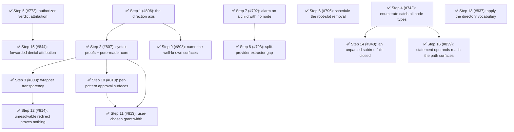

# Phase 14: The capability axis

## Findings (planned 2026-08-24)

The declared candidate is [ADR-0013](../../decisions/0013-permission-policy-model.md), accepted 2026-08-22 and amended 2026-08-23, whose Staging section assigns its decomposition to this planning pass — the same relationship [ADR-0011](../../decisions/0011-prompt-presentation-contract.md) had to Phase 13.

The cause is a **missing axis in the policy vocabulary**: a surface names *what is touched* and never *what is done to it*.
Design principle 6 now names the repair (capability as a suffix on the surface name), but no surface, rule, or intent carries direction today, so the deterministic layer cannot distinguish a read from a write.
Everything follows from that one gap.
A user who wants to permit reading outside the working tree must permit writing there too, so they permit neither and absorb the prompt; a redirect destination is provably a write and is governed by nothing; a wrapper's inner command is provably a pure reader and is floored to `ask` anyway.
ADR 0013 §1 names it as the single defect behind eight open issues ([#706], [#680], [#620], [#698], [#472], [#604], [#603], [#686]) — eight mechanisms aimed at one missing distinction.
The measured cost is a cause-joint ~51% of current prompts: ~19% tool reads (band A), ~19% provable bash reads (band B), ~13% floored pure-readers.

Phase 14 takes staging slices 1–3, with slice 2 split so that wrapper transparency depends only on the audited core and not on the user-declaration machinery.
Slices 4–7 (redirect projection [#609], blame threading, the sandbox seam [#802], structured bash rules [#804]) are Phase 15's spine.

Corroboration (fallow + sweeps, 2026-08-24): health 78 (B), dead code 0, duplication 0.1% (the two known clone groups, unchanged).
The health score fell from the 88 (A) recorded at Phase 13's archive on a new `hotspots -10.0` deduction; ~40 commits landed on the package in the six days after archiving ([#699], [#786], [#787], [#789], [#794], [#639]), which is a churn-window artifact rather than new structural debt — no other deduction moved and the coupling deduction improved.
The repeated-discriminator sweep found no new family: the survivors are validation-edge `typeof` guards, per-node AST dispatch, and gate-outcome dispatch at a single site, idiomatic per the taxonomy.
The `value-guards.ts` refactoring target remains rejected (healthy high-fan-in leaf, 17 LOC).

The craftsmanship scout **refuted all five** fallow large-function flags on test files — each is a nested tree of small behavior-named tests, with no over-mocking, implementation-coupled assertions, or fused arrange/act/assert.
It found one concentrated production cluster, and it sits inside the files this phase already rewrites: `handlers/gates/bash-path.ts` inlines a token-classification loop its two sibling gates extracted into `external-directory-policy.ts`, `handlers/gates/runner.ts`'s `runDescriptor` carries six numbered phases in one 172-line method, and `rule.ts:143` stacks a stale duplicate doc comment describing a different function.
All three ride Steps 1–2 as tidy-first prep commits rather than earning a step.
The scout explicitly cleared `src/index.ts` (the 292-line composition-root factory and top hotspot at 17.1): its two forward-declared `let`s exist to satisfy a circular closure, so splitting it would fight the requirement for no readability gain.
The one recorded deferred tidying (`test/service.test.ts`'s thrice-repeated root-slot `afterEach`) stays deferred as scattered trivia.

Directory check: every module this phase creates belongs to an existing domain directory (`access-intent/bash/`, `handlers/gates/`, `authority/`), and the root-level files it edits (`normalize.ts`, `config-schema.ts`, `rule.ts`, `permission-manager.ts`) are amended rather than rewritten, so they stay put per the convention recorded at the time — grow a domain directory in the phase that rewrites its files, never as a big-bang move.
Step 13 superseded that convention; see [Directory vocabulary](../architecture.md#directory-vocabulary).
Step 1 added one root-level module the check did not anticipate, `restrictiveness.ts`, relocated out of `handlers/gates/` because the core-layer resolver may not import from `handlers/`; it has no domain directory to belong to.

Trajectory: Phase 12's maximum step priority was 20 and Phase 13's was 20; this phase's is 20 (Step 3).
No decline, so the regular improvement rotation continues.

### Open-issue sweep dispositions

- [#837] — filed by the [#724] retrospective (a `pi-subagents` issue); adopted as Step 13 by operator decision. 62 of 147 `src` files sit at the package root while the directories most of them belong in already exist, and past phases reorganized inconsistently because no target layout was ever written down.
  Folded in here rather than deferred because the phase already carries disruptive work; the move itself is non-breaking, since `service.ts` is the only path-reachable export and nothing imports a deep path.
- [#806] and [#807] — filed for Steps 1 and 2, the two staging slices with no pre-existing issue.
- [#808] — filed by Step 1's planning; adopted as Step 9.
  Step 1 converts `permissionSchema` to a named-property object so the four directional keys carry their own documentation, which leaves the five surfaces people actually write anonymous under `additionalProperties`; closing that asymmetry is a peer-sized piece of the same config-schema surface.
- [#810] — filed by Step 2's planning; adopted as Step 10.
  Step 2 narrows a bash session grant to the direction its gate proved, but `SessionApproval` carries one surface for all its patterns, so a mixed-direction command still records on the bare family.
  Closing that gap touches the forwarded-approval wire, which Step 2 deliberately keeps out of its scope.
- [#813] — filed by Step 2's implementation; adopted as Step 11.
  Step 2's narrowing costs a second prompt in the read-after-write flow, and relieving it is a prompt affordance rather than a reshape of `SessionApproval`, so it stands as its own step beside Step 10 rather than inside it.
- [#803] — adopted as Step 3 (wrapper transparency, ADR 0013 §11 and staging slice 3).
- [#814] — filed by Step 3's implementation; adopted as Step 12.
  Step 3 extracts the `file_redirect` reading into its own module, and writing that module's first direct tests exposed a defect in the operator proof Step 2 shipped — so the correction lands against the surface this phase created rather than waiting for Phase 15's redirect slice ([#609]) to reopen the same file.
- [#742] — adopted as Step 4, having been swept out of Phase 13 as "a strong candidate for the next phase's spine".
  ADR 0013 §10 recasts it as a combinator clause of the verdict fold rather than a patch, so fixing it now is the fold's first clause.
- [#772] — adopted as Step 5; filed by Phase 13 Step 10's implementation and non-gating since.
- [#844] — filed by Step 5's planning; adopted as Step 15 by operator decision.
  Step 5's scope gate fixed the bus event for every decider and the agent-facing text for the `authorizer` arm only, leaving a forwarded denial the parent's rule or a gate error decided still rendered to the child's agent as the user's.
  It stands beside Step 5 rather than inside it because its hard half is an ADR 0011 §6 disclosure question — whether the parent's pattern and origin may reach the requesting agent at all — rather than the mapping Step 5 settles.
- [#796] — adopted as Step 6; its deferral trigger (the last known downstream migrating) fired during [#788]'s ship.
- [#792] and [#793] — adopted as Steps 7 and 8, the two ADR 0012 decision-6 residuals filed with [#789].
- [#799] — deferred with recorded rationale (user composition decision): the channel ADR is deliberative design budget that would compete with the capability axis for the same planning attention, and ADR 0013 §9 has already written its input constraints so nothing decays by waiting.
  It stays the strongest non-code candidate for Phase 15, and PRs [#675], [#692], and [#638] remain blocked on it.
- [#609] — deferred to Phase 15 as staging slice 4; it is a consequence of this phase's axis rather than its motivation (ADR 0013 §1), and it carries the phase's only breaking change, which does not belong in the same release as the axis that must be non-breaking by construction.
- [#840] — filed by Step 4's planning; adopted as Step 14 by operator decision.
- [#861] — filed by Step 8's planning; deferred to a later phase with recorded rationale.
  A locally-adjudicating child skips a configured chain link whose provider did not load there, which shares Steps 7 and 8's cause (a node's machinery is whatever happened to load in it) but not their remedy: Step 8's amendment is scoped so it cannot reach the authority registries, and inheriting a link would run authority the operator's own exclusion removed.
  Deferred rather than adopted because its hard half is a design question — whether the fail-safe skip is the correct resolution of two contradictory operator instructions — and that is the same deliberation budget [#799] was deferred for.
  Nothing decays by waiting: the skip is fail-to-human, so a human still decides every affected ask, where Steps 7 and 8 leave a call gated by nobody.
  Step 4 settled that an `ERROR` node is emitted whole and never descended, which leaves ADR 0013 §10's fail-closed clause the one part of that section still unwritten.
  Step 14 wrote it, and measured that the emitted blob is not the population that matters: 0 of 5269 real commands emit one, while the 2 that fail to parse drop a command from enumeration altogether.
  It stands beside Step 4 rather than inside it because the floor lives in the verdict fold (`bash-command.ts`) rather than the enumerator, and because Step 4 is otherwise a zero-prompt hardening change while this one newly prompts.
- [#839] — filed by Step 4's planning; deferred to Phase 15, then adopted as Step 16 by operator decision.
  Step 4's planning measured the whole nested-command bypass family and found one member that is not a command at all: a path named directly as a `for`/`select` operand or a `case` subject is a child of the statement node, so the path collector — which reads text only from `command` and `file_redirect` nodes — never sees it.
  The original deferral reasoned that Step 4 and its `command_name`-position half change zero path candidates across 4276 real commands, while this one newly asks on `external_directory`, so it did not belong in the same release as an axis that must be non-breaking by construction.
  That reason expired rather than being overruled: the capability-axis batch shipped long ago, so there is no longer a release for it to contaminate, and it ships alone as a `fix!:`.
  The remaining half of the rationale — that it reopens `token-collection.ts`, which Phase 15's redirect slice returns to — argues for landing it *before* that slice rather than after, since the slice would otherwise inherit an unclosed fail-open in the file it rewrites.
- [#875] — filed by Step 14's planning; deferred to a later phase with recorded rationale.
  It is Step 14's own residual, and the part the verdict floor structurally cannot reach: a heredoc redirect combined with `2>&1` and a pipe drops the piped command from enumeration entirely, so a `bash:` deny on it is never consulted and Step 14 can only convert the resulting silence into a prompt.
  Deferred rather than adopted because none of its three candidate fixes is a verdict-fold question — an upstream grammar fix with no lever today (`tree-sitter-bash` is at 0.25.1, npm's latest), a heredoc pre-pass that introduces a second notion of what a bash program is, or an ADR 0013 §10 amendment to hard-deny an unresolved parse.
  Nothing decays by waiting: after Step 14 a human sees the whole command line, including the text the parse dropped, and decides.
- [#868] — filed by Step 9's planning; deferred to a later phase with recorded rationale.
  It shares Step 9's file, defect class (Category F), and clearing mechanism — the `authorizerChain` array element carries no `description`/`markdownDescription`, so the one cursor position where a link name is typed completes and hovers nothing — but not Step 9's parentage.
  Step 9 exists because Step 1 created its asymmetry; this gap has been there since `authorizerChain` was added, no Phase 14 step touches the field, and the capability axis has no bearing on it.
  Nothing decays by waiting, and Phase 15 reopens the same file.
- [#802] and [#804] — deferred to Phase 15 as staging slices 6 and 7.
- [#620] — deferred with recorded rationale (explicit user decision; third consecutive phase).
  Not a silent re-defer: ADR 0013 §7 **narrows its charter** rather than parking it — the classifier now answers the provable slice at zero tokens, so the chain is no longer the only path to read relief and keeps only what genuinely needs judgment.
  Scheduling it this phase would contend for the same bash-surface files as Steps 2 and 3.
  [#698] and [#706] fold into it when it is scheduled.
- [#519] — deferred with recorded rationale (explicit user decision): still externally blocked on Pi SDK `UIContext` evolution, with no in-repo work that unblocks it.
  It closes or schedules when the SDK ships the capability.
- [#751] — deferred with recorded rationale (explicit user decision; second phase).
  It is the last residual of ADR 0011 §4's reachable-complete-view contract and remains small and self-contained, so it stays a cheap independent candidate for any later phase.
- [#797] — the package's only open `bug`, and not planned as a step (explicit user decision).
  `officecli set data.xlsx /Sheet1/B1` passes a spreadsheet cell reference shaped exactly like an absolute path, and ADR 0009 gates an absolute bash token by shape rather than existence — deliberately, because a nonexistent absolute destination is still a write target.
  No deterministic classifier separates the two, so the answer is a config recipe (`external_directory: {"/Sheet1/*": "allow"}`) rather than a mechanism.
  This phase answers the issue with that recipe.
- [#815] — a third-party report that a partially permissive surface (`bash: {"*": "deny", "git *": "ask"}`) hides the tool outright; out of scope for the roadmap and fixed independently.
  No Phase 14 step names `permission-manager.ts`'s tool-level query or `handlers/before-agent-start.ts`, and the capability axis has no bearing on which question tool exposure asks.
- [#821] — a third-party fail-open report (a bracket-glob path token is dropped before any gate sees it); out of scope for the roadmap and fixed independently.
  No Phase 14 step names `access-intent/bash/token-classification.ts`, and the fix is a prelude deletion that ships on its own release.
- [#822] — filed by [#821]'s planning; deferred to a later phase with recorded rationale.
  Gating a glob token by its expansions rather than its literal text is ADR 0009 projection completeness, and it belongs beside the sandbox seam ([#802]) and [#686] in Phase 15 — a sandbox would subsume static expansion, so building the expansion mechanism ahead of that seam risks replacing it immediately.
- [#823] — filed by [#821]'s pre-completion review; out of scope for the roadmap and fixed independently (explicit user decision), and now shipped.
  Its first framing as a false positive was wrong: three flag spellings stop the pattern-first walker from learning the script was supplied — an `=`-embedded long flag, a glued short flag, and the everyday `-A 3` numeric argument, which tree-sitter types `number` — so the walker eats the command's first real operand and `grep -A 3 pattern /etc/passwd` reaches no path surface, a fail-open predating [#821] and untouched by it.
  Recorded here rather than adopted as a step because it is an ordinary bug against `token-collection.ts`, not part of the capability axis; the initial deferral was revised once the bypass half was measured.
- [#735] scenario 2 and [#722] — unchanged from Phase 13: a parent whose turn is occupied stays with the [#722] diagnosis.
- [#762] — out of scope: the `pkg:pi-permission-system` label is contextual and the body targets `pi-autoformat`'s own config-path resolution.
- [#780] — deferred: two ADRs recording the conservative-defaults and outbound-bridge boundaries; documentation work with no dependency on this phase, and the phase's ADR budget is already spent on ADR 0013's implementation.
- Feature issues [#736], [#720], [#691], [#688], [#687], [#686], [#680], [#658], [#654], [#648], [#604], [#603], [#472] — out of scope for a structural phase.
  Eight of them are named by ADR 0013 §1 as aimed at this phase's cause, so the axis narrows what each of them still has to ask for; none is closed by it outright.
- [#874] — filed by [#733]'s planning (a `pi-subagents` issue); out of scope for the roadmap (explicit user decision).
  `config-modal.ts` is one of the repo's only two `ui.custom(..., { overlay: true })` call sites, and Pi's regular-mode compositor writes overlay chrome into the buffer that backs scrollback.
  No Phase 14 step names `config-modal.ts`, and the capability axis has no bearing on how a settings modal is mounted.
  Its exposure is far lower than [#733]'s — smearing needs the buffer to grow while the overlay is open — and its fix is a different design question, because the modal asks for a fixed 82-column width that the non-overlay path does not offer.
- [#879] — filed by Step 13's ship; out of scope for the roadmap (explicit user decision).
  `rumdl` caches per markdown file keyed on that file's own content while `MD057` depends on the surrounding filesystem, so Step 13's moves left four links in [#815]'s plan doc cached as clean and CI caught them only on a fresh checkout.
  It is `scope:repo` lint tooling at the repository root affecting every package, and shares no mechanism with the capability axis; Step 13 is where it surfaced, not what caused it.
- [#873] — out of scope for the roadmap and fixed independently.
  The `ToolSurfaceBaseline` monotonic-shrink bug (a tool denied on one turn stayed removed after its rule was relaxed) is a tool-exposure lifecycle defect, not a capability-axis question; no Phase 14 step names `tool-surface-baseline.ts` or `resolveExposedTools`.
- [#863] and [#859] — deferred to a later phase with recorded rationale, the same disposition [#822] received; 1st consecutive sweep.
  All three are ADR 0009 classifier false positives — a token that is not a path reaches the `external_directory` gate (a `node -e` inline script's leading `//` comment, a git revision range's `..`, a bracket glob's literal text) — so they raise spurious asks, which is the prompt-volume cause ADR 0013 measures rather than a defect unrelated to it.
  Out of scope for *this* phase because no Phase 14 step names `token-classification.ts`, and the capability axis decides what a surface may permit rather than which tokens reach one.
  They belong beside [#822] in Phase 15's projection-completeness work.
- [#860] — out of scope: a third-party host integration crash (`omp`), unrelated to the capability axis.
- [#856] — out of scope for a structural phase: a JSONC config-format enhancement request, the same bucket as the Feature issues bullet above.

## Health metrics

| Metric                                                                      | Baseline (2026-08-24) | Phase 14 target |
| --------------------------------------------------------------------------- | --------------------- | --------------- |
| Directional surface-family vocabulary in `path-surfaces.ts`                 | 0                     | ≥ 5             |
| Directional keys in `config-schema.ts`                                      | 0                     | ≥ 2             |
| Sugar-expansion site in `normalize.ts`                                      | 0                     | ≥ 1             |
| Family-resolved delegation exclusion (`delegation-envelope.ts`)             | 0                     | ≥ 1             |
| Effect-vocabulary module present (`access-intent/bash/command-effects.ts`)  | 0                     | 1               |
| Pure-reader core words in `command-effects.ts`                              | 0                     | ≥ 20            |
| Wrapper-transparency predicate (`wrapper-analysis.ts`)                      | 0                     | ≥ 1             |
| Nested-execution descent sites in the command enumerator                    | 3                     | ≥ 4             |
| Authorizer resolution values in `permission-events.ts`                      | 0                     | 2               |
| ADR 0012 amendments recording the root-slot decision ✅                     | 2                     | ≥ 3 (3)         |
| Absent-child alarm event in `src/`                                          | 0                     | ≥ 1             |
| Named permission-surface properties (`surfaceProperty`, `config-schema.ts`) | 0                     | ≥ 9 (11) ✅     |
| Per-pattern surfaces on `SessionApproval` (`session-approval.ts`) ✅        | 0                     | ≥ 1 (4)         |
| Split-provider extractor test files                                         | 0                     | ≥ 1             |
| Statement-operand collection in `token-collection.ts` ✅                    | 0                     | ≥ 2 (2)         |
| fallow health score                                                         | 78 (B)                | ≥ 78            |
| Production duplication                                                      | 0.1%                  | ≤ 0.2%          |
| Dead exports                                                                | 0                     | 0               |

Recompute commands (run from the repo root):

- Directional family vocabulary: `grep -cE 'DIRECTIONAL_FAMILIES|CAPABILITY_SUFFIXES|surfaceFamilyOf|surfaceFamilyMembers|capabilitySurfaceForTool' packages/pi-permission-system/src/access-intent/path-surfaces.ts`
  (Step 1 derives the four names from a family set and a suffix list rather than spelling them out, so each appears exactly once in the codebase and a literal-name count reads zero by design.)
- Directional schema keys: `grep -cE 'path_read|path_write' packages/pi-permission-system/src/config/config-schema.ts`
- Sugar expansion: `grep -c 'expandDirectionalSugar' packages/pi-permission-system/src/policy/normalize.ts`
- Family exclusion: `grep -c 'surfaceFamily' packages/pi-permission-system/src/authority/delegation-envelope.ts`
- Effect module: `ls packages/pi-permission-system/src/access-intent/bash | grep -c 'command-effects'`
- Wrapper predicate: `grep -c 'isTransparentWrapper' packages/pi-permission-system/src/access-intent/bash/wrapper-analysis.ts`
- Enumerator descent: `grep -c 'collectHostedCommands' packages/pi-permission-system/src/access-intent/bash/command-enumeration.ts`
- Authorizer resolutions: `grep -cE 'authorizer_allowed|authorizer_denied' packages/pi-permission-system/src/service/permission-events.ts`
- ADR 0012 amendments: `grep -c '#### Amendment' packages/pi-permission-system/docs/decisions/0012-cross-node-extension-contract.md`
- Absent-child alarm: `grep -rn 'child_node_absent' packages/pi-permission-system/src --include="*.ts" | wc -l`
- Named surface properties: `grep -c 'surfaceProperty' packages/pi-permission-system/src/config/config-schema.ts`
- Split-provider tests: `grep -rl 'split-provider' packages/pi-permission-system/test | wc -l`
- Statement-operand collection: `grep -cE 'for_statement|case_statement' packages/pi-permission-system/src/access-intent/bash/token-collection.ts`
  (Added with Step 16, which the phase did not carry when it opened; the baseline was verified 0 at the step's planning time.)
- Per-pattern approval surfaces: `grep -c 'ApprovalGrant' packages/pi-permission-system/src/session/session-approval.ts`
  (Step 10 named the pair type `ApprovalGrant` rather than the roadmap's predicted `ApprovalPattern`, which names a `{surface, pattern}` object after one of its two fields; the row moves with the name, per the clause below.)
- Health/duplication/dead exports: `pnpm fallow health --score --workspace @gotgenes/pi-permission-system` / `pnpm fallow dupes --workspace @gotgenes/pi-permission-system` / `pnpm fallow dead-code --workspace @gotgenes/pi-permission-system`

Eight rows greped for a name the phase had not created when it opened — `expandDirectionalSugar`, `surfaceFamily`, `command-effects.ts`, `isTransparentWrapper`, `authorizer_allowed`/`authorizer_denied`, `child_node_absent`, the `split-provider` test phrase, and `surfaceProperty`.
The step that creates each (Steps 1, 1, 2, 3, 5, 7, 8, 9 respectively) must either use the roadmap's name or update the metric row in the same commit, or the rename silently breaks the delivered-vs-predicted verification at phase close.
Step 1 exercised that clause: it created `expandDirectionalSugar` and `surfaceFamily` under their predicted names, and rewrote the directional-surface row, whose literal-name grep the delivered derivation reads as zero.
Step 10 exercised it again, renaming `ApprovalPattern` to `ApprovalGrant`.
The fallow health score is carried as a floor rather than a target: it is blind to the type-level wins a cause-driven phase produces, and its current value is depressed by a churn artifact this phase does not set out to fix.

## Steps

### ✅ Step 1: The direction axis — `path_read`, `path_write`, and their boundary twins ([#806])

**Cause:** the policy vocabulary names the object of an access and never its capability, so no rule can say *this is only a read, so it is fine* — the missing axis itself, expressed as config.

- **Smell:** Category C (a distinction the domain requires has no representation).
- **Target:** `src/config/config-schema.ts` (the four directional keys, with `pnpm run gen:schema`), `src/policy/normalize.ts` (`expandDirectionalSugar` — bare `path` / `external_directory` expand into both directions at load, sugar entries inserted first and explicit directional entries appended after, regardless of textual key order, per ADR 0013 §4), `src/access-intent/path-surfaces.ts` (`PATH_SURFACES` gains the four names so win32 folding and the manager's path handling follow), `src/authority/delegation-envelope.ts` (`DELEGATION_EXCLUDED_SURFACES` becomes a surface-**family** test, not literal membership), the path gates in `src/handlers/gates/` (a tool-surface access has a known direction — `READ_ONLY_PATH_BEARING_TOOLS` proves the read, `write`/`edit` prove the write — while a bash token stays unknown and consults **both** directional surfaces, most-restrictive, per §10's base case), plus `config/config.example.json`, `docs/configuration.md`, and `README.md`.
  Tidy-first prep commits: relocate the restrictiveness ordering out of `handlers/gates/` so the core-layer resolver can fold with it, and restore the orphaned doc comment above `evaluateFirst` in `rule.ts`.
  The roadmap's earlier prep suggestion — extracting `selectUncoveredPathCandidates` in `handlers/gates/bash-path.ts` — was dropped: under the delivered design that file has no diff, so Tidy First's own rule excludes it.
  It is left for Step 2, which rewrites the file for per-token effects.
- **Ordering constraint:** the family-membership conversion must land in the **same commit** as the new surface names.
  A directional key reaching an authorizer link ahead of it is a silent widening of the bounded-delegation envelope (ADR 0013 §4).
- **Outcome:** direction is expressible; every existing config expands to its current meaning exactly, so nothing prompts differently on upgrade; band A (~19% of current asks) becomes relievable by one directional grant.
  The four metrics above move off zero.
- **Landed:** the family fold sits in `PermissionResolver.resolve`, not in the gates.
  Tracing the readers of a bare-surface query found three the Target line above had not: the cross-extension policy query, the `PermissionQuery` injected into every authorizer link, and — the load-bearing one — the recorded-authority view a serving node resolves a **forwarded child request** against.
  A gate-side fold leaves that last reader resolving an emptied surface, so a parent's recorded `path` deny would stop hard-denying a child's request and escalate it to an approvable prompt ([#712]'s defect class).
  Both bash path gates therefore needed no *routing* diff — they still resolve on the bare family surface, and `bash-external-directory.ts` is untouched; `bash-path.ts` changed only to name that surface on the ask payload, which became a required fact.
  The tool-identity attribution table and the two consequences of the independent-bits reading are recorded in ADR 0013's 2026-08-25 amendment.
- **Commit type:** `feat:`.
- **Impact 5 / Risk 3 / Priority 15.**

Release: batch "capability-axis"

### ✅ Step 2: Effect attribution — syntax proofs and the built-in pure-reader core ([#807])

**Cause:** the same missing axis, one layer down: even with directional surfaces, a bash path token has no effect to attribute, so every token falls to the fail-closed both-surfaces base case and the axis relieves nothing on the bash surface.

- **Smell:** Category C (a fact the parse tree already establishes is discarded before the gate).
- **Target:** new `src/access-intent/bash/command-effects.ts` (the `Effect` vocabulary — `read`, `write`, with `delete` reserved — and the frozen, package-audited pure-reader core, matched as bare basenames only, with `find`'s retraction guard on `-exec`/`-execdir`/`-ok`/`-okdir`/`-delete`); `src/access-intent/bash/token-collection.ts` and `bash-path-resolver.ts` attribute an effect per **token**, not per command, so `cat ~/a | tee ~/b` reads `~/a` and writes `~/b` in one unit; `src/handlers/gates/bash-path.ts` and `bash-external-directory.ts` route a proven-effect token to that effect's surfaces and an unproven one to both.
  Syntax proofs are absolute and unretractable: an output redirect destination is a write, an input redirect is a read, and `2>&1` is not a file access.
  Tidy-first prep commit: split `runDescriptor`'s six numbered phases in `handlers/gates/runner.ts` into private methods before this step extends that dispatch.
- **Constraint:** the core is frozen, always active, and not user-removable; a user who distrusts `cat` is served by the ask-everything fallback, not by removal machinery.
  Admission is argument-independence across GNU and BSD alike, which is what keeps this from being the package-maintained fail-open command table ADR 0009 rejected.
- **Outcome:** band B (~19% of current asks) becomes relievable by a directional read grant; the review log records which source classified a unit (syntax or core), so a surprising allow is auditable to the line that produced it.
- **Commit type:** `refactor:` (hidden — ships in the same release as Steps 1 and 3).
- **Impact 5 / Risk 3 / Priority 15.**

Landed: the vocabulary split across `access-intent/effect.ts` (core-layer, so `path-surfaces.ts` can consume it) and `access-intent/bash/command-effects.ts` (the bash-specific proofs), rather than the single module the step sketched.
`EffectSource` gained a fourth value, `retracted`, so "nobody claimed anything about `pnpm`" and "`find` is core and `-delete` withdrew the claim" read as different diagnoses.
The roster shipped at 21 words with guards on `find`, `fd`, and `sort` — the plan's 22nd, `file`, was dropped in pre-completion review because `-C`/`--compile` writes a `magic.mgc` file, so it failed the roster's own bar.
Measured against the local review log by `scripts/measure-core-coverage.mjs` (2026-08-27: 804 bash asks, 230 recent), every unit head word is in the core for **23.0% of recent asks and 35.9% of all-time**.
The plan's 27.9%/36.9% came from a scan that had not applied the retraction guards; with them applied the recent figure is ~6 points lower, and all 14 asks the guards exclude are `find … -exec <core reader> {} +` — already floored to `ask` by the indirection wrapper, and therefore Step 3's population rather than relief this step forfeits.
Dropping `file` moved neither figure: it appears in one ask out of 804.
The `runDescriptor` tidy-first prep was dropped: provenance rides in each gate's `logContext`, which the runner already spreads, so `runner.ts` has zero diff and Tidy First's own rule excludes it.
Narrowing the session grant to the proven direction costs a second prompt in the read-after-write flow; that is [#813], adopted as Step 11.

Release: batch "capability-axis"

### ✅ Step 3: Wrapper transparency — argument-independence defeats the floor's reason ([#803])

**Cause:** the indirection floor guards unknowability of *scope*, but it is applied as if it guarded unknowability of *direction* — so `xargs grep -l foo` is forced to `ask` even though no arguments exist that make `grep` write a file.
The floor's reason does not hold for the one class the core is defined by.

- **Smell:** Category C (a guard whose trigger is wider than its justification), with the largest measured symptom in the record: floored prompts are 27–28% of all prompts in the two most recent months, 40–55% of them with a pure-reader inner command.
- **Target:** `src/access-intent/bash/wrapper-analysis.ts` (`isTransparentWrapper` — the executed inner unit's head is a bare-basename core word and the unit carries no real output redirect), consumed by `src/handlers/gates/bash-command.ts` so a transparent wrapper resolves by the inner command's own rules instead of the `WRAPPER_SENTINEL` synthetic `ask`.
- **Constraint:** everything else keeps the floor untouched — interpreters, `bash -c`/`eval` opaque payloads, mutators, and any wrapper whose inner command is unresolvable (`executedUnitOf` fails to `null`, and that discipline is retained). v1 exempts on the **built-in core only**: a user `commandEffects` declaration participates in classification but does not lift the floor, because a user's argument-independence claim fails open behind a wrapper.
  An explicit `deny`/`ask` on the wrapper unit is never weakened.
- **Outcome:** `xargs grep -l foo` under a matching `bash` allow stops prompting while `xargs rm`, `xargs sed`, `time pnpm test`, and `find -exec sh -c '…' \;` still do; ~13% of current prompt volume relieved, the single largest deterministic relief in ADR 0013.
- **Commit type:** `fix:` — the release vehicle for batch "capability-axis".
- **Impact 5 / Risk 2 / Priority 20.**

Landed: measured by `scripts/measure-wrapper-transparency.mjs` (2026-08-27), wrapper-floored asks are 91 of 328 prompts across 2026-07 and 2026-08 (27.7%) and 43 of them are relieved — 13.1% of all prompts, 47.3% of floored ones.
That script also prices each conservative clause, so no figure here rests on prose: dropping the opaque-payload refusal would relieve 6 more asks, and the redirect clause and the rejected `sudo`/`doas` carve-out cost 0 each.
The predicate could not be built on `executedUnitOf`, which the step's Target line named: it unwraps *through* an opaque payload by design, so `xargs -I{} sh -c 'grep -l x {}'` names `grep -l x {}` and a predicate reading that string would exempt an unparsed shell program.
The two functions share one `unwrapIndirection` walk and part company at the opaque layer instead.
Core *membership* was likewise the wrong test — `xargs sort -o /tmp/x` has a core head word and writes — so the predicate proves the inner command through `proveCommandEffect` and inherits Step 2's retraction guards behind the wrapper.
The verdict is the inner command's own rule rather than a lifted floor, so a `deny` on the inner command now reaches the wrapper, which the floor had softened to a prompt.
`sudo`/`doas` are ordinary wrappers by explicit decision: the path surfaces gate `sudo cat X` exactly as `cat X`, modelling OS refusal would be a principal axis this package has nowhere else, and `bash: {"sudo *": "ask"}` settles it in one line (shipped as a `docs/configuration.md` recipe; measured cost of the rejected carve-out: 0 asks).
The redirect fact needed a new `redirect-analysis.ts` owner, since tree-sitter-bash hangs `file_redirect` off the parent statement and `TSNode` exposes no parent; giving it one surfaced [#814], adopted as Step 12.
That owner answers the exemption with a **refusal** rather than a write proof, which pre-completion review established the hard way: the first implementation reused the token collector's `ARG_NODE_TYPES` filter, so `xargs grep foo > $OUT`, `>${OUT}`, and `> $(mktemp)` were exempted — a real write to a run-time-chosen path, and the one shape the path projection does not collect either ([#609]), so the floor had been its only guard.
The audit fact rides the gate's `logContext` rather than `PromptRequestFacts`, leaving that published contract untouched.

Release: batch "capability-axis"

### ✅ Step 4: Enumerate commands in every catch-all node type ([#742])

**Cause:** the command enumerator answers "is this node a command?"
and "can this node host one?"
correctly for redirects and heredocs since [#741], but its catch-all branch still emits any other named statement whole without descending — so a command inside an `if` body, a `declaration_command`, a `test_command`, or an `unset_command` is matched against the bash rules only as part of the enclosing string, and an `rm *` deny never fires.
This is the last member of the [#306] / [#741] nested-command bypass family, and ADR 0013 §10 recasts it as a combinator clause ("any unhandled node type: fail closed") rather than a patch.

- **Smell:** Category C (a boundary flaw with a user-visible bypass).
- **Target:** `src/access-intent/bash/command-enumeration.ts`'s catch-all branch descends for nested executions through the existing `forEachNestedExecution` / `EXECUTION_HOST_TYPES` seam in `nested-execution.ts` rather than adding a third traversal; control-flow conditions and bodies, function definitions, `declaration_command`, `test_command`, `unset_command`, and `variable_assignment` all reach the command surface.
  The path surface already handles most of these, so this closes an asymmetry rather than opening a surface.
- **Design question the step must settle:** a control-flow body runs in the current shell, so it has no distinct execution context to tag — whether it emits with no `context` (like a top-level chain member) or earns a `BashCommandContext` variant is a prompt-quality decision, since `context` is what explains *why* a nested command was gated.
- **Outcome:** `if true; then rm y; fi` resolves `deny` under an `rm *` rule; the enclosing statement is still emitted whole, so the change can only ever be more restrictive, never weaker; `grep -c 'collectHostedCommands'` in the enumerator goes 3 → ≥ 4.
- **Commit type:** `fix:`.
- **Impact 4 / Risk 2 / Priority 16.**

Landed: the enumerator gained the third question the step's Target sketched as a catch-all descent, because a blanket descent was measurably wrong.
A compound statement's named children are a mix of statements and operand words, so descending all of them emitted `for` word-list entries, `case` subjects, and function names as bash command units — never weaker, but a prompt naming a package as the offending *command* is wrong on its face.
The answer is `STATEMENT_TYPES` plus a filtered `descendStatementChildren`, beside `COMPOUND_STATEMENT_TYPES` (emitted whole, then descended) and `STATEMENT_GROUP_TYPES` (`do_group` / `case_item` / `elif_clause` / `else_clause` — descended, never emitted).
A non-statement child is still searched for the executions it hosts, which is what reaches `for f in $(rm x)`.
`grep -c 'collectHostedCommands'` in the enumerator is 5.

The step's design question settled as no new `BashCommandContext` variant: a control-flow body runs in the current shell, so it has no distinct execution context to name, and the enum is validated by `BASH_COMMAND_CONTEXTS` in a tolerant reader an older serving node uses on a forwarded request (ADR 0012), which an unknown value would make reject the whole payload.
An `ERROR` node's recovered structure is deliberately not descended — tree-sitter *invents* it, so an unterminated heredoc's backtick-quoted prose parses as commands — which made the unparsed blob a first-class unit and left ADR 0013 §10's fail-closed clause to [#840], where the floor is keyed on the parse's health rather than on that blob.
The scope relays unchanged into a compound statement, so [#803]'s floor exemption is still withheld from every wrapper under a write-establishing redirect.

The path surface's matching hole closed in the same change: both token walkers skipped a `command_name` and a `variable_assignment` child without searching them, so a substitution in either prefix position projected no candidate at all while the same substitution in argument position always did.
Measured by `scripts/measure-statement-descent.mjs` (2026-08-29) over 4348 intact local review-log commands, 191 (4.4%) gain command units (+842).
Eleven of those added units carry a wrapper head and floor `allow` to `ask` through the pre-existing wrapper floor; none newly denies, and no user needs to edit config.
The same run reports **zero** commands carrying a prefix-position substitution, which bounds the path half's blast radius from above — `pathRuleCandidates()` and `externalAccesses()` change on no command in the log, re-derivable without checking out the pre-change source.

Release: independent

### ✅ Step 5: An authorizer link's verdict is attributed to the link, not the human ([#772])

**Cause:** `deriveResolution` maps an `ask` gate resolved to `allow` onto `user_approved` unless a session approval or the yolo flag explains it, and the chain runs inside `AskEscalator.escalate` where the runner never learns which link answered — so the one fact [#726] added everywhere else (who decided) is discarded at exactly the collection point that already captures `autoApproved` and `confirmationUnavailable`.
The review log is correct; the bus event is the single record that mis-attributes.

- **Smell:** Category C (a fact established at the decision point dies before one of its two consumers), the same shape as Phase 13 Steps 6 and 9.
- **Target:** `src/service/permission-events.ts` gains `authorizer_allowed` / `authorizer_denied` on `PermissionDecisionResolution`; `src/handlers/gates/runner.ts` reads `decision.decidedBy.kind` at the same point in `runDescriptor` that already reads the other two flags; `src/handlers/gates/helpers.ts`'s `deriveResolution` branches on it.
- **Note:** this changes the `resolution` an existing local decision reports rather than only adding a value, so whether it warrants a major bump is part of the step's decision — it is not additive the way [#752] was.
- **Outcome:** a consumer can distinguish "the operator approved this" from "a policy extension approved this" on the bus, matching what the review log has recorded since [#726]; `grep -cE 'authorizer_allowed|authorizer_denied'` goes 0 → 2.
- **Commit type:** `feat!:` — the operator settled the bump note as breaking.
- **Impact 3 / Risk 1 / Priority 15.**

Landed: the branch the Target line sketched became a total mapping, because counting the log found the larger half of the defect.
Across 12,281 review-log lines every terminal entry written since [#726], 13 carry an `authorizer` decider — and 68 carry a `forwarded` one, of which 57 were decided by a **rule in the parent session** and broadcast as the operator's approval.
So `deriveResolution` and `forwarded-request-server.ts`'s `servedResolution` both dissolved into one `resolutionFor(decidedBy, outcome)` (`authority/decision-resolution.ts`) over an exhaustive switch, fed by `effectiveDecider` (`authority/decision-source.ts`), which unwraps a `forwarded` hop to the decider inside the responding session.
The two parallel derivations are gone; a decider variant added later is a compile error at the one site.

The step's own bump note settled as breaking (`feat!:`), and the agent-facing half shipped with it: `renderRefusal` dispatches the denial text on the same decider, so the reported case now reads "The 'model-judge' authorizer denied this ..." rather than attributing it to a human who never saw the prompt.
Its `rule` and `gate_error` arms were deliberately left on the user render and adopted as Step 15 ([#844]) — the serving session's pattern and origin are not on the child's payload, so naming a rule there would name the child's own ask rule, and whether those facts may cross the hop is an ADR 0011 §6 disclosure question.

Two findings the plan did not predict.
`PermissionGateResult` gained a `decidedBy` on both arms: the plan had `runDescriptor` capture the escalated decision in a closure variable, which TypeScript narrows to its initializer because the assignment inside the callback is invisible to control-flow analysis.
The gate is the one place that knows whether recorded authority or an escalation answered, so it reports that rather than leaving the caller to reconstruct it — and the runner keeps no capture at all.
And `PermissionPromptDecision.autoApproved` turned out to have no producer in `src/` at all (yolo short-circuits ahead of escalation since [#712]), so it was removed rather than carried; the `yolo` decider is how an auto-approval names itself now.

`grep -cE 'authorizer_allowed|authorizer_denied' src/service/permission-events.ts` is 2.

Release: independent

### ✅ Step 6: Schedule the process-root service slot's removal ([#796])

**Cause:** ADR 0012 decision 7 deferred the root slot's removal on a condition — downstream migration — that has since been met, and nothing tracks it.
The deferral's trigger fired during [#788]'s ship and its only record was an Open Question in a shipped plan plus a table row, neither of which the backlog sweeps: a decision with a fired trigger and no owner.

- **Smell:** Category A (a mechanism populated every session and read by nothing), scoped as a decision rather than a removal.
- **Target:** an ADR 0012 amendment deciding three things — whether `getRootPermissionsService()` is removed in the next major or the `DEP0001` deprecation window stays open for consumers we cannot see; whether the slot should stop being **written** (`publishRootPermissionsService` in `src/service/service-lifecycle.ts`, a separate question from retiring its public reader); and what becomes of the [#302] child guard whose only remaining purpose is protecting that slot from an in-process child.
- **Outcome:** the decision is recorded where the sweep will find it rather than in a shipped plan's Open Questions; `grep -c '#### Amendment'` on ADR 0012 goes 2 → ≥ 3.
  Whether code changes in this step is the step's own decision; nothing is blocked either way.
- **Commit type:** `docs:` (hidden) — the deliverable is an ADR amendment; any code it schedules lands in a later step or a later phase.
- **Impact 2 / Risk 2 / Priority 8.**

Landed: all three questions resolved the same way — remove, stop writing, dissolve — so the step shipped code as well as the amendment.
They are not three decisions: removing the reader leaves nothing that reads the slot, and removing the write leaves the [#302] guard with nothing to guard.

The argument that closed the deprecation window is a fact about its population rather than its length.
`getRootPermissionsService` did not exist before `v27.0.0` — it is the name that release gave the old behavior when [#794] reclaimed `getPermissionsService` for the keyed locator — and that same release already broke the zero-arg spelling it replaced.
So no consumer predating the deprecation can be calling it; every possible caller adopted a symbol marked `@deprecated` at first sight, after being warned, in preference to the keyed locator the migration guide recommends.
A warning tombstone (an export answering `undefined` forever) was declined on the same reading: it would be a silent behavior change for exactly that population, and would need its own removal later.

The removal took `RegisteredChildDetector`, `SubagentDetection.isRegisteredChild`, and `PermissionServiceLifecycle`'s detection dependency with it; the pure `isRegisteredSubagentChild` stays, because `isSubagentExecutionContext` still calls it.
`PI_PERMISSION_SYSTEM_WARN0001` survives with its message rewritten — it guards a caller the type checker cannot reach, which is a live case, where `DEP0001` guarded a path that no longer exists.
`grep -c '#### Amendment'` on ADR 0012 is 3.

Release: independent

### ✅ Step 7: Alarm when a registered in-process child session has no permission node ([#792])

**Cause:** gating is node-local (ADR 0012 decision 1), so a child that loads no instance of this extension has no `tool_call` gate, no tool filtering, no `permission:` frontmatter resolution, and no ask-forwarding — and the parent's own gating is unaffected, so the operator watches the permission system work and never learns the child is unguarded.
One line of `excludedExtensionPackages` in `subagents.json` reaches that state, and so does a load failure inside the child.

- **Smell:** Category C (a policy hole that is observable to the parent node and reported by nobody).
- **Target:** the parent node already holds both signals — every in-process child session id is registered from `subagents:child:session-created`, and since [#699] every node publishes a keyed service — so a registered child that has published no keyed service by its first turn is a child with no permission node.
  The alarm writes a `child_node_absent` review-log event and a visible warning; `src/authority/subagent-registry.ts` and `src/service/service-lifecycle.ts` hold the two halves.
- **Design questions the step must settle:** where the check fires, since there is no parent-side "the child's first turn" event and the timing needs a real seam rather than a sleep; whether the parent can (or needs to) distinguish deliberate exclusion from a load failure; and whether to warn or refuse — refusing means one package overriding another's settings, which cuts against ADR 0002's separation.
- **Outcome:** an ungated child is announced rather than silent; `grep -rn 'child_node_absent' src` goes 0 → ≥ 1.
- **Commit type:** `feat:`.
- **Impact 3 / Risk 2 / Priority 12.**

Landed: the design question the step named — where the check fires — was answered by eliminating candidates against the code rather than by choosing among them.
Auditing at `disposed` is unusable because `SubagentSession.dispose()` awaits the child's `session_shutdown`, which unpublishes the keyed service, *before* emitting `disposed`; a healthy child would false-alarm.
A sweep of registered children on the parent's next `before_agent_start` is post-hoc by construction — a foreground child runs to completion inside the parent's own tool call — and is not reliably reachable either, since a completed child stays registered only until pi-subagents' interval retention sweep releases its session.
So the step's target was wrong in one respect: `subagent-registry.ts` holds no half of the alarm, because the registry cannot answer *when*.

The seam is a new **optional** `subagents:child:bound` channel in pi-subagents, emitted after `bindExtensions()` resolves — which awaits every child `session_start`, making it the first instant at which "this child published a service" is settled.
Optional rather than required so ADR 0012 decision 5's obligation stays at two events and no existing implementation becomes non-conformant; the amendment records it.
The other two questions resolved as the issue leaned: warn rather than refuse ([ADR-0002] separation), and no attempt to distinguish exclusion from a load failure, since both leave the identical absence — the message names the likelier cause and admits the other.

The two halves fire at different rates: a `child_node_absent` review entry per affected child, one visible warning per parent session.
The warn-once latch needs no re-arm hook, because the extension factory is re-invoked per session generation.
`grep -rn 'child_node_absent' src` is 1.

Release: independent

### ✅ Step 8: Close or announce the split-provider access-extractor gap ([#793])

**Cause:** ADR 0012 decision 6 names a hazard and states the contract cannot prevent it, but checked against pi-subagents' actual exclusion semantics the hazard is **narrower and sharper** than the ADR reads.
Excluding a package normally removes its tools and their extractors together, so nothing is weakened; a gap needs a **split** between providers — package A registers tool `deploy` whose path lives under `input.target`, package B registers the extractor for it, and the operator excludes B from children.
The child then gates `deploy` with no extractor, its path never reaches the child's `path` / `external_directory` gates, and the parent gates its own calls correctly, so the weakening is visible nowhere.

- **Smell:** Category C (a security surface degrading silently across a node boundary), and Category F in its cross-package half.
- **Target:** decide between the issue's two mechanisms and implement it.
  **A — child-side diagnostic:** warn once per tool name and record it when a child gates a tool whose extractor is registered in the parent node but not locally; reports the gap without closing it, needs a lookup surface `PermissionsService` does not expose today (there is a registrar, no reader), and introduces a cross-node read ADR 0012 currently limits to the forwarded ask and the serving heartbeat.
  **B — parent read-through fallback:** an in-process child's extractor lookup falls back to the parent node's registry, which makes decision 6's "riding along is harmless by construction" hold unconditionally — at the cost of an ADR 0012 decision 1 amendment distinguishing *where a registration lands* (unchanged: node-local) from *lookup fallback inside one process* (new).
  Whether that distinction is principled or a crack in the law is the thing to deliberate.
  Preview formatters split the same way but are cosmetic; only extractors are a security surface.
  Out-of-process children are out of scope for B — no shared `globalThis`, and the exclusion is in-process only.
- **Outcome:** the split-provider condition is either impossible or announced, replacing the interim by-hand check [#789] shipped in pi-subagents' `docs/configuration.md`; `grep -rl 'split-provider' test` goes 0 → ≥ 1.
- **Commit type:** `feat:` — mechanism B landed.
- **Impact 3 / Risk 2 / Priority 12.**

Landed: mechanism B, and the deliberation the step was adopted to settle resolved by finding the distinction already in ADR 0012 rather than inventing one.
A candidate framing — "capability is inherited, policy is node-local", spanning all three registries — was drafted and withdrawn: it lumped extractors, formatters, and chain links under one word, and the first two produce a **fact** while the third produces a **verdict**, which is decision 1's own axis.
The amendment therefore adds one clause to that axis (a fact-shaping registration's *lookup* may cross an in-process node boundary; where it *lands* is unchanged) instead of naming a new concept.

That correction changed the answer, not just the wording.
The all-three-registries option was not merely broader but wrong: `selectAuthorizer` tests `hasUI` first, so a subagent with its own UI adjudicates locally, and inheriting links would have run authority an operator's own `excludedExtensionPackages` removed.
The two cases also differ in declared intent — an extractor appears in no config, while a link's name is written in `authorizerChain` — so the live-authority case is a conflict to resolve rather than a capability to restore, and it is filed as [#861] and deferred.
A composition-root guard test fails if the authorizer registry is ever added to the inheriting wiring.

Two costs are recorded rather than hidden: a child is no longer explainable from the child alone (mitigated by the `extractorSource: "inherited"` stamp on every affected decision), and the repair is in-process only, since an out-of-process child shares no `globalThis` and an extractor is a closure.
The deeper root — fact-shaping intent is declared nowhere, so a node cannot statically know it is missing an extractor — is named in the amendment and deliberately left standing.

`grep -rl 'split-provider' packages/pi-permission-system/test | wc -l` is 1.

Release: independent

### ✅ Step 9: Name the well-known permission surfaces in the config schema ([#808])

**Cause:** Step 1 converts `permissionSchema` from a bare record to a named-property object so the four directional keys carry editor autocomplete and hover documentation.
The five surfaces people actually write — `path`, `external_directory`, `bash`, `mcp`, `skill` — stay anonymous `additionalProperties`, and their documentation stays fused into one ~2000-character `markdownDescription` on the `permission` object that an editor cannot bind to the key under the cursor.

- **Smell:** Category F (documentation that exists but is not reachable from where it is needed).
- **Target:** `src/config/config-schema.ts` gains a `surfaceProperty` helper building one named property per well-known surface, applied to the five above beside Step 1's four directional keys, with `.catchall(...)` retained so tool-name surfaces keep validating; each surface's prose moves out of the object-level `markdownDescription` onto its own property, leaving the object-level text to cover the flat shape, the string-vs-map shorthand, last-match-wins, and the global → project → agent merge order.
  Regenerated with `pnpm run gen:schema`; the parity test in `test/config-schema.test.ts` guards the drift.
- **Outcome:** every well-known surface completes and self-documents in a schema-aware editor; `grep -c 'surfaceProperty'` on `config-schema.ts` goes 0 → ≥ 9.
- **Commit type:** `feat:` — the generated schema ships in the tarball, so new completions and hover text are user-observable.
- **Impact 2 / Risk 1 / Priority 10.**
- **Landed:** ten named properties, not five — the operator added `"*"`, the universal fallback and the most-written key of all, and declined the six built-in file tools, whose paragraph therefore stays object-level.
  `grep -c 'surfaceProperty'` reads 11; the object-level `markdownDescription` went 2034 → 969 characters and the generated schema 20,475 → 24,601 bytes.
  A test caps any one property at 800 characters and the object's own at 1200, so the blob cannot re-form one property at a time.
  Two findings came out of running the plan's killing mutations: dropping `.catchall(...)` does not fail closed but makes zod **strip** every tool-name surface while `safeParse` still succeeds (the pin asserting only `.success` was vacuous and now asserts the parsed data), and the more precise inferred `FlatPermissionConfig` made `expandDirectionalSugar`'s explicit-`undefined` guard unreachable by type though it is live at runtime.

Release: independent

### ✅ Step 10: A session approval records the direction the gate proved ([#810])

**Cause:** Step 2 proves a direction per bash path token and narrows the session grant to it — but only where one direction covers the whole gate.
`SessionApproval` holds one surface for many patterns, so the external-directory gate, which aggregates every uncovered path into one prompt, falls back to the bare family whenever a command mixes a proven read with a proven write.
The grant is then wider than the prompt the user answered.

- **Smell:** Category C (a fact established at the decision point is discarded by the shape that carries it).
- **Target:** `src/session/session-approval.ts` carries `(surface, pattern)` pairs rather than one surface and a pattern list; `src/session/session-rules.ts`'s per-pattern loop reads the pair's own surface; `src/handlers/gates/bash-external-directory.ts` stops falling back to the family for a mixed-direction command.
- **Design question the step must settle:** `ForwardedSessionApproval` is written to a file another process reads, so the pair form either ships as a tolerated alternative shape the reader normalizes, or waits for a major.
- **Outcome:** approving `grep -r foo ~/dev > ~/other/out.txt` for the session grants a read under `~/dev` and a write to `~/other/out.txt`, not both directions on both; `grep -c 'ApprovalPattern'` on `session-approval.ts` goes 0 → ≥ 1.
- **Commit type:** `feat:`, or `feat!:` if the wire shape is not made tolerant — undecided at plan time.
- **Impact 3 / Risk 2 / Priority 12.**

Landed: the design question was settled the other way from how the step framed it.
The wire file turned out to be the *smaller* of the two breaks: `ForwardedSessionApproval` is structurally reachable from the published declaration bundle through `PromptPermissionDetails`, which is the type a third-party `Authorizer` chain link receives — so replacing its fields breaks a consumer at compile time whether or not two processes ever skew.
With tolerance no longer buying non-breaking status, the operator took the strictest shape: `grants: ApprovalGrant[]` alone, with the reader rejecting the pre-#810 shape rather than normalizing it.
Skew then drops the suggestion in both directions, which was verified against the published tag rather than assumed — `sessionApproval` is not in `readForwardedPermissionRequest`'s required set at v29.3.0, so the request is still accepted and still prompts, and the child still records its own narrow grant.
The cost is a lost whole-session scope option, never a wider grant.

The `Outcome:` line needs one correction a reader should not have to derive.
The relief is visible only when the uncovered paths sit in **different directories**: `deriveApprovalPattern` scopes a glob at the value's last separator, so `cat /outside/a.ts > /outside/b.ts` derives `/outside/*` for both tokens and its two directional grants reconstitute exactly what the bare family sugar-expands to.
That is correct — the user did approve a read and a write in that directory — and it has its own test so the no-op is documented rather than rediscovered.
The issue's own headline example holds because `~/dev` and `~/other/out.txt` do not share a directory.

One preparatory `refactor:` came out of the Tidy-First assessment: `PermissionGateResult`'s session-approval echo had no reader at all (`GateRunner` tested only `!== undefined`, and the runner's public `GateOutcome` carries no such field), so it collapsed to `canGrantForSession` in / `forSession` out first.
That deleted `toGateApproval()` and `representativePattern` — neither can name a single representative `(surface, pattern)` once an approval carries a surface per pattern — and kept the reshape commit out of `permission-gate.ts` entirely.
`SessionApproval.multiple` was dropped rather than kept beside the new `forGrants`, since both its production callers moved and a test-only constructor is a dead-code liability.

`grep -c 'ApprovalGrant' packages/pi-permission-system/src/session/session-approval.ts` is 4.

Release: independent

### ✅ Step 11: The user chooses a session grant's direction width ([#813])

**Cause:** Step 2 narrows a bash session grant to the direction the gate proved, which is what the prompt named and what least privilege requires.
It also costs a prompt the user had no way to avoid: approving `echo hi > out.txt` for the session grants a write, so a following `cat out.txt` asks again.
The read-after-write flow is common, the second ask carries no new information, and the only remedy today is to answer it — the user cannot say "and reads too" at the moment they already have the context.

- **Smell:** Category C (a decision the user is qualified to make has no representation at the point they are asked).
- **Target:** the ask prompt offers a both-directions session grant beside the proven-direction one, and `src/handlers/gates/` records the chosen width; the narrow grant stays the default, so a user who never notices the second option is never granted more than the prompt named.
- **Design question the step must settle:** whether the choice is a second approve-for-session affordance or a modifier on the existing one — ADR 0011 caps what an ask may render, and a third session option competes for the same prompt real estate the evidence list uses.
- **Outcome:** approving `echo hi > ~/other/out.txt` at the wider width silences the following `cat ~/other/out.txt`; approving it at the default width still asks, and the review log's `decidedBy` names which width was chosen.
- **Commit type:** `feat:` — a new prompt affordance the user acts on.
- **Impact 2 / Risk 1 / Priority 10.**

Landed: the design question was settled as a second affordance — a conditional fifth option row, hotkey `b`, offered only when every grant in the approval proves the same direction.
The competing shape (a second step after `s`, reusing the forwarded scope-step machinery) was declined on measured frequency: over the six days since Step 2 landed, 40 of 107 distinct asks (37.4%) resolved on a directional surface, so a step would have cost a keystroke on more than a third of all session grants, and three steps on a forwarded one.
The same measurement settled symmetry the other way from the issue's framing: all 40 were `external_directory_read` and none were writes, so the read-after-write flow the issue names never occurred in the window while its mirror occurred throughout — the option is offered on either direction.

The `Outcome:` line needs one correction.
It promised the review log's `decidedBy` would name the chosen width, but `decidedBy` answers *who decided* and for a human ask is `{kind: "user", via}` with no room for a property of the grant.
The width is recorded as its own `sessionGrantWidth` field on the terminal review entry, which states `"proven"` explicitly rather than leaving a log reader to know the default.

The width travels as an optional field orthogonal to `PermissionDecisionState`, never as a new state value: read at the published tag, `readForwardedPermissionResponse` gates on `isPermissionDecisionState` and returns `null` for an unrecognized one, so a skewed child would have polled to the full ten-minute forwarding timeout rather than losing one field.
Both skew directions now land on `"proven"`.

Two residuals [#810] deferred here are paid off: the forwarded whole-session scope label named one grant out of several and now names their count, and `docs/session-approvals.md` documents grant direction now that the user chooses it.

Release: independent

### ✅ Step 12: An unresolvable redirect proves nothing ([#814])

**Cause:** Step 2's operator table answers by operator spelling, and `redirectOperatorOf` reads whichever operator survives the parse — but tree-sitter-bash has no node for the read-write open `<>`, so it degrades to an `ERROR` whose placement depends on the destination's shape.
Measured on `main` against the real collector: `cat <> rw.txt` proves `read` and `cat <> ~/rw.txt` proves `write`.
The first is a fail-open in the one direction ADR 0013 §10 is careful about everywhere else, and the second makes the answer a function of the filename rather than the syntax.

- **Smell:** Category C (a proof is synthesized from a parse the parser itself did not resolve).
- **Target:** `src/access-intent/bash/redirect-analysis.ts` — refuse a redirect carrying an unresolved parse and return `UNPROVEN_EFFECT`, so the destination consults both directional surfaces per §10's base case, rather than guessing from a partial operator.
- **Constraint:** every currently-proven operator (`>`, `>>`, `>|`, `&>`, `&>>`, `<`, `<<<`, `2>&1`, `>& out`, `<& in`) keeps its answer; the change may only move an unresolvable form to unproven.
- **Outcome:** `cat <> rw.txt` and `cat <> ~/rw.txt` attribute the same effect, and it is not a bare `read`; the `it.fails` characterization test Step 3 left in `test/access-intent/bash/redirect-analysis.test.ts` flips to a plain assertion.
- **Commit type:** `fix:` (settled at plan time; see the `Landed:` note).
- **Impact 3 / Risk 1 / Priority 12.**

Landed: the fix is one predicate, `parseUnresolvedAt`, and the Target line named the wrong home for it.
It lives in `parser.ts`, not `redirect-analysis.ts`, because the sibling split is a fact about tree-sitter's **error recovery** rather than about redirects — `cat <> rw.txt` keeps the discarded `>` inside the redirect while `cat <> ~/rw.txt` strands the `<` ahead of one, and nothing inside the second node distinguishes it from a genuine `> ~/rw.txt`.
Reading `TSNode`'s new `hasError` / `previousSibling` only there keeps a later walker from hand-rolling a sibling chain of its own.
Consulting the immediate predecessor rather than the enclosing statement is what keeps the answer per redirect: `cat a > out.txt <> ~/rw.txt` errors as a statement while its first redirect is a fully resolved write.

Three things the step's bullets did not name.

The defect had a second instance in the *other* reader: `cat <>&1` parses to a redirect whose only children are the operator and a descriptor, so `redirectMayWriteFile`'s loop found nothing to refuse on and cleared the wrapper-floor exemption Step 3 built.
The up-front refusal is strictly stronger than the in-loop `ERROR` check it replaces, and that command is the case which distinguishes them.

The demotion is applied to a *proof* and never to the `null` a descriptor duplication answers, or `<>&1`'s bare `1` would be emitted as a path candidate.
Nothing pinned that ordering until a test called `redirectEffectForDestination` with a descriptor node directly — both production callers filter to `ARG_NODE_TYPES` first, so neither can reach the branch.

The accepted residual is about the **parse**, not about `<>`, so it is wider than the form that exposed it: any redirect whose own subtree or immediate predecessor carries an `ERROR` goes unproven, including one that is itself well-formed.
`cat $(( > out.txt` and `echo ) > out.txt` each carry a perfectly good `> out.txt` demoted because an unrelated recovery failure precedes it.
Both are pinned as tests so the width is deliberate rather than incidental, and the direction is the affordable one — over-refusing costs a prompt, under-refusing hands a write to a read grant.

The cost is measured, not argued, by `scripts/measure-unresolved-redirects.mjs`: of 5352 distinct intact bash commands in the author's review log, 2619 name a file through a redirect and **1** (0.019%) changes an attribution — `"tail"`: write → unproven in `git commit -F - <<'MSG' 2>&1 | tail -4`, the valid bash ADR 0013's 2026-08-29 amendment records the grammar cannot parse.
That one real occurrence is itself an instance of the wider residual rather than of `<>`, which is the clearest evidence that the residual is the honest way to state the change.
Its token is not path-shaped, so no command newly prompts, which is what made this `fix:` rather than `fix!:`.
The corpus contains no executed read-write open at all; the literal `<>` appears 13 times, every one as quoted text.

Release: independent

### ✅ Step 13: Apply the package's own directory vocabulary to the 62 root files ([#837])

**Cause:** the package has an organizing vocabulary (`authority/`, `handlers/gates/`, `access-intent/bash/`, `presentation/`, `path/`) and stopped applying it — 42% of `src` files sit at the root, several with an unambiguous existing home (`path-normalizer`, `expand-home`, `normalize` → `path/`; `bash-arity`, `bash-advisory-check` → `access-intent/bash/`).
Past phases reorganized periodically but inconsistently and then lapsed, because the target layout was re-derived each time rather than recorded.

- **Smell:** Category C (a stated structure the code does not follow).
- **Target:** `packages/pi-permission-system/src/` — one-shot bulk move, plus the resulting layout written into this document's module tree so later work conforms rather than re-derives.
- **Constraint:** non-breaking (`refactor:`, not `refactor!:`) — `exports` declares only `.` → `src/service.ts`, and no deep import of this package exists in the repo; the `exports` map moves with the file if `service.ts` relocates.
  Intra-package imports use the eslint-enforced `#src/` alias, so every move is a mechanical specifier rewrite `tsc` verifies exhaustively.
  Needs a quiet trunk — file moves conflict badly with peer worktree sessions.
- **Outcome:** root-level `src/*.ts` drops from 62 to the entry points that belong there, the partition is documented in the module tree, and `pnpm run check` plus the full suite pass unchanged.
- **Commit type:** `refactor:`.
- **Impact 3 / Risk 2 / Priority 12.**

Release: independent

Landed: 64 root files, not the 62 the heading counts — `restrictiveness.ts` and `approval-grant.ts` arrived after the issue was filed, which is the drift the step exists to stop. 59 moved into ten destinations, leaving the five entry points and package-wide leaves the `Outcome:` line predicted, with `test/` mirrored in the same commits.

The `Constraint:` line was right that `tsc` verifies the specifier rewrite exhaustively, and wrong that this makes the move mechanical.
Three classes of reference are invisible to it, and each was found by a probe rather than by a gate.
`scripts/generate-permissions-schema.ts` imports `config-schema` by relative path from outside `tsconfig`'s `include`, and no workflow runs `gen:schema` — with the stale import in place `tsc` still exits 0.
`test/config-schema.test.ts` resolves two files through `import.meta.dirname` + `".."`, which no specifier rewrite can see; a sweep found only three such sites in the package.
And nine `vi.mock`/`typeof import(...)` specifiers named modules by `../src/…`: a `CallExpression` argument is not an `ImportDeclaration`, so neither the lint rule nor a `#src/`-keyed grep reaches it.
All three were normalized in preparatory commits ahead of the moves.

The sharper finding is that a `files:`-scoped lint guard fails **permissively** when its glob stops matching, with `tsc`, the suite, and `eslint` all green.
Two such guards pin literal paths here, so both were probed at their new locations rather than eyeballed: an `AccessPath` import added to the moved `permission-manager.ts` raises the ADR-0002 error, and a `process.platform` read added to the moved `rule.ts` raises the #510 error.
The biome pin is worse still — reverting it to the stale path surfaces `expand-home.ts`'s live `"${HOME}"` only as a *warning*, so `biome check` exits 0 and `pnpm run lint` reports PASS with the exemption voided.
A biome pin's gate is a finding count, never an exit code.

The step's own framing of the import-conformance pass was also wrong, and the Tidy-First assessor caught it before the plan froze: it shrinks no move commit, since only 9 of the package's 115 own-directory alias imports sit in files any move touches.
It is a precondition for the lint rule that now holds the convention, which is the durable half.
That rule is scoped to this package; `pi-subagents` carries 80 such sites and the repo-wide rollout is [#877].

Collected tests held at 157 files / 4117 tests across all ten move commits, which is the invariant that distinguishes a moved test from a silently uncollected one.

### ✅ Step 14: An unparsed bash subtree fails closed ([#840])

**Cause:** ADR 0013 §10's last combinator clause — "any unhandled node type: fail closed (`ask`, `unknown`)" — is unimplemented.
`resolveBashCommandCheck` fails closed only on a **zero-unit** parse (the `<unparseable-bash-command>` sentinel from [#452]); a *partial* failure emits the unparsed subtree's text as one ordinary unit, which the `bash:` patterns match like any string and a permissive fallback allows.
Step 4 makes that emission an explicit branch and deliberately stops there, because the floor is the fold's behavior rather than the enumerator's.

- **Smell:** Category C (a fail-open the model's own decision record already forbids).
- **Target:** a marker on `BashCommand` (`src/access-intent/bash/command-enumeration.ts`) set wherever the parse could not be resolved, read by `src/handlers/gates/bash-command.ts` to floor an `allow` to a synthetic `ask` beside the existing `WRAPPER_SENTINEL` entries.
  The floor is synthesized after the resolver returns, like the other three sentinels, so `resolveYoloGrant` still reconciles it ([#712]).
- **Constraint:** an explicit `deny`/`ask` on the unit is left untouched, as with the wrapper floors.
- **Outcome:** a subtree the fold did not understand can no longer ride the universal fallback; measured cost is 2 commands in 5269 intact review-log commands (0.038%).
  `grep -c '<unparsed' packages/pi-permission-system/src/handlers/gates/bash-command.ts` goes 0 → ≥ 1.
- **Commit type:** `fix:`.
- **Impact 3 / Risk 1 / Priority 15.**

Release: independent

Landed: the Target line named a trigger that fires **zero** times on real input, and measuring before designing is what caught it.
It said the marker is set on the `ERROR` branch Step 4 introduces.
Over 5269 intact deduplicated review-log commands, 2 have a parse error and **0** emit an `ERROR` node's text as a command unit — and the `ERROR`-emitting population is input `bash -n` rejects, which the shell never runs.
Both real cases are the grammar gap ADR 0013's 2026-08-29 amendment already named, where the `ERROR` sits under `heredoc_redirect → file_redirect`, an `EXECUTION_HOST_TYPES` member never read for text.
The step's own `Outcome:` line counted `ERROR`-node *presence*, not units a floor on that branch would reach; the 1-in-4276 figure was right about the former and inapplicable to the latter.

So the trigger is the parse's health rather than a node type: `parseUnresolvedWithin` in `parser.ts` (subtree only — distinct from `parseUnresolvedAt`, whose predecessor clause is a fact about redirects), threaded through a third `UnitScope` field and skipped for `program`/`list`/`pipeline`, which report an error whenever anything anywhere beneath them failed.

Two things the bullets did not name.
The floor names the **whole** command, not the marked unit: `command` is the prompt value, the decision value, the review-log value, and the session-approval pattern at once, so naming `git commit -F` would both hide the text that failed to parse and record a grant covering any later command enumerating that fragment.
And the session-grant exemption needed no code — `GateRunner` tests `check.source === "session"` before it tests state, so spreading the resolved check carries a grant through; it was behavior nothing pinned, and now is.

The residual is enumeration rather than the verdict: a dropped command is consulted against no rule, so an explicit `deny` still does not fire and the floor converts silence into a reviewable prompt.
Tracked as [#875].

### ✅ Step 15: A forwarded denial names what actually refused it ([#844])

**Cause:** Step 5 reconciles the `permissions:decision` broadcast with the stamped decider on every path, and reconciles the agent-facing denial text on one — the `authorizer` arm the issue reported.
A forwarded ask the parent's own rule denied, or one whose parent-side escalation threw, still renders through `renderUserDenial`, so after Step 5 the broadcast says `policy_deny` and the text says the user denied it, about the same request.

- **Smell:** Category C (a fact established at the decision point reaching one of its two consumers), the residual half of Step 5.
- **Target:** two more arms on `renderRefusal` (`src/presentation/agent-renderer.ts`).
  The `gate_error` arm is a render saying the permission authority failed to answer, with `decidedBy.reason` carrying the detail.
  The `rule` arm is the step's real work: the child's `PromptPayload.request.matchedPattern` is the pattern that raised the child's *ask*, not the parent's deny rule, so `renderPolicyDenial` would name the wrong rule and the parent's pattern and origin live only on the response's `decidedBy`.
- **Design question the step must settle:** whether a forwarded verdict may disclose the serving node's rule facts to the requesting agent (ADR 0011 §6), or whether the arm renders without naming a rule.
- **Outcome:** the two records agree on every forwarded path; `grep -c 'renderEscalatedPolicyDenial' packages/pi-permission-system/src/presentation/agent-renderer.ts` goes 0 → 2.
- **Commit type:** `fix:`.
- **Impact 2 / Risk 1 / Priority 8.**

Landed: the disclosure question the step was adopted to settle is answered in ADR 0011 §10 rather than in the plan — a forwarded refusal may name the deciding node's rule pattern, its deny-with-reason text, and an escalation's error text, and may say another session decided; the responder session id and the rule's `origin` scope stay withheld.
The deciding rule's pattern **replaces** the payload's in the sentence rather than joining it, because rendering both would state two rules where the agent needs the one that refused — so `identification` now takes its rule clause as a parameter, and the ask's own rule is named by `askRuleClause`.

Two things the Target line did not name.
The hop is **derived**, not assumed: `renderRefusal` keeps `decidedBy.kind === "forwarded"` alongside the unwrapped decider, so a `rule` or `gate_error` decided locally does not claim a serving session it never had — both arms are forwarding-only today, but the exhaustive switch has to answer for them anyway.
And the reason clause had no producer at all: `resolveDecision` built its denial literal by hand and never copied `check.reason`, so a serving node's deny-with-reason text stopped at the node holding the config.
Carrying it (through `createDeniedPermissionDecision`, which normalizes the reason and selects the state) is what gives the new render something to say; the wire field and its reader already existed.

The step's own `Outcome:` metric was replaced during planning: `grep -c 'case "rule"'` measured **1** at baseline, not the 0 the line predicted, because [#772]'s fall-through group already listed the label — it could not discriminate in either direction.

`grep -c 'renderEscalatedPolicyDenial' packages/pi-permission-system/src/presentation/agent-renderer.ts` is 2.

Release: independent

### ✅ Step 16: A path named as a statement's own operand reaches the path surfaces ([#839])

**Cause:** the bash path collector reads token text only from `command` and `file_redirect` nodes, so a path a statement names directly — a `for`/`select` word-list entry, a `case` subject — is a child of the statement node and reaches neither the `path` nor the `external_directory` surface.
The loop body cannot recover it: `cat $f` carries only the unexpanded `$f`, which ADR 0009 declines to resolve, so the word list is the sole place the literal appears and `for f in ~/other/secret; do cat $f; done` reads outside the working directory with no prompt.
Step 4 closed the command surface's half of this family; this is the member that is not a command at all.

- **Smell:** Category C (a boundary flaw with a user-visible fail-open).
- **Target:** two node-type branches in `src/access-intent/bash/token-collection.ts`'s `collectPathCandidateTokens`, feeding one private walker parameterized by which side of the anonymous `in` keyword carries the operands — a `for`/`select` word list follows it, a `case` subject precedes it.
  A `case` pattern, a loop variable, and a function's own name stay unread, so the command surface's `STATEMENT_TYPES` filter and the path surface's operand read draw the same boundary from opposite sides.
  No resolver change: `BashPathResolver.walkForCandidates` already routes both node types through its `default:` branch.
- **Design question the step must settle:** what effect a statement operand carries, since neither proof source can speak for it — no command word owns it and no redirect operator names it.
- **Outcome:** `for f in /etc/shadow; do cat $f; done` yields `["/etc/shadow"]` from both `pathRuleCandidates()` and `externalAccesses()` where it yielded `[]`; `grep -cE 'for_statement|case_statement' packages/pi-permission-system/src/access-intent/bash/token-collection.ts` goes 0 → ≥ 2.
- **Commit type:** `fix!:`.
- **Impact 4 / Risk 3 / Priority 12.**

Landed: the design question settled as `UNPROVEN_EFFECT`, the fail-closed base case — the gates consult both directional surfaces most-restrictive, so a `path_read: allow` alone does not silence a `for`-list operand.
Deriving a direction from the loop body was not available: the body reaches the token only through `$f`.

Three properties of the walk carry the safety argument and are each pinned by a named mutation.
A non-operand child falls through to the **ordinary recursion**, not to a hosted-execution search — otherwise the `do_group` stops reaching the loop body's commands entirely.
An operand-side child outside `ARG_NODE_TYPES` does the same, so a substitution in the word list is descended rather than read as literal text and keeps its own command's [#807] attribution.
An operand-side argument node is both read and searched for hosted executions, the pairing a redirect destination already gets.

One mutation behaved differently from the plan's prediction, and the difference is the finding: flipping the `case` operand side to `after-in` kills the subject pins but **not** the pattern pins, because a `case_item` is not an argument node and the ordinary recursion reads no `word` text — two independent facts protect the pattern, and the one that does is the `ARG_NODE_TYPES` guard.

Measured by `scripts/measure-statement-operands.mjs` (2026-09-02) over the local review log: 132 `for_statement` nodes contributing 343 argument-typed operand words, and exactly one `case_statement`, whose subject `":$PATH:"` is not path-shaped — so the `for` half carries the entire blast radius and the `case` half is hardening.
Diffing real `BashProgram.parse` output across a spike of the change over 5191 intact commands: 22 (0.42%) change `pathRuleCandidates()`, 11 (0.21%) change `externalAccesses()`, and 3 (0.058%) newly prompt under a real policy, with none ceasing to prompt.
That non-zero prompt count is why this shipped `fix!:` where Step 4 shipped `fix:`.

`grep -cE 'for_statement|case_statement' packages/pi-permission-system/src/access-intent/bash/token-collection.ts` is 2.

Release: independent

## Step dependency diagram

The dashed edges are sequencing preferences, not dependencies.
Steps 7 and 8 both touch the cross-node reading surface, and Step 7's alarm needs the same parent-side lookup Step 8's mechanism A would introduce — landing Step 7 first tells Step 8 whether that surface already exists.
Steps 10 and 11 both write a session grant from a bash gate: Step 10 decides whether one approval can carry two surfaces, which is the shape Step 11's wider width would be recorded in, so landing Step 10 first tells Step 11 what it is choosing between.
Steps 4 and 16 close the two halves of the same bypass family from opposite surfaces, and Step 4 settled the statement vocabulary Step 16's operand read mirrors — landing Step 4 first means Step 16 draws its boundary against a written one rather than inventing both.

## Parallel tracks

- **Track A — the capability axis:** Steps 1 → 2 → 3, strictly sequential.
  Step 2 needs the directional surfaces to route a proven effect to, and Step 3 needs the pure-reader core Step 2 defines.
  This track owns `src/access-intent/bash/` and `src/handlers/gates/`.
- **Track B — bash enumeration completeness:** Steps 4 → 14, in that order, with Step 16 beside them.
  Step 14 reads the `ERROR` branch Step 4 introduces, so it cannot precede it.
  Step 16 has no such dependency — it is the path surface's half of the same family, and Step 4 merely settled the statement vocabulary it mirrors from the other side.
  The track touches `command-enumeration.ts`, `nested-execution.ts`, `token-collection.ts`, and `handlers/gates/bash-command.ts`, which Track A's Steps 2 and 3 also read — land it before Step 2 or after Step 3, not concurrently.
- **Track C — decision attribution:** Steps 5 → 15, in that order; Step 15 adds arms to the `renderRefusal` dispatch Step 5 introduces, so it cannot precede it.
  The track touches `permission-events.ts`, `runner.ts`, `gates/helpers.ts`, `permission-gate.ts`, and `presentation/agent-renderer.ts`, and Track A's tidy-first prep splits `runDescriptor` in the same file — sequence it against Step 2 rather than running both at once.
- **Track D — cross-node contract residuals:** Steps 6, 7, 8, disjoint from every other track (`service.ts`, `service-lifecycle.ts`, `authority/subagent-registry.ts`, `tool-access-extractor-registry.ts`).
- **Track E — config-schema ergonomics:** Step 9, after Step 1 has converted `permissionSchema` to a named-property object; it touches `config-schema.ts` and the generated JSON Schema, which no other step edits once Step 1 has landed.
- **Track F — session-approval width:** Steps 10 and 11, after Step 2 has proven a direction to record.
  Step 10 touches `session-approval.ts`, `session-rules.ts`, and the forwarded-approval wire, which Track A leaves alone; Step 11 touches the ask prompt and the gates that build a `SessionApproval`, so it reads Step 10's shape rather than competing for it.

## Release batches

- **Batch "capability-axis":** Steps 1, 2, 3 (ship together; tail = Step 3; release vehicle = Step 3's `fix:` for [#803], with Step 1's `feat:` for the new config keys riding the same release — Step 2 is a hidden `refactor:` on its own).
  The batch ships together because Steps 1 and 2 relieve nothing a user can observe until a directional grant exists to write, while Step 3's relief is immediate and unconditional.
- Independently releasable: Step 4 (`fix:`), Step 14 (`fix:`), Step 16 (`fix!:` — it newly prompts on `external_directory` for 3 of 5191 measured real commands, where Step 4's half changed no path candidate at all), Step 5 (`feat!:` — the operator settled the bump note as breaking), Step 15 (`fix:`), Step 7 (`feat:`), Step 8 (`feat:` — mechanism B landed), Step 9 (`feat:` — the generated schema ships in the tarball, so new completions and hover text are user-observable), Step 10 (`feat!:` — the wire shape was not made tolerant, and the type is reachable from the published declaration bundle), Step 11 (`feat:` — a new prompt affordance the user acts on).
- Step 6 cuts no release on its own: its deliverable is an ADR amendment (`docs:`, hidden), and any code it schedules lands in a later step or a later phase.

## Completion

All 16 steps are closed: [#806], [#807], [#803], [#742], [#772], [#796], [#792], [#793], [#808], [#810], [#813], [#814], [#837], [#840], [#844], [#839].

Follow-on issues — filed during the phase window, not carried as steps, and already resolved:

- [#815] — a third-party report that a fully-deny surface catch-all hid the tool outright even with a more permissive nested pattern; fixed independently.
- [#821] — a bracket-glob path token dropped before any gate saw it (third-party fail-open report); fixed independently.
- [#823] — a pattern-first flag-bookkeeping bug that dropped a command's real file operand, found by [#821]'s pre-completion review; fixed independently.
- [#873] — the `ToolSurfaceBaseline` monotonic-shrink bug (a tool denied on one turn stayed removed after its rule was relaxed); fixed independently.
- [#874] — a `pi-subagents` settings-overlay scrollback-smear report, filed by that package's own planning; out of scope for this phase, tracked in `pi-subagents`.
- [#879] — `rumdl`'s per-file `MD057` cache left four links stale after Step 13's file moves, caught only on a fresh checkout; `scope:repo` lint tooling, fixed independently.

Deferred to Phase 15 or later, with recorded rationale in the dispositions above: [#609] (redirect projection, staging slice 4), [#802] and [#804] (staging slices 6 and 7), [#620] (opaque-bash adjudicator, third consecutive phase), [#519] (blocked on Pi SDK `UIContext`), [#751] (ADR 0011 §4 reachable-complete-view residual), [#799] (forwarding-channel ADR), [#861] (locally-adjudicating child skips an excluded authority link), [#868] (`authorizerChain` array element documentation), [#875] (Step 14's own enumeration residual), [#822] (glob-expansion projection completeness), and [#863] and [#859] (ADR 0009 classifier false positives, beside [#822]).
Out of scope for the roadmap, recorded and left open: [#797] (answered with a config recipe instead of a mechanism), [#735] scenario 2 / [#722] (unchanged from Phase 13), [#762], [#780], the Feature issues bullet ([#736], [#720], [#691], [#688], [#687], [#686], [#680], [#658], [#654], [#648], [#604], [#603], [#472]), [#860], [#856].

### Delivered vs. predicted metrics

Recomputed at archive time (`pnpm fallow health --score --hotspots --targets --workspace @gotgenes/pi-permission-system` — the flag set the 78 (B) baseline was itself computed with; `pnpm fallow dupes --workspace @gotgenes/pi-permission-system`; `pnpm fallow dead-code --workspace @gotgenes/pi-permission-system`):

| Metric                                                                      | Phase 14 target | Delivered                                        |
| --------------------------------------------------------------------------- | --------------- | ------------------------------------------------ |
| Directional surface-family vocabulary in `path-surfaces.ts`                 | ≥ 5             | 14 — met                                         |
| Directional keys in `config-schema.ts`                                      | ≥ 2             | 8 — met                                          |
| Sugar-expansion site in `normalize.ts`                                      | ≥ 1             | 1 — met                                          |
| Family-resolved delegation exclusion (`delegation-envelope.ts`)             | ≥ 1             | 2 — met                                          |
| Effect-vocabulary module present (`access-intent/bash/command-effects.ts`)  | 1               | 1 — met                                          |
| Pure-reader core words in `command-effects.ts`                              | ≥ 20            | 21 — met                                         |
| Wrapper-transparency predicate (`wrapper-analysis.ts`)                      | ≥ 1             | 2 — met                                          |
| Nested-execution descent sites in the command enumerator                    | ≥ 4             | 5 — met                                          |
| Authorizer resolution values in `permission-events.ts`                      | 2               | 2 — met                                          |
| ADR 0012 amendments recording the root-slot decision                        | ≥ 3 (3)         | 5 — met, exceeded (Steps 7 and 8 each added one) |
| Absent-child alarm event in `src/`                                          | ≥ 1             | 2 — met                                          |
| Named permission-surface properties (`surfaceProperty`, `config-schema.ts`) | ≥ 9 (11)        | 11 — met, unchanged since Step 9                 |
| Per-pattern surfaces on `SessionApproval` (`session-approval.ts`)           | ≥ 1 (4)         | 4 — met, unchanged since Step 10                 |
| Split-provider extractor test files                                         | ≥ 1             | 1 — met                                          |
| Statement-operand collection in `token-collection.ts`                       | ≥ 2 (2)         | 2 — met, unchanged since Step 16                 |
| fallow health score                                                         | ≥ 78            | 78 (B) — met, unchanged                          |
| Production duplication                                                      | ≤ 0.2%          | 0.1% (2 clone groups, 24 lines) — met, unchanged |
| Dead exports                                                                | 0               | 0 — met                                          |

Source LOC and test counts, recomputed at archive time: 152 `src/*.ts` files, 23,412 lines (`find packages/pi-permission-system/src -name '*.ts' | wc -l` / `… -exec wc -l {} +`); 157 test files / 4,117 tests (`pnpm --filter @gotgenes/pi-permission-system run test`), matching the invariant Step 13 pinned across its ten move commits.

[#302]: https://github.com/gotgenes/pi-packages/issues/302
[#306]: https://github.com/gotgenes/pi-packages/issues/306
[#452]: https://github.com/gotgenes/pi-packages/issues/452
[#472]: https://github.com/gotgenes/pi-packages/issues/472
[#519]: https://github.com/gotgenes/pi-packages/issues/519
[#603]: https://github.com/gotgenes/pi-packages/issues/603
[#604]: https://github.com/gotgenes/pi-packages/issues/604
[#609]: https://github.com/gotgenes/pi-packages/issues/609
[#620]: https://github.com/gotgenes/pi-packages/issues/620
[#638]: https://github.com/gotgenes/pi-packages/pull/638
[#639]: https://github.com/gotgenes/pi-packages/issues/639
[#648]: https://github.com/gotgenes/pi-packages/issues/648
[#654]: https://github.com/gotgenes/pi-packages/issues/654
[#658]: https://github.com/gotgenes/pi-packages/issues/658
[#675]: https://github.com/gotgenes/pi-packages/pull/675
[#680]: https://github.com/gotgenes/pi-packages/issues/680
[#686]: https://github.com/gotgenes/pi-packages/issues/686
[#687]: https://github.com/gotgenes/pi-packages/issues/687
[#688]: https://github.com/gotgenes/pi-packages/issues/688
[#691]: https://github.com/gotgenes/pi-packages/issues/691
[#692]: https://github.com/gotgenes/pi-packages/pull/692
[#698]: https://github.com/gotgenes/pi-packages/issues/698
[#699]: https://github.com/gotgenes/pi-packages/issues/699
[#706]: https://github.com/gotgenes/pi-packages/issues/706
[#712]: https://github.com/gotgenes/pi-packages/issues/712
[#720]: https://github.com/gotgenes/pi-packages/issues/720
[#722]: https://github.com/gotgenes/pi-packages/issues/722
[#724]: https://github.com/gotgenes/pi-packages/issues/724
[#726]: https://github.com/gotgenes/pi-packages/issues/726
[#733]: https://github.com/gotgenes/pi-packages/issues/733
[#735]: https://github.com/gotgenes/pi-packages/issues/735
[#736]: https://github.com/gotgenes/pi-packages/issues/736
[#741]: https://github.com/gotgenes/pi-packages/issues/741
[#742]: https://github.com/gotgenes/pi-packages/issues/742
[#751]: https://github.com/gotgenes/pi-packages/issues/751
[#752]: https://github.com/gotgenes/pi-packages/issues/752
[#762]: https://github.com/gotgenes/pi-packages/issues/762
[#772]: https://github.com/gotgenes/pi-packages/issues/772
[#780]: https://github.com/gotgenes/pi-packages/issues/780
[#786]: https://github.com/gotgenes/pi-packages/issues/786
[#787]: https://github.com/gotgenes/pi-packages/issues/787
[#788]: https://github.com/gotgenes/pi-packages/issues/788
[#789]: https://github.com/gotgenes/pi-packages/issues/789
[#792]: https://github.com/gotgenes/pi-packages/issues/792
[#793]: https://github.com/gotgenes/pi-packages/issues/793
[#794]: https://github.com/gotgenes/pi-packages/issues/794
[#796]: https://github.com/gotgenes/pi-packages/issues/796
[#797]: https://github.com/gotgenes/pi-packages/issues/797
[#799]: https://github.com/gotgenes/pi-packages/issues/799
[#802]: https://github.com/gotgenes/pi-packages/issues/802
[#803]: https://github.com/gotgenes/pi-packages/issues/803
[#804]: https://github.com/gotgenes/pi-packages/issues/804
[#806]: https://github.com/gotgenes/pi-packages/issues/806
[#807]: https://github.com/gotgenes/pi-packages/issues/807
[#808]: https://github.com/gotgenes/pi-packages/issues/808
[#810]: https://github.com/gotgenes/pi-packages/issues/810
[#813]: https://github.com/gotgenes/pi-packages/issues/813
[#814]: https://github.com/gotgenes/pi-packages/issues/814
[#815]: https://github.com/gotgenes/pi-packages/issues/815
[#821]: https://github.com/gotgenes/pi-packages/issues/821
[#822]: https://github.com/gotgenes/pi-packages/issues/822
[#823]: https://github.com/gotgenes/pi-packages/issues/823
[#837]: https://github.com/gotgenes/pi-packages/issues/837
[#839]: https://github.com/gotgenes/pi-packages/issues/839
[#840]: https://github.com/gotgenes/pi-packages/issues/840
[#844]: https://github.com/gotgenes/pi-packages/issues/844
[#856]: https://github.com/gotgenes/pi-packages/issues/856
[#859]: https://github.com/gotgenes/pi-packages/issues/859
[#860]: https://github.com/gotgenes/pi-packages/issues/860
[#861]: https://github.com/gotgenes/pi-packages/issues/861
[#863]: https://github.com/gotgenes/pi-packages/issues/863
[#868]: https://github.com/gotgenes/pi-packages/issues/868
[#873]: https://github.com/gotgenes/pi-packages/issues/873
[#874]: https://github.com/gotgenes/pi-packages/issues/874
[#875]: https://github.com/gotgenes/pi-packages/issues/875
[#877]: https://github.com/gotgenes/pi-packages/issues/877
[#879]: https://github.com/gotgenes/pi-packages/issues/879
[ADR-0002]: https://github.com/gotgenes/pi-packages/blob/main/packages/pi-subagents/docs/decisions/0002-extensions-on-a-minimal-core.md
